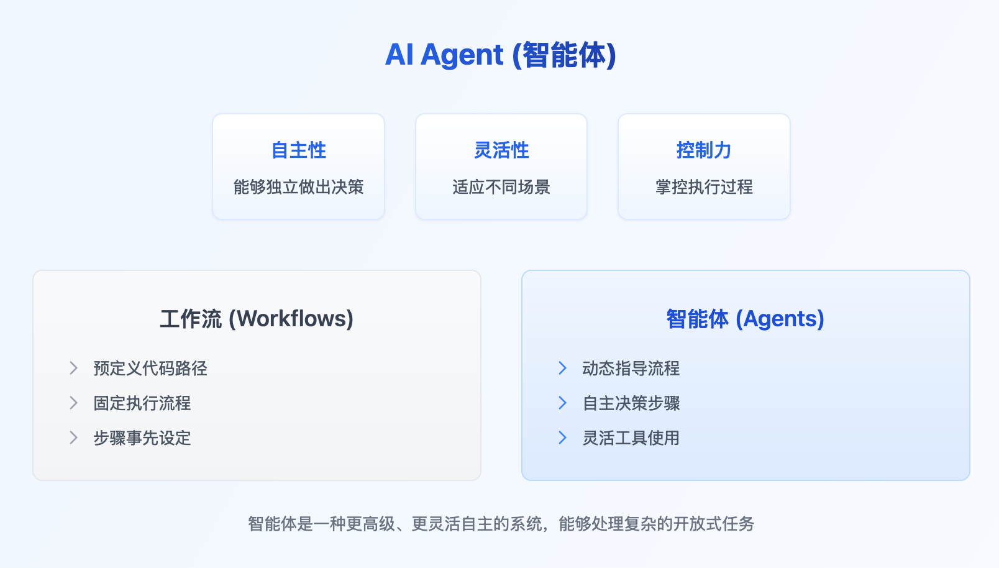
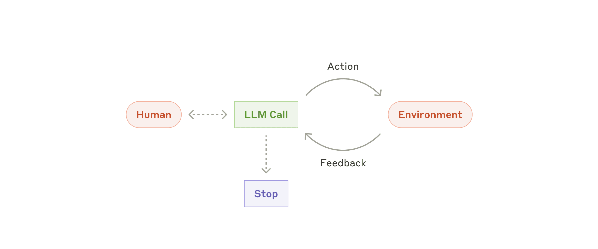

# 【转】构建有效的智能体

## 什么是智能体

“智能体”（Agent）可以有多种定义方式。一些客户将智能体定义为完全自主的系统，能够长时间独立运行，并利用各种工具完成复杂任务。另一些客户则用该术语指代遵循预设流程、更具规范性的实现方式。在 Anthropic，我们将所有这些变体统称为**智能体系统**（agentic systems），但在架构上对**工作流**（workflows）和**智能体**（agents）做出了重要区分：

*   **工作流**（Workflows）是指通过**预定义的代码路径**来编排 LLM（大语言模型）和工具的系统。
*   **智能体**（Agents）则是指由 LLM **动态引导**自身流程和工具使用的系统，**保持对任务完成方式的控制权**。

接下来，我们将详细探讨这两种类型的智能体系统。在附录 1（“智能体实践”）中，我们将具体描述客户在应用此类系统时发现特别有价值的两个领域。

## 何时（何时不）使用智能体

在构建基于大语言模型（LLM）的应用时，我们建议**尽可能寻求最简单的解决方案**，仅在必要时才增加复杂性。这可能意味着**完全不构建智能体系统**。智能体系统通常**以延迟和成本为代价，来换取更好的任务表现**；您需要仔细考量这种取舍在何时是合理的。

当确实需要更高的复杂性时，**工作流（Workflows）为定义明确的任务提供了可预测性和一致性**；而**当需要大规模灵活性和模型驱动的决策时，智能体（Agents）是更好的选择**。然而，对于许多应用而言，**通过检索（Retrieval）和上下文示例（In-context Examples）来优化单次 LLM 调用通常就足够了**。

## 何时以及如何使用框架

目前已有许多框架能够简化智能体系统的实现，包括：

- [LangGraph](https://langchain-ai.github.io/langgraph/)（来自 LangChain）；
- Amazon Bedrock 的 [AI Agent 框架](https://aws.amazon.com/bedrock/agents/)；
- [Rivet](https://rivet.ironcladapp.com/)（一款拖拽式图形界面 LLM 工作流构建工具）；以及
- [Vellum](https://www.vellum.ai/)（另一款用于构建和测试复杂工作流的图形界面工具）。

这些框架通过简化诸如**调用 LLM、定义和解析工具、链式调用**等标准的底层任务，使得入门变得容易。然而，它们通常也会引入**额外的抽象层**，这些抽象层可能**掩盖底层的提示词和响应细节，使其更难以调试**。此外，当更简单的设置就足够时，这些框架也可能诱使开发者添加不必要的复杂性。

我们建议开发者**从直接使用 LLM API 开始**：许多模式只需几行代码即可实现。**如果确实需要使用框架，请确保理解其底层代码**。对框架内部机制的错误假设是客户遇到问题的常见根源。

有关一些示例实现，请参阅我们的[开发指南](https://github.com/anthropics/anthropic-cookbook/tree/main/patterns/agents)。

## 构建单元、工作流程和智能体

在本节中，我们将探讨在生产环境中常见的智能体系统模式。我们将从基础构建单元——**增强型LLM（Augmented LLM）**——开始，并**逐步提升复杂度**，从**简单的组合式工作流（Compositional Workflows）** 到**自主智能体（Autonomous Agents）**。

### 构建单元：增强型LLM (Augmented LLM)

智能体系统的基本构建单元是**经过增强的大语言模型（LLM）**，其增强功能包括检索（retrieval）、工具（tools）和记忆（memory）。我们当前的模型能够**主动调用**这些能力——**自主生成搜索查询、选择合适的工具，并决定应留存哪些信息**。

在实现方面，我们建议重点关注两个关键方面：**针对您的特定用例定制这些能力**，以及**确保它们为您的LLM提供一个简单、文档完善的接口**。虽然实现这些增强功能的方法多种多样，但其中一种方式是通过我们最近发布的 [Model Context Protocol](https://www.anthropic.com/news/model-context-protocol)。该协议允许开发者通过简单的[客户端实现](https://modelcontextprotocol.io/tutorials/building-a-client#building-mcp-clients)，与日益增长的第三方工具生态体系进行集成。

在本文的后续部分，我们将**默认每次LLM调用都具备这些增强能力**。

### 工作流：提示链（Prompt Chaining）

**提示链（Prompt Chaining）** 将一个任务**分解为一系列步骤**，其中**每次LLM调用都处理前一次调用的输出**。您可以在任何中间步骤添加**程序化检查**（参见下图中的“**门控（gate）**”），以确保流程仍在正轨上。

**何时使用此工作流：** 此工作流非常适用于任务**能够轻松、清晰地分解为固定子任务**的情况。其主要目标是**以延迟为代价换取更高的准确性**，因为每个LLM调用处理的任务都变得更简单。

提示链有用的示例：
1. 生成营销文案（Marketing copy），然后将其翻译成另一种语言。
2. 撰写文档大纲，检查该大纲是否符合特定标准，然后根据大纲撰写文档。

### 工作流：路由 (Routing)

**路由（Routing）** 对输入进行分类，并将其**导向专门的后续任务**。这种工作流实现了**关注点分离（separation of concerns）**，并允许构建**更专业化的提示词**。若不采用此工作流，针对某一类输入的优化可能会损害其他输入的处理效果。

**何时使用此工作流：** 路由非常适用于**处理复杂任务**的情况，特别是当任务中存在**明显不同的类别**（这些类别**更适合分开处理**），并且**分类过程能够准确完成**（无论是通过LLM还是更传统的分类模型/算法）时。

**路由有用的示例：**

1. 将不同类型的客服查询（如：一般性问题、退款请求、技术支持）引导至不同的下游流程、提示词和工具进行处理。
2. 将简单/常见的问题路由到较小的模型（如 Claude 3.5 Haiku），将困难/罕见的问题路由到能力更强的模型（如 Claude 3.5 Sonnet），以优化成本和速度。

### 工作流：并行化 (Parallelization)

大语言模型（LLM）有时可以**同时处理一个任务**，并通过程序化方式**聚合它们的输出**。这种工作流，即**并行化（Parallelization）**，主要有两种关键形式：

1. **分块执行（Sectioning）**：将任务**分解为独立的子任务并行运行**。
2. **投票聚合（Voting）**：**多次运行相同的任务**以获得多样化的输出。

**何时使用此工作流：** 当**被划分的子任务可以并行执行以提高速度**，或者**需要多种视角或多次尝试以获得更高置信度的结果**时，并行化非常有效。对于**具有多重考量因素的复杂任务**，LLM通常在**每个考量因素由单独的LLM调用处理**时表现更好，这允许模型专注于每个特定的方面。

**并行化有用的示例：**

- **分块执行（Sectioning）示例：**
    - **实施防护机制（Guardrails）**：一个模型实例处理用户查询，同时另一个模型实例对查询进行**不当内容或请求筛查**。这通常比让同一个LLM调用既处理防护又处理核心响应的**效果更好**。
    - **自动化评估（Automating evals）**：评估LLM在给定提示词上的性能，其中**每个LLM调用评估模型性能的不同方面**（例如：相关性、安全性、流畅度等）。

- **投票聚合（Voting）示例：**
    - **审查代码漏洞**：使用**多个不同的提示词**审查同一段代码，如果**任何一个提示词发现问题**就标记该代码。
    - **评估内容是否不当**：使用**多个提示词评估内容的不同方面**（如：仇恨言论、暴力、色情），或者**要求达到不同的投票阈值（vote thresholds）** 以平衡**假阳性（false positives）和假阴性（false negatives）**。

### 工作流：协调者-工作者 (Orchestrator-workers)

在**协调者-工作者（Orchestrator-Workers）工作流**中，一个**中央LLM（协调者）** 会**动态地分解任务**，将它们**委派给工作者LLMs**，并**合成它们的结果**。

**何时使用此工作流：** 此工作流非常适合处理**无法预测所需子任务**的复杂任务（例如，在编码任务中，需要修改的文件数量以及每个文件的修改性质很可能取决于具体任务）。虽然**结构上**与并行化（Parallelization）相似，但其关键区别在于**灵活性**——子任务**并非预先定义**，而是由协调者根据具体输入**动态确定**。

**协调者-工作者工作流有用的示例：**

1. **编码类产品**：每次都需要**对多个文件进行复杂修改**的编码任务。
2. **搜索任务**：需要**从多个来源收集并分析信息**以寻找可能相关信息的搜索任务。

### 工作流：评估者-优化者 (Evaluator-optimizer)

在**评估者-优化者（Evaluator-Optimizer）工作流**中，**一个LLM调用负责生成响应**，而**另一个LLM调用则在一个循环中提供评估和反馈**。

**何时使用此工作流：** 当我们**拥有清晰的评估标准**，并且**迭代优化能带来可衡量的价值**时，此工作流特别有效。适用该工作流的两个关键信号是：**首先**，当人类明确表达反馈时，LLM的响应能够**得到显著改进**；**其次**，LLM本身**能够提供此类反馈**。这类似于人类作者在创作一篇**经过润色的文档（polished document）** 时可能经历的迭代写作过程。

**评估者-优化者工作流有用的示例：**

1. **文学翻译（Literary translation）**：涉及语言**微妙差异（nuances）** 的场景，翻译LLM可能**无法在初次尝试时就完全把握**，但评估者LLM能够提供**有价值的批判性反馈**（如：风格、文化内涵、韵律）。
2. **复杂搜索任务**：需要**多轮搜索和分析**才能收集全面信息的任务，其中**评估者LLM负责判断是否需要进一步搜索**。
### 智能体

随着大语言模型（LLM）在**关键能力上的成熟**——包括理解复杂输入、进行推理和规划、可靠地使用工具以及从错误中恢复——**智能体（Agents）** 正在生产环境中崭露头角。

智能体开始工作时，会接收人类用户的**指令**或与其进行**交互讨论**。一旦任务明确，智能体便**独立进行规划和操作**，并可能在需要时**返回人类处寻求更多信息或判断**。在执行过程中，智能体**在每个步骤都从环境中获取“真实反馈”（ground truth）**（例如工具调用结果或代码执行结果）以评估其进展。智能体可以在**检查点（checkpoints）** 或**遇到阻碍（blockers）** 时暂停，等待人类反馈。任务通常在完成后终止，但也常会设置**停止条件（stopping conditions）**（例如最大迭代次数）以保持控制。

智能体能够处理**复杂的任务**，但其**实现通常很直接**。它们通常**只是一个循环运行的LLM，基于环境反馈使用工具**。因此，**清晰且深思熟虑地设计工具集及其文档**至关重要。我们在附录 2（“工具提示词工程（Prompt Engineering your Tools）”）中详细阐述了工具开发的最佳实践。

**何时使用智能体：** 智能体适用于处理**开放式问题（open-ended problems）**，这类问题的**所需步骤数量难以或无法预测**，并且**无法硬编码固定路径**。LLM**可能需要运行多个轮次**，因此您必须对其决策能力**有一定程度的信任**。智能体的**自主性（autonomy）** 使其成为在**受信任环境中扩展任务**的理想选择。

智能体的**自主特性**也意味着**更高的成本**和**错误累积（compounding errors）** 的可能性。我们建议在**沙盒环境（sandboxed environments）** 中进行**广泛的测试**，并设置**适当的防护机制（guardrails）**。

**智能体有用的示例：**

以下示例来自我们自己的实现：
1. 一个用于解决 [SWE-bench 任务](https://www.anthropic.com/research/swe-bench-sonnet)的编码智能体：这些任务涉及**根据任务描述修改多个文件**。
2. 我们的 [“计算机操作”（“computer use”）参考实现](https://github.com/anthropics/anthropic-quickstarts/tree/main/computer-use-demo)：在该实现中，Claude **使用计算机来完成各种任务**。

### 组合与定制这些模式

这些**构建单元（building blocks）** 并非**规定性的（prescriptive）**。它们是开发者可以**塑造（shape）和组合（combine）** 以适应不同用例的**常见模式（common patterns）**。与任何LLM功能一样，**成功的关键在于衡量性能（measuring performance）并对实现进行迭代（iterating on implementations）**。再次强调：**仅当能够显著改善结果时**，您才应考虑增加复杂性。

## 总结（Summary）

在LLM领域取得成功，**不在于构建最复杂的系统**，而在于**构建适合您需求的正确系统**。**从简单的提示词开始**，通过**全面评估（comprehensive evaluation）** 对其进行优化，**仅当更简单的解决方案无法满足需求时**，才添加多步骤的智能体系统。

在实现智能体时，我们力求遵循三个核心原则：

1. **保持智能体设计的简洁性（Maintain simplicity）**。
2. **优先保证透明度（Prioritize transparency）**：**明确展示智能体的规划步骤**。
3. **精心设计智能体-计算机接口（agent-computer interface, ACI）**：通过**详尽的工具文档和测试**来实现。

框架可以帮助您**快速入门**，但在进入生产环境时，请**毫不犹豫地减少（甚至移除）抽象层**，并**使用基础组件进行构建**。遵循这些原则，您可以创建出**不仅强大，而且可靠、易维护且值得用户信赖**的智能体。

## 附录1：智能体实践（Agents in practice）

我们与客户合作的经验揭示了两种**特别有前景的AI智能体应用**，它们展示了上述模式的实际价值。这两种应用都说明了智能体在哪些任务中能发挥最大价值：需要**对话与行动相结合**、具有**清晰的成功标准**、支持**反馈循环**、并整合了**有意义的人工监督**的任务。

**A. 客户支持（Customer support）**  

客户支持将**熟悉的聊天机器人界面**与**通过工具集成实现的增强功能**相结合。这自然更适合**开放式智能体**，因为：

- 支持交互天然遵循对话流程，同时需要访问外部信息和执行操作；
- 可以集成工具来**拉取客户数据、订单历史记录和知识库文章**；
- 诸如**发放退款或更新工单**等操作可以通过编程方式处理；
- 成功可以通过**用户定义的解决结果**进行明确衡量。

多家公司已通过**按成功解决量计费（usage-based pricing models）** 的模式证明了这种方法的可行性，这显示了他们对其智能体有效性的信心。

**B. 编码智能体（Coding agents）** 

软件开发领域在利用LLM功能方面展现出显著潜力，其能力已从代码补全发展到**自主解决问题**。智能体在此特别有效，因为：

- 代码解决方案可以通过**自动化测试进行验证**；
- 智能体可以利用测试结果作为反馈来**迭代解决方案**；
- 问题空间是**定义明确且结构化的**；
- 输出质量可以**客观地衡量**。

在我们自己的实现中，智能体现在仅基于拉取请求（pull request）描述，就能在 [SWE-bench Verified 基准测试](https://www.anthropic.com/research/swe-bench-sonnet)中解决真实的 GitHub issues（问题）。然而，虽然自动化测试有助于验证功能，但**人工审查**对于确保解决方案符合更广泛的系统要求仍然至关重要。

## 附录2：工具提示词工程（Prompt engineering your tools）

无论您构建哪种智能体系统，**工具（tools）** 都可能是您智能体的重要组成部分。[工具](https://www.anthropic.com/news/tool-use-ga)使 Claude 能够通过在我们的 API 中**精确指定其结构和定义**来与外部服务和 API 交互。当 Claude 响应时，如果它计划调用工具，它将在 API 响应中包含一个 [`tool_use` 块](https://docs.anthropic.com/en/docs/build-with-claude/tool-use#example-api-response-with-a-tool-use-content-block)。**工具定义和规范的提示词工程**应与您的整体提示词受到同等重视。在这个简短的附录中，我们将描述如何对您的工具进行提示词工程。

通常有**多种方法可以指定相同的操作**。例如，您可以通过**编写差异（diff）** 或**重写整个文件**来指定文件编辑。对于结构化输出，您可以在 **Markdown 中**或 **JSON 内部**返回代码。在软件工程中，这些差异是表面性的，可以无损地从一种格式转换为另一种格式。然而，某些格式对于 LLM 来说比其他格式**更难编写**：

- 编写差异（diff）需要知道在编写新代码之前，块头（chunk header）中有多少行正在更改。
- 在 JSON 中编写代码（与 Markdown 相比）需要对换行符和引号进行**额外转义**。

我们关于决定工具格式的建议如下：

1. **给予模型足够的 token 来“思考”**，以免它在编写时陷入困境。
2. **使格式尽可能接近模型在互联网文本中自然看到的内容**。
3. **确保没有格式化的“开销”**，例如必须准确计算数千行代码的行数，或者对其编写的任何代码进行字符串转义。

一个经验法则是：思考投入在**人类-计算机交互界面（HCI）** 上的工作量，并计划投入同样多的精力来创建良好的**智能体-计算机接口（ACI）**。以下是一些关于如何做到这一点的想法：

- **站在模型的角度思考（Put yourself in the model's shoes）**：根据描述和参数，工具的使用方法是否显而易见？还是需要仔细思考？如果是后者，那么模型很可能也会遇到困难。一个好的工具定义通常包括**使用示例、边界情况（edge cases）、输入格式要求以及与其他工具的清晰界限**。
- **优化参数名称和描述（Optimize parameter names and descriptions）**：如何更改参数名称或描述以使事情更加清晰？可以将其想象为给团队中的初级开发者（junior developer）编写一份优秀的文档字符串（docstring）。在使用许多相似工具时，这一点尤其重要。
- **测试模型如何使用您的工具（Test tool usage）**：在 [Workbench](https://console.anthropic.com/workbench) 中运行许多示例输入，观察模型会犯哪些错误，并进行迭代。
- **[为工具设计防错机制（Poka-yoke your tools）](https://en.wikipedia.org/wiki/Poka-yoke)**：更改参数，使其更难出错。 

在构建用于 [SWE-bench](https://www.anthropic.com/research/swe-bench-sonnet) 的智能体时，我们实际上在**优化工具上花费的时间比优化整体提示词还要多**。例如，我们发现当智能体移出根目录后，模型在使用涉及**相对文件路径（relative filepaths）** 的工具时会出错。为了解决这个问题，我们将工具更改为**始终要求绝对文件路径（absolute filepaths）**——结果发现模型能够完美地使用这种方法。

参考：

[Building Effective AI Agents \ Anthropic](https://www.anthropic.com/engineering/building-effective-agents)

[『深度好文』来自Claude官方的AI Agent详解！](https://blog.csdn.net/weixin_40774379/article/details/144656436)
