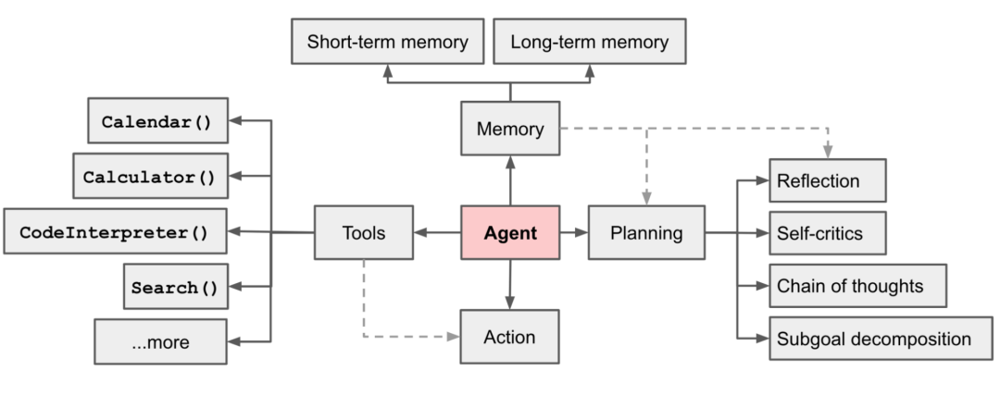

# 智能体

**Agent（智能体）=LLM（大模型）+ Planning（规划）+Memory（记忆）+ Tools（工具）**

资料：

[A practical guide to building agents](https://cdn.openai.com/business-guides-and-resources/a-practical-guide-to-building-agents.pdf)

[AI Agent调研--7种Agent框架对比！盘点国内一站式Agent搭建平台，一文说清差别！大家都在用Agent做什么？-CSDN博客](https://blog.csdn.net/Python_cocola/article/details/140407020)

[主流开源AI Agent框架对比与选型（langgraph, AutoGen, MetaGPT, ChatDev, Swarm, uagents） • Tech Explorer 🚀](https://stable-learn.com/zh/global-open-source-ai-agents-introduction-and-selection/)

## 如何构建 Agent

- 明确Agent角色与目标：定义任务、服务对象及输出格式，如医疗助手自动读片并生成口语报告。  
- 设计结构化输入输出：用Pydantic AI或JSON Schema规范数据接口，避免杂乱文本，提升交互一致性。  
- 制定Prompt（提示词）与行为协议：通过角色系统Prompt及Prompt Tuning，确保Agent保持统一人格与任务执行标准。  
- 注入推理与工具接入：结合ReAct、Chain-of-Thought等推理框架，接入网络搜索、代码解释器等工具实现复杂决策。  
- 多Agent协同逻辑（选项）：利用CrewAI、LangGraph等框架，构建分工明确的Planner、Researcher、Reporter多Agent体系。  
- 加入记忆与长期上下文：采用对话记忆、摘要记忆或向量存储，支持Agent持续跟踪历史信息，提升智能连贯性。  
- 语音与视觉能力扩展（可选）：集成Coqui、ElevenLabs语音合成，或GPT-4o、LLaMA 3.2视觉理解，赋予Agent多模态交互能力。  
- 输出格式优化：生成Markdown、PDF或结构化JSON，兼顾人类可读与机器可解析需求。  
- UI/API封装（可选）：通过Gradio、Streamlit或FastAPI构建界面或API，快速将Agent转化为产品。  
- 评估与监控：利用MCP日志、OpenAI评估API和自定义仪表盘，持续测试与优化Agent性能。[🔗](https://weibo.com/1402400261/Q3v14gCpS)