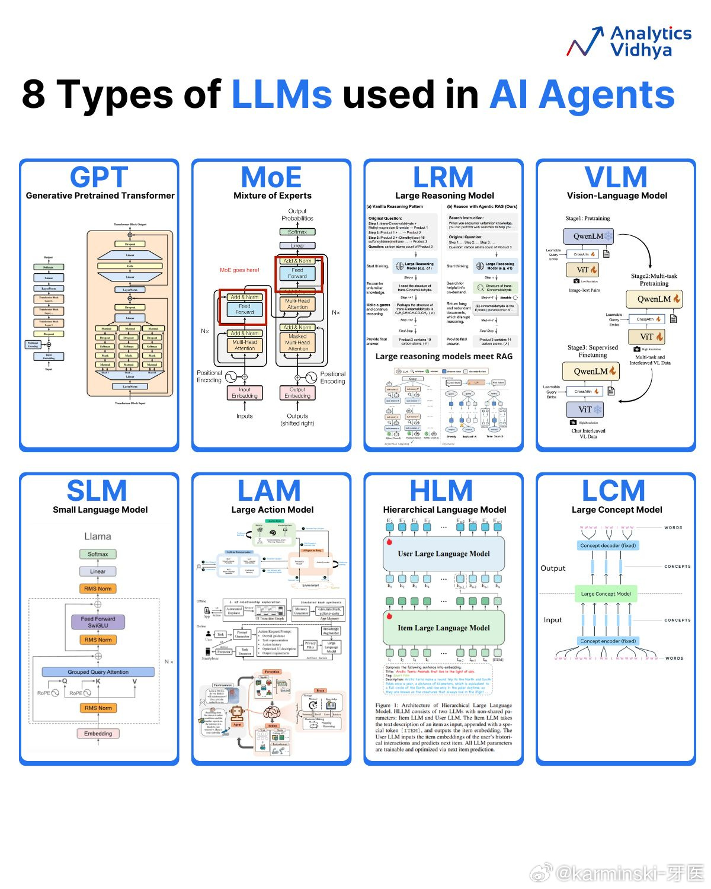

# 大模型

## 分类

1. GPT (Generative Pretrained Transformer) - 生成式预训练变换模型  
就是最传统的Transformer架构利用大规模文本数据进行预训练的语言模型。它通过学习语言的模式、语法和知识，可以生成类似人类书写的文本。  
  
2. MoE (Mixture of Experts) - 混合专家模型  
MoE是一种模型架构，它由多个“专家”网络（通常是前馈网络）和一个“门控”网络组成。门控网络会根据输入决定将信息传递给哪个专家进行处理。这种设计可以在不显著增加计算成本的情况下，极大地扩展模型的参数量，从而提升性能。大家应该也和熟悉了，DeepSeek-V3 的横空出世，让现在的非 Dense 文本模型都是 MoE 了。  
  
3. LRM (Large Reasoning Model) - 大推理模型  
这是一种专注于提升复杂推理能力的大型语言模型。图示中提到了两种推理模式：一种是“原始推理模式”，另一种是结合了“智能体RAG（检索增强生成）”的推理模式，表明其旨在通过更强大的推理过程和外部知识检索来解决复杂问题。  
  
4. VLM (Vision-Language Model) - 视觉语言模型  
这是一种多模态模型，能够同时理解和处理图像与文本信息。它通常通过将视觉特征（例如，从ViT - Vision Transformer模型中提取）和文本嵌入相结合，来实现对图文内容的理解和生成。  
  
5. SLM (Small Language Model) - 小语言模型  
顾名思义，这是一种规模和参数量都相对较小的语言模型。图中的例子是Llama，虽然Llama系列也有非常大的模型，但这里用它来示意SLM的典型架构。小模型在特定任务上经过精调后，可以在资源受限的环境中高效运行。  
  
6. LAM (Large Action Model) - 大行为模型  
这种模型旨在将大型语言模型的能力扩展到软件应用和API的交互上。它不仅能理解语言，还能生成并执行与环境（如操作系统、网页、应用）交互的动作，从而完成更复杂的任务。  
  
7. HLM (Hierarchical Language Model) - 分层语言模型  
这是一种具有层次结构的模型。图示中包含一个“用户大语言模型”和一个“物品大语言模型”，暗示这种模型可能通过不同层级的模型协作来处理和理解信息，例如在推荐系统中，一个模型理解用户，另一个模型理解物品。  
  
8. LCM (Large Concept Model) - 大概念模型  
这种模型的核心在于对“概念”的编码和解码。它接收词语（Words）作为输入，通过一个概念编码器将其转化为概念（Concepts），然后再通过一个概念解码器将这些概念转化为词语输出。这表明它旨在更高层次的语义和概念上进行信息的处理和生成。

RLVR（强化学习与可验证奖励）