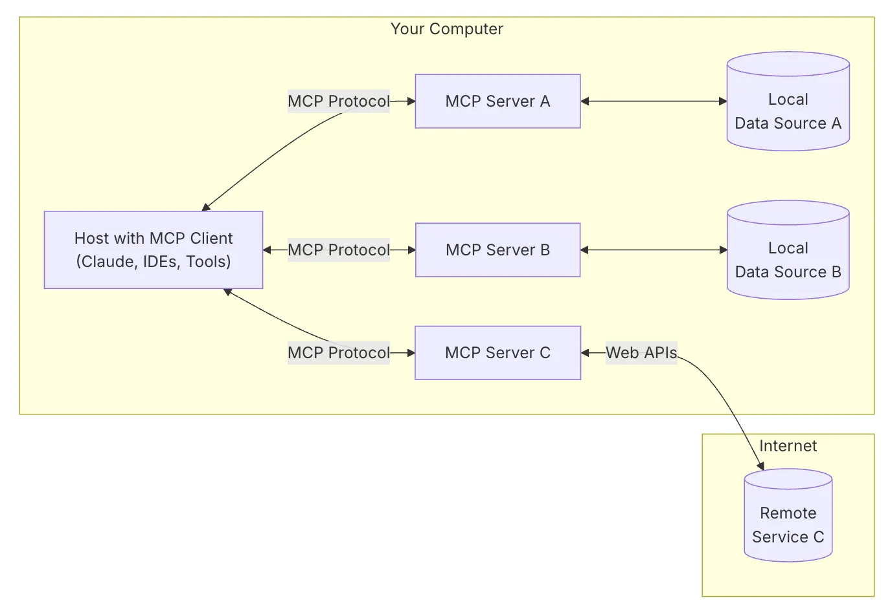
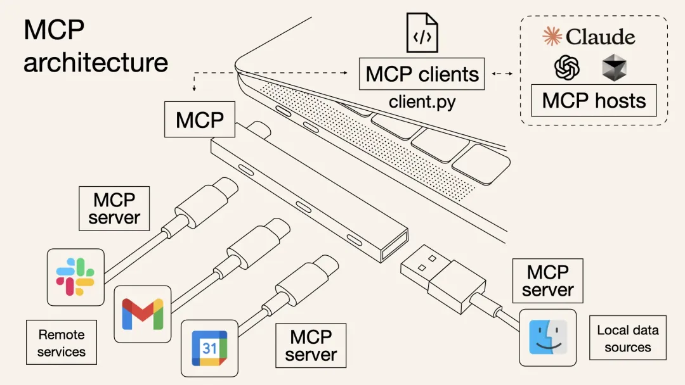

## 介绍

```scss
┌─────────────────────────────────────────────────────────┐
│                        Host                              │
│              (Claude Desktop / Cursor)                   │
│                                                          │
│  ┌─────────────┐  ┌─────────────┐  ┌─────────────┐      │
│  │   Client    │  │   Client    │  │   Client    │      │
│  │  (GitHub)   │  │ (Postgres)  │  │  (Sentry)   │      │
│  └──────┬──────┘  └──────┬──────┘  └──────┬──────┘      │
└─────────┼────────────────┼────────────────┼─────────────┘
          │                │                │
          ▼                ▼                ▼
    ┌───────────┐    ┌───────────┐    ┌───────────┐
    │MCP Server │    │MCP Server │    │MCP Server │
    │ (GitHub)  │    │(Postgres) │    │ (Sentry)  │
    └───────────┘    └───────────┘    └───────────┘

```





MCP 采用客户端-服务器架构，主要包含以下几个组件：

- MCP 主机（Host）：如 Claude Desktop、IDE 或其他 AI 工具，通过 MCP 访问数据。
- MCP 客户端（Client）：与服务器保持 1:1 连接的协议客户端。
- MCP 服务器（Server）：轻量级程序，通过标准化的 MCP 协议公开特定功能。
- 本地数据源（Local Data Source）：计算机上的文件、数据库和服务，MCP 服务器可以安全访问这些内容。
- 远程服务（Remote Service）：通过互联网可用的外部系统（例如通过 API），MCP 服务器可以连接这些服务。

## 文档

[MCP 官方文档中文版 - apifox.cn](https://mcp-docs.apifox.cn/)
## 资料

[一文讲透MCP的原理及实践](https://mp.weixin.qq.com/s/kElGH8WvrHr_0Hv-nQT8lQ)

[实操干货！MCP Server开发从0到1](https://mp.weixin.qq.com/s/H5RLAeYTkyTIZFUM9AdkLQ)

[MCP很好，但它不是万灵药！真正的技术进步，往往始于祛魅之后的清醒认知](https://mp.weixin.qq.com/s/Zs2yF1MovpBD_a12bIVibg)

[microsoft/mcp-for-beginners: This open-source curriculum introduces the fundamentals of Model Context Protocol (MCP) through real-world, cross-language examples in .NET, Java, TypeScript, JavaScript, Rust and Python. Designed for developers, it focuses on practical techniques for building modular, scalable, and secure AI workflows from session setup to service orchestration.](https://github.com/microsoft/mcp-for-beginners)

## MCP 市场

[MCP Marketplace](https://mcp.higress.ai/)

MCP.so

## MCP Server

## ffmpeg-mcp

https://github.com/egoist/ffmpeg-mcp

ffmpeg-mcp 是一个基于 MCP 协议的服务端项目，专门用来和 FFmpeg 交互，简化常见多媒体操作。  
  
它通过标准输入输出接口与 FFmpeg 通信，方便集成到各种 MCP 客户端中，提升自动化处理效率。  
  
主要特点：  
  
- 轻量级 MCP 服务器，专注于 FFmpeg 的常用命令封装；  
- 支持通过环境变量自定义 FFmpeg 路径，灵活适配各种环境；  
- 易于集成，直接通过 `npx -y ffmpeg-mcp` 命令即可启动；  
- 由 ChatWise 赞助，持续维护和更新；  
- 开源 MIT 许可，适合二次开发和商业使用。  
  
适合需要自动化音视频转码、处理的开发者和运维人员。

