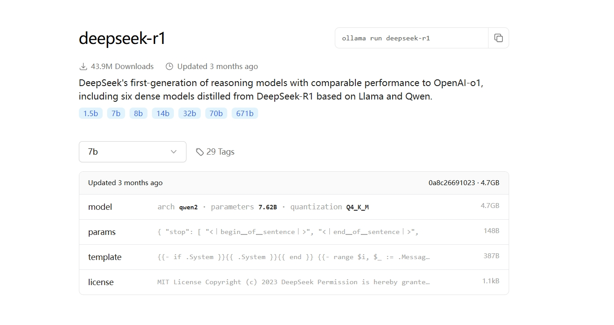

# Ollama

本地运行大型语言模型。
## 官网

[Ollama](https://ollama.com/)

## 安装

Windows\MacOS 下载 [https://ollama.com/download](https://ollama.com/download) 安装。

Linux:

```shell
curl -fsSL https://ollama.com/install.sh | sh
```

## 设置

设置环境变量：

`OLLAMA_MODELS`：指定下载模型的存放路径，不设置将会放在默认目录，Windows 系统默认是 `C:\Users\{用户名}\.ollama\models`。 

`OLLAMA_HOST`：指定 ollama 运行时绑定ip，默认是:https://127.0.0.1:11434。


## 模型

查找模型 [https://ollama.com/search](https://ollama.com/search) ，比如 DeepSeek 模型 [https://ollama.com/library/deepseek-r1](https://ollama.com/library/deepseek-r1) ：



### 安装模型

这里选用 `deepseek-r1:14b`:

```shell
ollama run deepseek-r1:14b
```