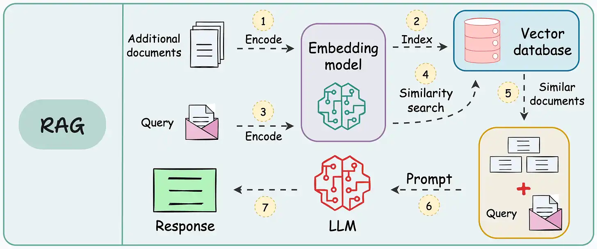

# RAG

RAG（Retrieval Augmented Generation ，检索增强生成）

参考：

[16 Techniques to Supercharge and Build Real-world RAG Systems—Part 1](https://www.dailydoseofds.com/16-techniques-to-supercharge-and-build-real-world-rag-systems-part-1/)