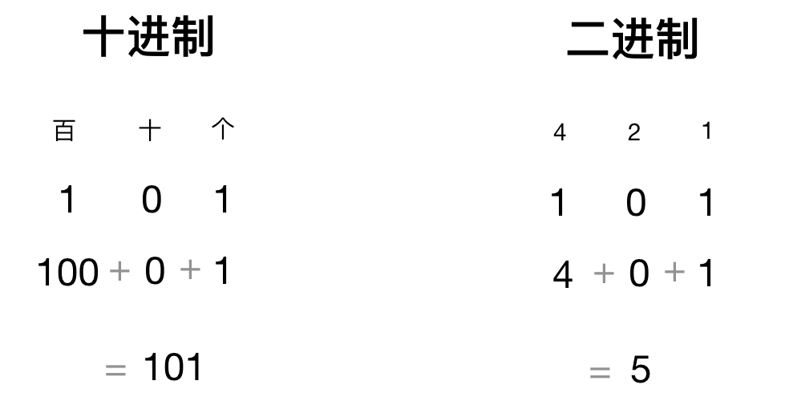
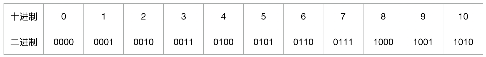
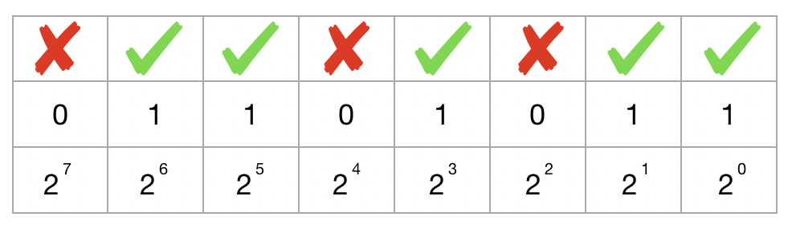
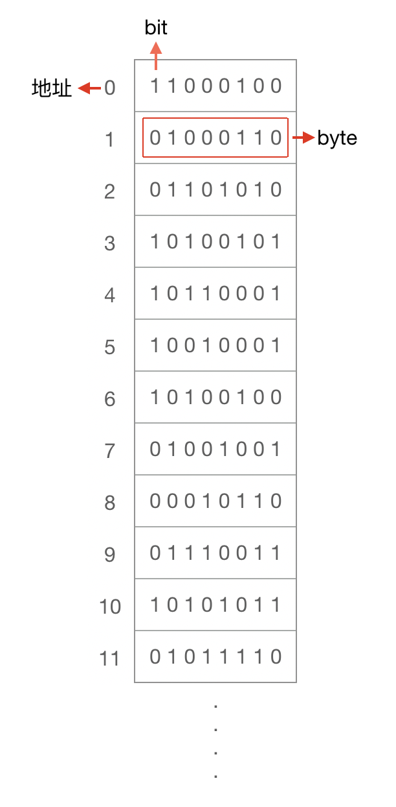
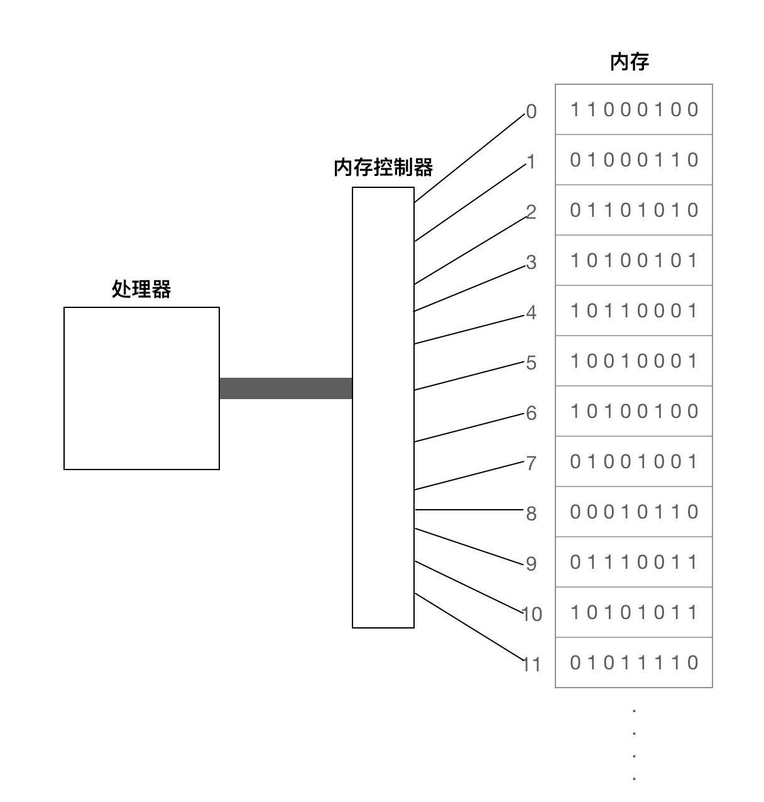
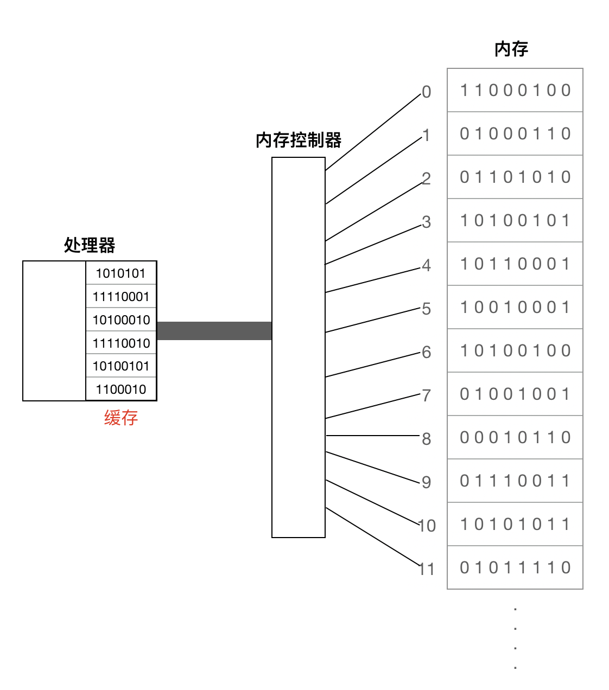
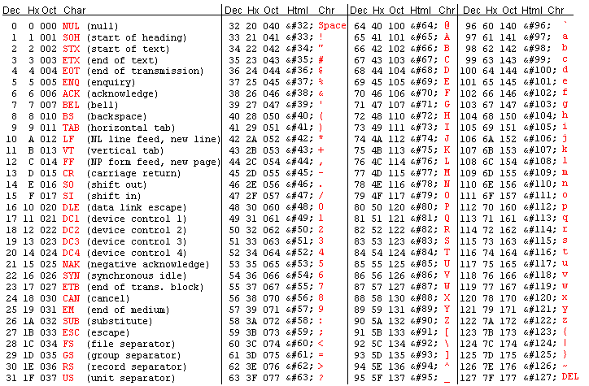
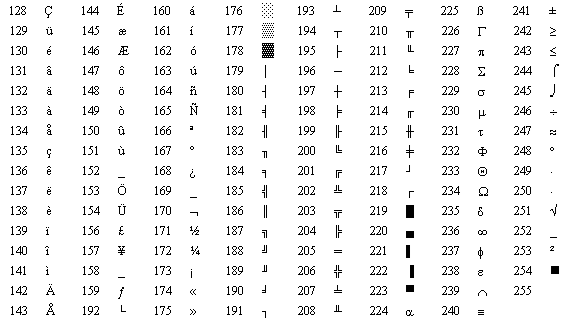

# 二进制

## 什么是二进制

二进制是一套计数方法，每个位置上的数有 2 种可能（0 - 1）；二进制是计算机的执行语言，但是早在计算机出现前就存在这套计数方法，最早可追溯到古埃及。在日常生活中，我们使用的是十进制，每个位置上的数有 10 种可能（0 - 9），在了解二进制前，先看下十进制是如何运作的。

如十进制下的 101；这里有两个 1 ，代表不同的含义，左边的代表 100 ，右边的代表 1 ，因为左边的 1 在百位，而右边的 1 在个位，同理，中间的 0 在十位。所以十进制的 101 是 “ 百位为 1 ，十位为 0 ，个位为 1 ”，这里的位数对应的是 10 的幂：

- 100 = 1；
- 101 = 10；
- 102 = 100；
- 103 = 1000；
- …

二进制的位数对应的是 2 的幂：

- 20 = 1；
- 21 = 2；
- 22 = 4；
- 23 = 8；
- …

所以二进制下的 101 代表 5。下图是二进制的前十位：

## 二进制转换

计算机运行的是二进制，但是我们在键盘上输入的并非二进制的内容，而是字母、数字（十进制）、汉字等，那计算机是怎么知道把这些内容转成二进制呢？计算机是人设计的，在了解计算机将我们输入的内容转成二进制前，先简单看下十进制和二进制的转换。这里的套路是：

1. 算出 2 的 n 次幂不大于要表示的值；
2. 用要表示的值减去 2n，得到剩下的值后，重复步骤 1，直到最后剩下 0 为止。

举个例子，十进制的 107 如何转成二进制，先找出 2 的 n 次幂不大于 107 ，算得 n = 6，用 107 减去 26 得到 43；重复下来后 :

107 = 1 x 26 + 1 x 25 + 0 x 24 + 1 x 23 + 0 x 22 + 1 x 21 + 1 x 20 ，如果该位用到，用 1 表示，否则用 0 表示。所以 107 用二进制表示为：01101011

二进制转成十进制就是相反的过程，如 01011001 转成十进制：

01011001 = 0 x 27 + 1 x 26 + 0 x 25 + 1 x 24 + 1 x 23 + 0 x 22+ 0 x 21 + 1 x 20 = 89

## 什么是比特

计算机拥有数十亿超小型的数字电路，这些电路由开关组成，并且开关的状态只有开或关，分别代表二进制中的 1 和 0 。

计算机中最小的存储单位是二进制位（`bi`nary digi`t`），也叫`比特`， bit 只能够存储 0 或 1 ；而要存储额外的信息（如更大的十进制数），计算机通过串联这些 bit 来完成。只要开关足够多，它可以通过这些 0 和 1 代表任何内容。由 8 bit 串联组成的称为`字节（byte）`，1 个字节可以代表 256 种不同的可能（28），2 个字节可以代表 65,536 种不同的可能（216），而这只需要 16 个开关 …

## 内存是怎么工作的

计算机运行的二进制存储在内存当中，这里的内存英文是 `random access memory (RAM)` ，那么它的结构是怎样的呢？可以把内存想象成一个大的书架，这个书架有几十亿层 … 每一层都有编号，把每一层的编号称为`地址`，每一层有 8 个 bit 用来存储数据。如下：

同时，有一个用于执行内存操作的`处理器`和`内存控制器`，内存控制器负责接收处理器的指令，对内存执行读写操作，它可以`直接操作`内存这个大书架的的每一层，如下：

`random access memory (RAM)`这个名字的由来 — “ 立即访问内存的中随机地址”

虽然内存控制器能够在相隔很远的内存地址间快速切换，但是它还是倾向于访问相邻的地址的内存，计算机在这方面做了优化。处理器有一个`缓存`用来保存最近从 RAM 中访问的数据的副本，如下：

处理器从缓存中读取数据的速度快于 RAM ，因此缓存的出现有助于我们节省时间。当处理器下达指令要内存处理器去访问某个内存地址时，内存处理器其实还把要访问地址的相邻地址的内容一起返回给处理器，处理器把这些内容存储在缓存中。

假如处理器想按顺序，先后访问地址 951、952、953、954 … 在第一次读取地址 951 时就会把所需的内容全部取出来放到处理器的缓存中，之后 952 、953、954 的读取则是通过快速的缓存读取方式获得。

但是假如处理器先后访问的地址是 951、321、146 … 那此时的缓存就帮不上忙了，内存管理器每次都得老老实实的去 RAM 区获取数据，当然速度就会比上面的慢了。

## 二进制表示数字

上面我们已经知道如何用二进制表示十进制，日常生活中使用的数字范围在在计算机中可以用 4 或 8 个字节（32 或 64 bit）来表示：

- 4 比特可以表示的数字范围：2147483648 ~ 2147483647
- 8 比特可以表示的数字范围：9223372036854775808 ~ 9223372036854775807

二进制还可以用来表示分数、小数、负数：

- 分数：分别储存两个数：分子和分母
- 小数：分别存储两个数：去掉小数点后的数字；小数点出现的位置
- 负数：二进制位中最左边的那一位代表符号，0 表示正数，1 表示负数；

## 二进制表示字符

了解了计算机如何用二进制表达数字（十进制），那么计算机如何用二进制表达字符呢？计算机用到了`编码（encoding）`。编码就是一套数字和字符间的映射关系，有许多不同的编码格式，举个常用的例子： `ASCII（American Standard Code for Information Interchange，美国信息交换标准代码）`。ASCII 编码表可以翻译数字、大小写字母、以及常用的一些特殊符号，有了这套规则，计算机就知道如何应对我们输入的内容了：

假设我们输入的内容为 NICE ，通过 ASCII 编码表首先转化成十进制为：

**78** **73** **67** **69**

再转成二进制：

**01001110** **01001001** **01000011** **01000101**

观察上面这个例子发现

- 一个字符需要 8 bit 来表示，也就是 1 byte
- 二进制表示字母都以 0 开头

看起来只需要 7 bit 就能表达一个字符，第一个 bit 总是 0 ，给人的感觉好像是浪费了 1 bit，那么当初设计这个表的时候难道没发现这个 bug 么？再看一眼上面的 ASCII 表，我们发现表中缺了很多其他特殊符号，如 é、æ 等等，这些符号计算机要怎么用二进制表达呢？最初设计的 ASCII 编码表只用到了 7 bit ，因此有 128 种可能，再把第一位利用起来，ASCII 编码表就得以翻倍扩展：

还有其他方式可以对字符编码，例如 Unicode 编码表，可以用来表达世界上各个国家的字符，区别在于每个字符占用 2 个 byte（这样理论上一共最多可以表示 216（即 65536 ）个字符。基本满足各种语言的使用。实际上当前版本的 Unicode 码并未完全使用这 16 位编码，而是保留了大量空间以作为特殊使用或将来扩展）。这些编码的核心思想是一致的：建立一套规则作为抽象层，用来简化我们在字符和二进制之间的转化方式。