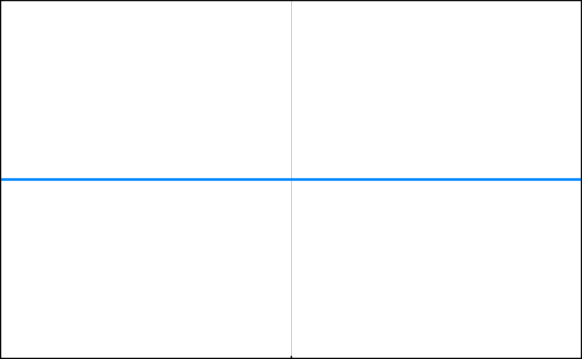

# 大 O 表示法

## 复杂度是什么

衡量算法的高效与否的标准有两个：

- 花更少的时间
- 花更少的空间

## 大 O 表示法是什么

大 O 符号是用来描述算法复杂度的语言，用它来反应不同算法处理问题的效率。算法的效率体现在：`当输入任意增长时，算法相对输入的运行时增长速度`。

**简单分析**

- **输入任意增长** — 大 O 表示法关心的是，随着输入 n 增长而增长最快速的部分，因为当 n 变得非常大时，其余的影响显得微不足道。
- **运行时增长速度** — 算法的运行时间取决于处理器的性能，因此很难确定其准确的运行时间。所以大 O 表示法讨论的是运行时的增长速度 。
- **相对输入** — 大 O 表示法可以衡量运行时的增长速度，如 “算法效率和输入成线性关系（O(N)）

## O(1) — 常数时间

这表示该算法的运行时是固定的，即无论输入多少数据，算法都将花费相同的时间。举个例子，下面的方法接收一个数组，不管传递的数组中的元素数量是 1 还是 1000，所花的时间是一致的，因为该方法只是简单得返回数组中的第一个元素。

```javascript
function(array) {  
  return array[0];  
}
```

趋势图如下：



## O(n) — 线性时间

随着数组中元素数量增加，处理所需的时间也以相同的速率增加。举个例子，下面的方法将传入的数组的元素打印出来，`console.log()` 方法执行的次数取决于数组的长度。

```javascript
function logArray(array) {  
  for (let i = 0; i < array.length; i++) {  
    console.log(array[i]);  
  }  
}
```

趋势图如下：


## O(N²), O(N³), O(N⁴)  — 平方时间, 立方时间, 四次方时间

算法复杂度为 O(N²) 的典型标志是代码中出现循环嵌套：

```javascript
function(array){  
  for (let i = 0; i < array.length; i++){  
    for (let j = 0; j < array.length; j++){  
      console.log(array[j]);  
    }  
  }  
}
```

下图给出 O(N) 和 O(N²) 的增长趋势对比：


*蓝色: O(N) · 红色: O(N²)*

同理，还有 O(N³)、 O(N⁴) 只要多嵌套几层循环，运行时也会随之急速增长。

*蓝色: O(N) · 红色: O(N²) · 绿色: O(N³) · 橘黄色: O(N⁴)*

## O(logN) — 对数时间

算法时间复杂度为 O(logN) 的例子是二分查找，二分查找的思路是：将要查找的数与当前数组中心值进行比较，每次比较过滤掉当前数组的一半，因此非常高效。如下图：


O(logN) 的增长趋势图：


*紫色: O(logN)*

## 忽略常量

下面的方法对传入的数组执行两次相同的操作：

```javascript
function countUpThenDown(array) {  
	for (let i = 0; i < array.length; i++) {  
	    console.log(i);  
	  };  
	for (let i = array.length; i > 0; i--) {  
	    console.log(i);  
	  };  
}
```

很容易想到该方法的算法效率为 O(2N)。如果在方法中再加一个非嵌套的循环，将执行 3 次相同的操作，算法效率为 O(3N)。在数据规模很小的情况下，这点差异是很重要的。但是大 O 表示法更加关注的是大规模数据下的性能表现，因此通常忽略常量倍数，从下面的图表就可以看到：


*蓝色: O(N) · 红色: O(2N) · 绿色: O(3N).*


*蓝色: O(N) · 红色: O(2N) · 绿色: O(3N).*

图一显示了 O(N) 、 O(2N)、O(3N) 在小规模下的差异，图二显示这种差异在大规模的情况下微不足道。

## 只关心最高次幂

很少会看到函数的时间复杂度被表示成 O(N² + N) 。实际上 O(N² + N) 和 O(N²) 的差异只是随着 N 的增加 Y 轴上移 N 个单位，如下图：


*蓝色: (N² + N) · 红色: O(N²).*

可以看到决定真正走势的是 N²，因此在许多情况下，将表达式缩减到对算法影响最大的元素就够了。有了这套规则，通常将算法时间复杂度为 O(2N³ + 5N² + 4N + 7) 缩写成 O(N³)。

## 考虑的是最差情况

```javascript
function findTheMeaningOfLife(array){  
  for (let i = 0; i < array.length; i++) {  
    if (array[i] === 42) {  
      return i;  
    }  
  }  
}
```

例如上面的方法很有可能会提前结束，但是大 O 表示法考虑的是最差的情况，因此该方法的时间复杂度还是 O(N)。

## 空间复杂度

大 O 也可以用来表示空间复杂度 。当讨论空间复杂度时，我们关注的是算法在运行时额外分配的内存空间。

```javascript
function sayHiNTimes(n) {  
  for (let i = 0; i < n; i++) {  
    console.log('hi');  
  }  
}
```

上面的方法空间复杂度是 O(1) ，因为整个过程只用到一个固定的变量。

```javascript
function arrayOfHiNTimes(n) {  
  const hiArray = [];  
  for (let i = 0; i < n; i++) {  
    hiArray[i] = 'hi';  
  }  
  return hiArray;  
}
```

上面的方法空间复杂度是 O(N) ，因为 hiArray 的长度随着 n 的增大而增大。