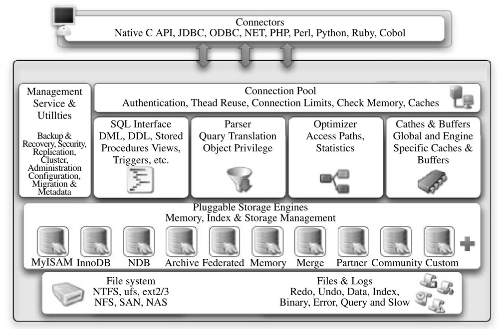

[SurrealDB | The ultimate multi-model database](https://surrealdb.com/)（[Github](https://github.com/surrealdb/surrealdb)）

[Chat2DB：智能的通用数据库SQL客户端和报表工具](https://github.com/chat2db/Chat2DB)

[NocoDB：将 MySQL、PostgreSQL、SQL Server、SQLite 或 MariaDB 转换为智能电子表格。](https://github.com/nocodb/nocodb)

[APITable：面向 API 的，可支持嵌入的可视化数据库，可替代 Airtable](https://github.com/apitable/apitable)

[Use The Index, Luke - A Guide to Database Performance for Developers ](https://use-the-index-luke.com/)

[ConnectionStrings.com helps developers connect software to data.](https://www.connectionstrings.com/)

[db-tutorial 是一个数据库教程。](https://dunwu.github.io/db-tutorial/)

## MySql 资料

[阿里：MySQL设计规约](https://mp.weixin.qq.com/s/XC8e5iuQtfsrEOERffEZ-Q)

[MySQL Tutorial](https://www.mysqltutorial.org/)

[MySQL 从入门到实践](https://segmentfault.com/a/1190000040642243)

[MySQL 性能优化神器 Explain 使用分析](https://segmentfault.com/a/1190000008131735)

[MySQL Explain执行计划 - 详解](https://learnku.com/articles/61310)

[SQL：我为什么慢你心里没数吗？](https://mp.weixin.qq.com/s/8A-s-GXng2AS4zNbs0yOEQ)

[用 10 个真实案列带你掌握 MySQL 调优](https://xie.infoq.cn/article/c5ce219185f54d1c316325e04)

[搞懂脏读、幻读和不可重复读](https://www.cnblogs.com/vipstone/p/15758962.html)

[微服务化的数据库设计与读写分离](https://mp.weixin.qq.com/s/WFKJxEZObJw60SVmMOmNyw)

[12 条用于 Linux 的 MySQL/MariaDB 安全最佳实践](https://www.oschina.net/translate/mysql-mariadb-security-best-practices-for-linux)

[MySQL 规约（转自阿里巴巴 Java 开发手册）](https://learnku.com/laravel/t/45456)

[一文看懂mysql数据库checkpoint机制](https://www.toutiao.com/article/6713507870362567175/)

[MySql GIS 空间数据库使用体验](https://blog.csdn.net/long535/article/details/75714781)

[MySQL数据类型DECIMAL用法 ](https://www.cnblogs.com/owenma/p/7097602.html)

[MySQL中tinytext、text、mediumtext和longtext等各个类型详解](https://blog.csdn.net/youcijibi/article/details/80673811)

[MySQL 的时间类型和时间相关的函数](https://f2h2h1.github.io/article/MySQL%E7%9A%84%E6%97%B6%E9%97%B4%E7%B1%BB%E5%9E%8B%E5%92%8C%E6%97%B6%E9%97%B4%E7%9B%B8%E5%85%B3%E7%9A%84%E5%87%BD%E6%95%B0.html)

[MySQL高可用方案选型参考](https://mp.weixin.qq.com/s?__biz=MjM5NzAzMTY4NQ==&mid=207615312&idx=1&sn=d1e774974371d1203daf1d1ae71a4d4b)

[mysql高可用衡搭建(Keepalived)](https://learnku.com/articles/52378)

[mysql 8.0.12 创建新的数据库、用户并授权](https://www.cnblogs.com/xzlive/p/9546964.html)

[SQLBolt - Learn SQL with simple, interactive exercises.](https://sqlbolt.com/)

## MySql 工具

[SOAR(SQL Optimizer And Rewriter) 是一个对 SQL 进行优化和改写的自动化工具。](https://github.com/XiaoMi/soar)

[Vitess是用于部署、扩展和管理大型MySQL实例集群的数据库解决方案。](https://vitess.io/zh/)

## Redis

[从一个事故中理解Redis（几乎）所有知识点](https://mp.weixin.qq.com/s/39Q5-vvIBmlmRVW8tzdjyA)

## postgres

[Postgres.js - The Fastest full featured PostgreSQL client for Node.js, Deno, Bun and CloudFlare](https://github.com/porsager/postgres)

## SQLite 

[sql.js - A javascript library to run SQLite on the web.](https://github.com/sql-js/sql.js)

[Hosting SQLite databases on Github Pages](https://phiresky.github.io/blog/2021/hosting-sqlite-databases-on-github-pages/)

[SQL As Understood By SQLite](https://www.sqlite.org/lang.html)

## SQLite 工具

[DB Browser for SQLite](https://sqlitebrowser.org/)

## Oracle Client

[Oracle Instant Client](https://www.oracle.com/database/technologies/instant-client.html)

[Updated PHP 7.2 PDO_OCI install 'configure' syntax](https://blogs.oracle.com/opal/post/updated-php-72-pdo_oci-install-configure-syntax)

## Oracle 资料

[php-PDO-预处理绑定参数的一个细节](https://blog.csdn.net/jiaobuchong/article/details/40304221) 循环绑定参数

## 时序数据库

[greptimedb - An open-source, cloud-native, distributed time-series database with PromQL/SQL/Python supported.](https://github.com/GreptimeTeam/greptimedb)

## IndexedDB

[Dexie.js - Minimalistic IndexedDB Wrapper(浏览器原生数据库 IndexedDB 的包装库，提供易于操作的 API。)](https://dexie.org/)

## 数据集成工具

[SeaTunnel is a next-generation super high-performance, distributed, massive data integration tool.](https://github.com/apache/seatunnel)

[Build Databases As Spreadsheets :No-Coding Required](https://docs.nocodb.com/)

## 数据分析工具

[ClickHouse® is a free analytics DBMS for big data](https://github.com/ClickHouse/ClickHouse)

## 资料

[Database Sharding Explained](https://architecturenotes.co/database-sharding-explained/)

[Prisma's Data Guide](https://www.prisma.io/dataguide)

