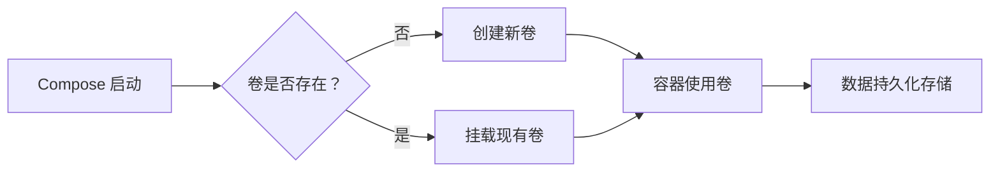

# Docker Compose 命名卷详解：持久化数据管理核心

命名卷（Named Volumes）是 Docker 数据持久化的核心机制，相比绑定挂载（bind mounts）和匿名卷（anonymous volumes），提供了更强大的管理和移植性。以下是全面解析：

## 一、命名卷的核心特性

| 特性         | 说明                        |
| ---------- | ------------------------- |
| **生命周期独立** | 与容器解耦，容器删除后数据保留           |
| **集中管理**   | 通过 `docker volume` 命令统一管理 |
| **跨容器共享**  | 多个容器可挂载同一命名卷              |
| **驱动程序支持** | 支持本地、NFS、云存储等驱动程序         |
| **便携性**    | 卷数据随 Docker 环境迁移          |

## 二、在 Compose 中定义命名卷

在 `docker-compose.yml` 的顶级 `volumes` 部分声明：
```yaml
version: "3.9"

services:
  db:
    image: postgres:15
    volumes:
      - db_data:/var/lib/postgresql/data  # 服务挂载点

volumes:  # 命名卷声明
  db_data:  # 默认使用 local 驱动
    driver: local
    driver_opts:  # 驱动参数
      type: nfs
      o: addr=192.168.1.100,rw
      device: ":/path/to/nfs/share"
```


## 三、关键配置参数

1. **驱动程序选项**
   ```yaml
   volumes:
     metrics:
       driver: local
       driver_opts:
         device: "./metrics"  # 主机路径
         o: bind
   ```

2. **标签管理**
   ```yaml
   volumes:
     logs:
       labels:
         - "com.example.description=Application logs"
         - "com.example.storage-tier=hot"
   ```

3. **只读卷**
   ```yaml
   services:
     backup:
       volumes:
         - "db_data:/backup:ro"  # 只读挂载
   ```

4. **卷重用**
   ```yaml
   volumes:
     shared_data:
       external: true  # 使用外部已存在卷
       name: legacy_app_data  # 指定卷名称
   ```

---

## 四、命名卷操作命令

| 命令 | 说明 |
|------|------|
| `docker volume ls` | 列出所有卷 |
| `docker volume inspect db_data` | 查看卷详情 |
| `docker volume create app_vol` | 手动创建卷 |
| `docker volume rm db_data` | 删除卷 |
| `docker volume prune` | 清理未使用卷 |

## 五、数据持久化流程**



## 六、与绑定挂载的对比

| **特性** | **命名卷** | **绑定挂载** |
|----------|------------|--------------|
| 存储位置 | Docker 管理目录 (`/var/lib/docker/volumes/`) | 主机任意路径 |
| 权限管理 | Docker 自动设置权限 | 需手动管理权限 |
| 数据迁移 | `docker volume export/import` | 依赖主机文件操作 |
| 性能 | 本地存储最佳性能 | 依赖主机文件系统 |
| 适用场景 | 数据库、应用数据 | 配置文件、开发代码 |

## 七、多服务共享卷

```yaml
services:
  app:
    image: my-app
    volumes:
      - shared_data:/app/data

  processor:
    image: data-processor
    volumes:
      - shared_data:/input

volumes:
  shared_data:  # 共享卷定义
```

> **注意**：确保服务设计为可并发访问共享数据，避免竞争条件


## 八、卷数据操作技巧

1. **备份命名卷**：
   ```bash
   docker run --rm -v db_data:/volume -v $(pwd):/backup alpine \
     tar cvf /backup/db_backup.tar /volume
   ```

2. **恢复数据到卷**：
   ```bash
   docker run --rm -v db_data:/restore -v $(pwd):/backup alpine \
     sh -c "rm -rf /restore/* && tar xvf /backup/db_backup.tar -C /restore --strip 1"
   ```

3. **查看卷内容**：
   ```bash
   docker run --rm -v db_data:/data alpine ls -l /data
   ```

---

## 九、生产环境最佳实践

1. **使用专用存储驱动**
   ```yaml
   volumes:
     db_data:
       driver: cloudstor:aws
       driver_opts:
         size: "100"
         ebstype: "gp3"
   ```

2. **设置卷标签分类**
   ```yaml
   volumes:
     logs:
       labels:
         backup: "daily"
         retention: "30d"
   ```

3. **资源限制**
   ```yaml
   services:
     db:
       volumes:
         - "db_data:/data"
       deploy:
         resources:
           limits:
             memory: 2g
   ```

4. **定期备份策略**
   ```bash
   # 示例：每日备份到S3
   0 2 * * * docker run --rm -v db_data:/data amazon/aws-cli s3 sync /data s3://mybucket/db_backup/$(date +\%Y\%m\%d)
   ```

---

## 十、常见问题解决方案

1. **卷权限问题**：
   ```yaml
   services:
     app:
       user: "1000:1000"  # 指定容器用户UID
       volumes:
         - "app_data:/data"
   ```

2. **卷空间不足**：
   ```bash
   # 扩展本地卷
   docker volume create --driver local \
     --opt o=size=200G \
     --opt device=/mnt/ssd \
     large_volume
   ```

3. **多主机共享**：
   ```yaml
   volumes:
     cluster_data:
       driver: flocker
       driver_opts:
         profile: "gold"
         size: "500GB"
   ```

4. **数据加密**：
   ```yaml
   volumes:
     sensitive_data:
       driver: local
       driver_opts:
         type: crypt
         device: "/path/to/cipher"
         keyfile: "/path/to/key"
   ```

> **官方文档**：[Docker Volume 文档](https://docs.docker.com/storage/volumes/)

命名卷是 Docker 数据管理的基石，合理使用可确保：
- ✅ **数据持久性**：容器重建不丢失数据
- ✅ **性能优化**：专用存储驱动提升IO
- ✅ **运维便捷**：标准化数据管理流程
- ✅ **环境一致性**：开发、测试、生产环境数据行为一致