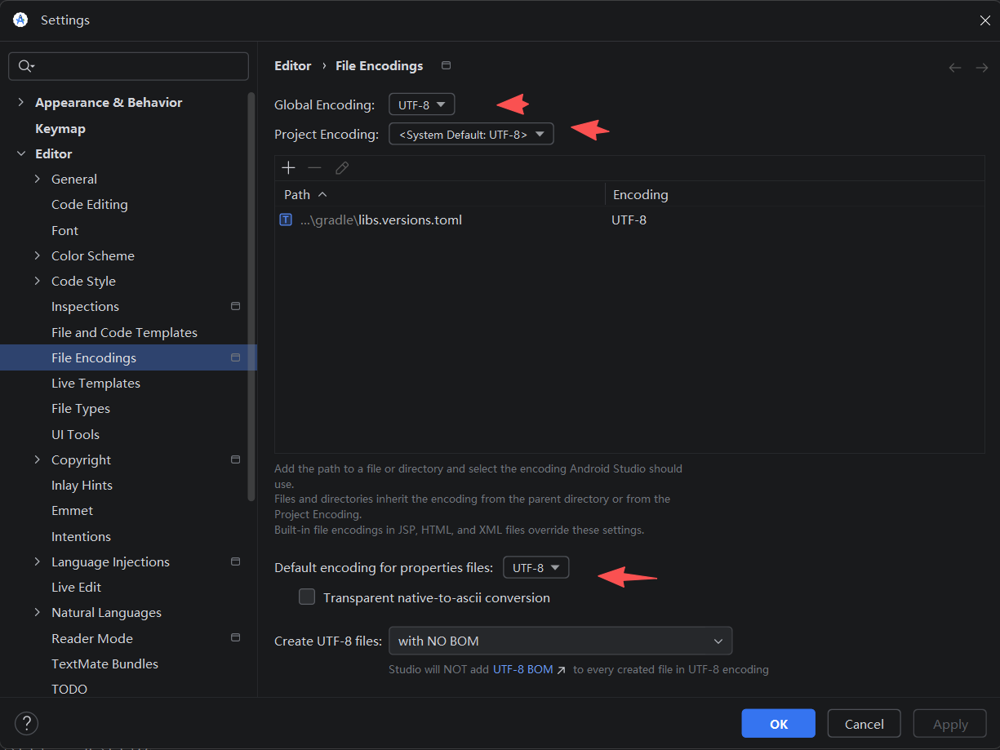
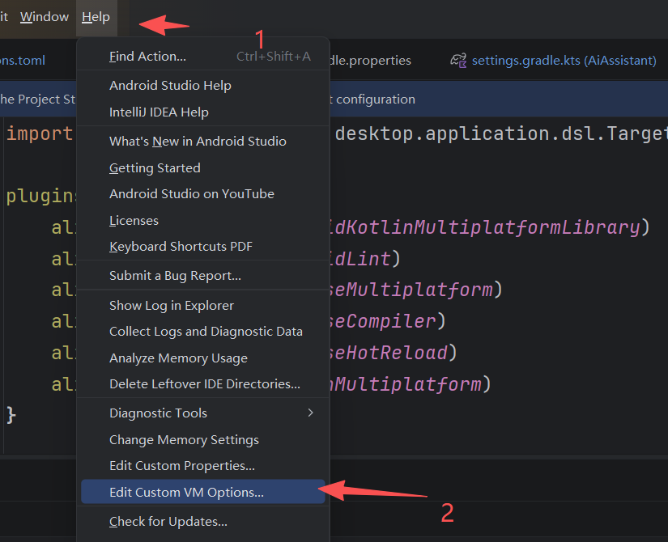
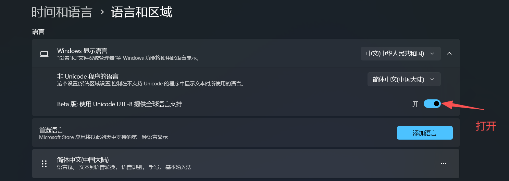

# Android Studio

## 设置

- [Android Studio 修改 .android 和 .gradle 目录](https://hefengbao.github.io/blog/20250310-android-studio-android-gradle-directory)

## android studio build output 中文乱码

设置文件编码：



设置输出编码：



```
-Dstdout.encoding=UTF-8
-Dstderr.encoding=UTF-8
-Dfile.encoding=UTF-8
-Dconsole.encoding=UTF-8
```


Windows 11 还需要做如下设置：



## gradle 下载慢

替换使用国内镜像：

修改 `gradle/wrapper/gradle-wrapper.properties` 中的 `distributionUrl`,比如

```shell
distributionUrl=https\://services.gradle.org/distributions/gradle-9.0.0-bin.zip
```

可修改为（腾讯镜像）

```shell
distributionUrl=https\://mirrors.cloud.tencent.com/gradle/gradle-9.0.0-bin.zip
```

或者（阿里镜像）

```shell
distributionUrl=https\://mirrors.aliyun.com/gradle/gradle-9.0.0-bin.zip
```