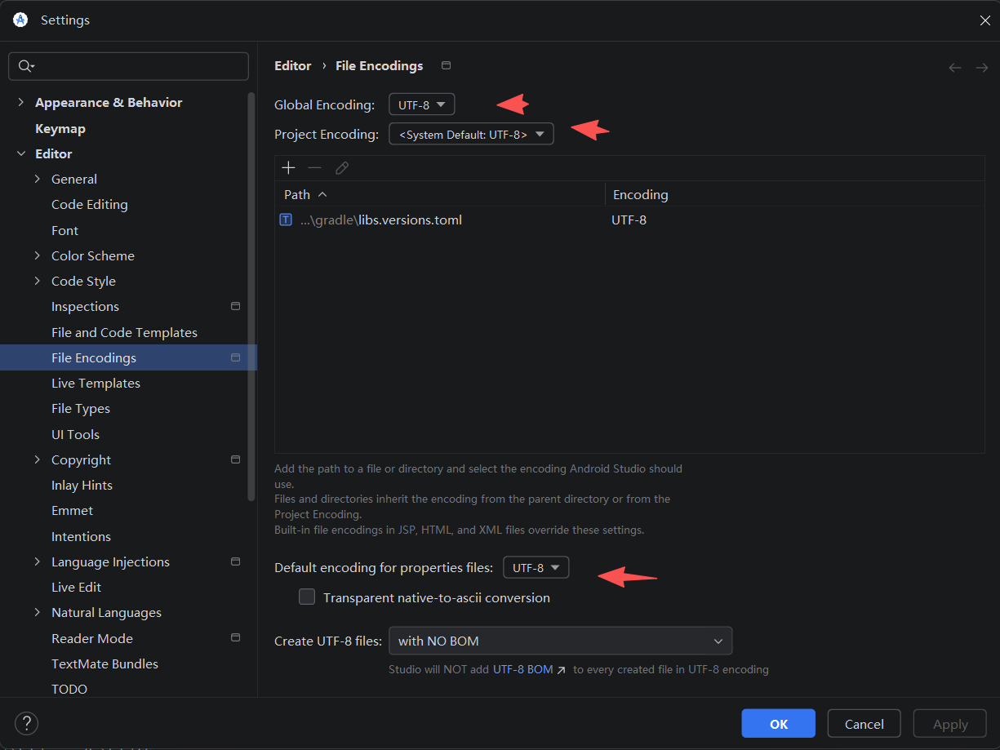
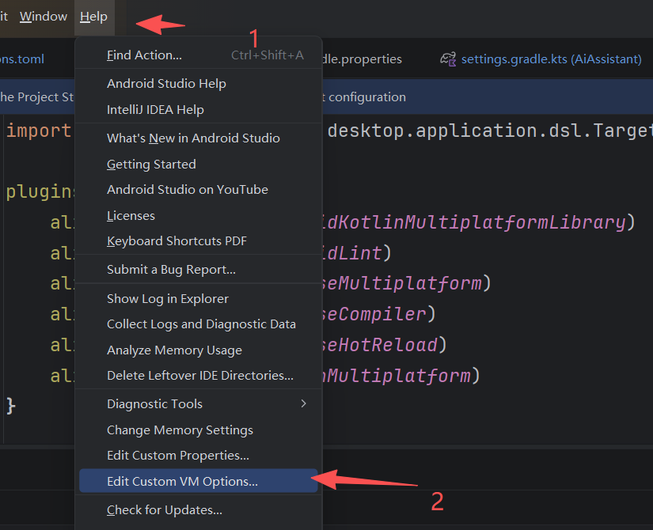

# Android Studio

## 设置

- [Android Studio 修改 .android 和 .gradle 目录](https://hefengbao.github.io/blog/20250310-android-studio-android-gradle-directory)

## android studio build output 中文乱码

设置文件编码：



设置输出编码：



```
-Dstdout.encoding=UTF-8
-Dstderr.encoding=UTF-8
-Dfile.encoding=UTF-8
-Dconsole.encoding=UTF-8
```

KMP 项目 Desktop 使用 `println()` 打印中文乱码， 编辑 `build.gradle.kts:

```
// 确保 Gradle 任务 fork 的 JVM 使用 UTF-8 编码，解决中文输出乱码问题  
tasks.withType<JavaExec>().configureEach {  
    systemProperty("file.encoding", "UTF-8")  
    systemProperty("stdout.encoding", "UTF-8")  
    systemProperty("stderr.encoding", "UTF-8")  
    jvmArgs("-Dfile.encoding=UTF-8")  
}


compose.desktop {  
    application {  
        mainClass = "aiassistant.app.MainKt"  
        jvmArgs += "-Dfile.encoding=UTF-8"  
        jvmArgs += "-Dstdout.encoding=UTF-8"  
        jvmArgs += "-Dstderr.encoding=UTF-8"  
        jvmArgs += "--add-opens=java.desktop/java.awt=ALL-UNNAMED"  
        jvmArgs += "--add-opens=java.desktop/sun.awt=ALL-UNNAMED"  
	}
}
```

另外 [更改 PowerShell 默认编码](https://hefengbao.github.io/hw/devops/env/#%E6%9B%B4%E6%94%B9-powershell-%E9%BB%98%E8%AE%A4%E7%BC%96%E7%A0%81) 为 UTF-8

[关于JDK 21在IDEA控制台中文乱码问题解决_jdk21中文乱码-CSDN博客](https://blog.csdn.net/lifeislikeadream8/article/details/141496725)

## gradle 下载慢


替换使用国内镜像：

修改 `gradle/wrapper/gradle-wrapper.properties` 中的 `distributionUrl`,比如

```shell
distributionUrl=https\://services.gradle.org/distributions/gradle-9.0.0-bin.zip
```

可修改为（腾讯镜像）

```shell
distributionUrl=https\://mirrors.cloud.tencent.com/gradle/gradle-9.0.0-bin.zip
```

或者（阿里镜像）

```shell
distributionUrl=https\://mirrors.aliyun.com/gradle/gradle-9.0.0-bin.zip
```