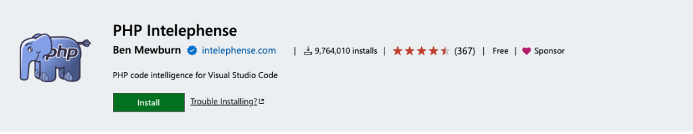
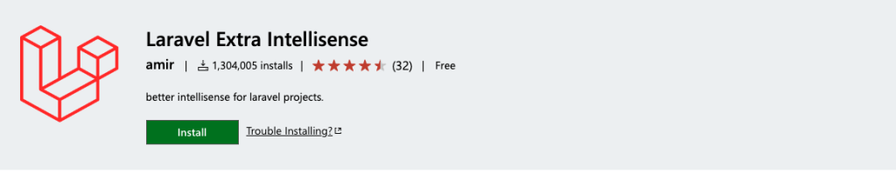
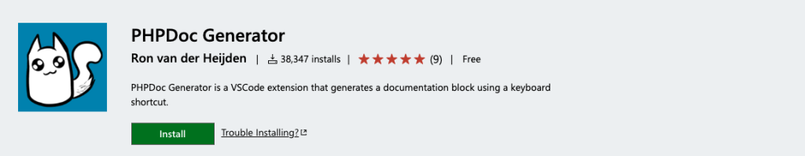
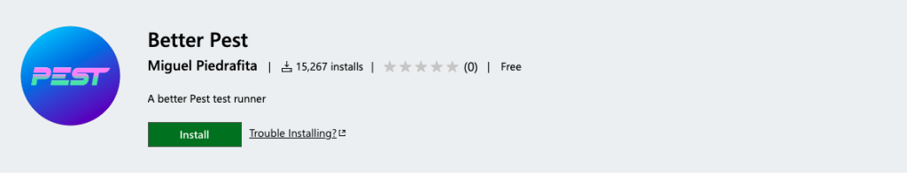
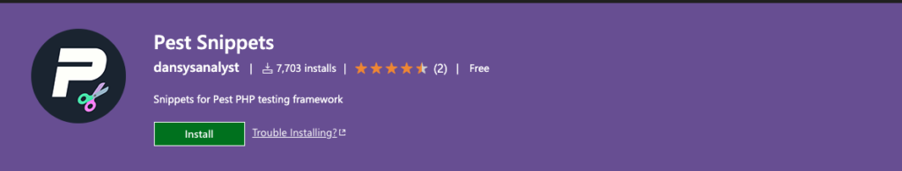

# 使用 vscode 作为 Laravel 开发 IDE

想要 vscode 使用方便，就得安装插件 😄

## 重要

### [PHP Intelephense](https://marketplace.visualstudio.com/items?itemName=bmewburn.vscode-intelephense-client)



如果你想在vscode中进行PHP开发，这是一个非常需要的扩展。为您提供适当的自动完成、错误提示、转到类型定义，提供基于文档注释的自动完成等。它还为您提供WordPress代码完成，但默认情况下未启用。

### [Laravel Extra Intellisense](https://marketplace.visualstudio.com/items?itemName=amiralizadeh9480.laravel-extra-intellisense)



另一个所需的扩展。它将为您提供更好的视图、验证规则、ENV、配置等自动完成功能。

### [Laravel goto view](https://marketplace.visualstudio.com/items?itemName=codingyu.laravel-goto-view)


### [PHPDoc Generator](https://marketplace.visualstudio.com/items?itemName=ronvanderheijden.phpdoc-generator)



我发现定期为类和函数编写文档很好。要使PHPDoc生成器生成PHPDoc块，请将光标放置在具有类、方法或特性的行上，然后按`Control+Enter` 键。

### [Laravel Blade formatted](https://marketplace.visualstudio.com/items?itemName=shufo.vscode-blade-formatter)


保存后会自动格式化 blade 文件。

### [Laravel Blade Snippets](https://marketplace.visualstudio.com/items?itemName=onecentlin.laravel-blade)


Laravel blade 文件的一些重要片段。例如，`b:foreach` 将设置 `foreach` 循环块，`b:if-else` 将设置 `if-else` 条件块。有关更多片段，您可以阅读扩展的详细信息。

### [ENV](https://marketplace.visualstudio.com/items?itemName=IronGeek.vscode-env)


`.env` 文件高亮显示


## 可选项

[pest: 优雅的 PHP 测试框架](https://pestphp.com)

### [Better Pest](https://marketplace.visualstudio.com/items?itemName=m1guelpf.better-pest)



可帮助您从文件、测试范围和全局运行 pest 测试。

键盘快捷键设置示例：

```
  {
    "key": "alt+r",
    "command": "better-pest.run"
  },
  {
    "key": "cmd+k cmd+r",
    "command": "-better-pest.run"
  },
  {
    "key": "alt+f",
    "command": "better-pest.run-file"
  },
  {
    "key": "cmd+k cmd+f",
    "command": "-better-pest.run-file"
  }
```

### [Pest Snippets](https://marketplace.visualstudio.com/items?itemName=dansysanalyst.pest-snippets)



provides some snippets for quickly writing pest related common block of codes.

`:pte` to access all `test()` snippets.

`:pti` to access all `it()` snippets.

`:pex` to access the available `expect()` methods.


参考：

https://script-jungle.com/setup-vscode-for-laravel-development

https://dhanar98.hashnode.dev/best-laravel-dev-tools-for-faster-development-2024

https://alemsbaja.hashnode.dev/recommended-visual-studio-code-extensions-for-laravel-developers