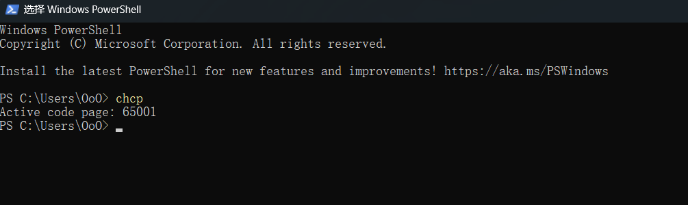
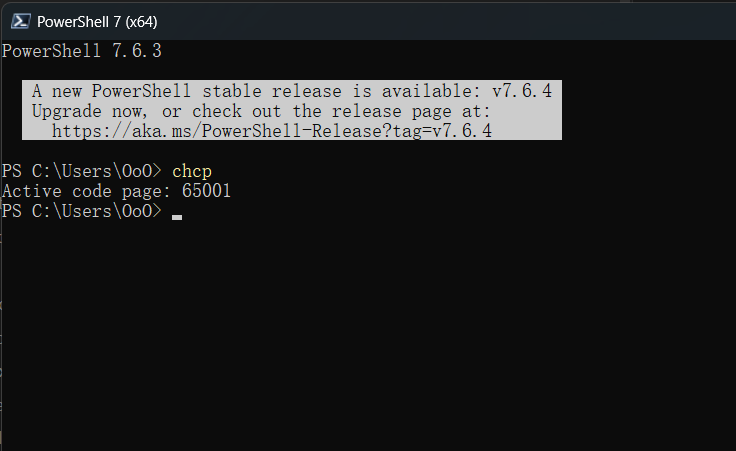

# 开发环境

## Windows

### 更改 PowerShell 默认编码

WindowsPowerShell：

C:\Users\OoO\Documents\WindowsPowerShell

PowerShell：

C:\Users\OoO\Documents\PowerShell

其中 `OoO` 为用户名，更加明了的目录 `C:\Users\OoO\文档\`，找到上述目录，如果目录下没有 `Microsoft.PowerShell_profile.ps1` 文件，则创建，添加如下配置：

```
$OutputEncoding = [console]::InputEncoding = [console]::OutputEncoding = New-Object System.Text.UTF8Encoding
```

关闭所有 Shell 重新打开，验证：





最初为 936

```shell
chcp 936  #gbk  
chcp 65001 #utf-8
```

[更改cmd、powershell默认编码为utf-8](https://blog.csdn.net/qq_43780850/article/details/129122210)

[中文乱码问题的原因](https://www.cnblogs.com/w1920/p/14035438.html)
