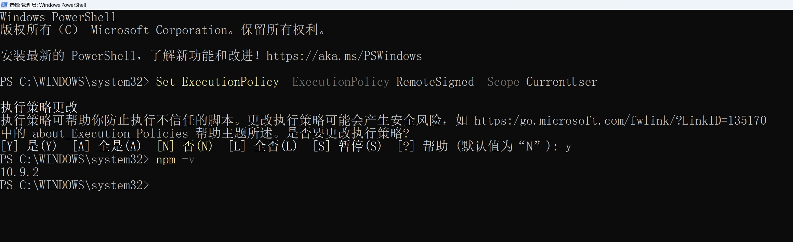
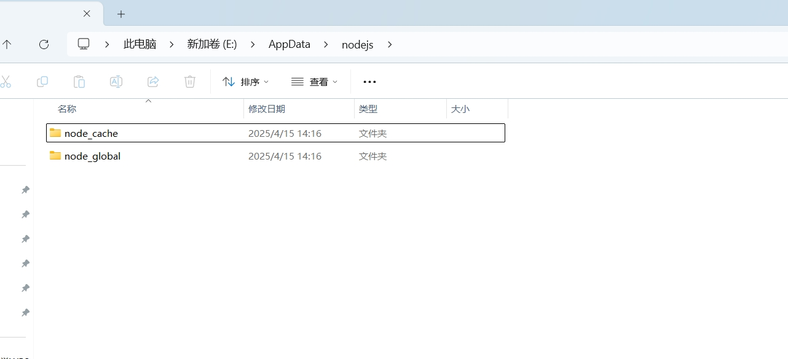
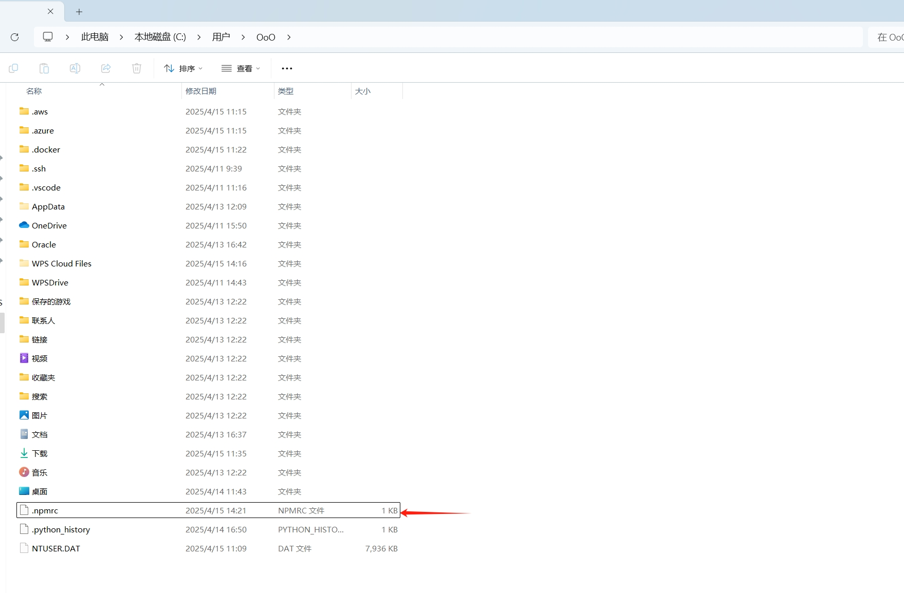
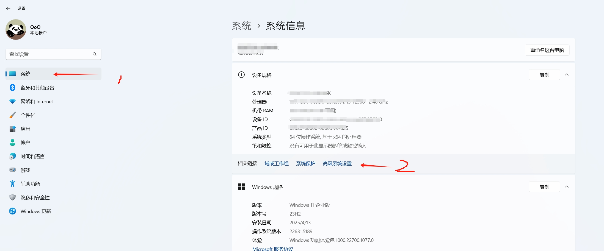
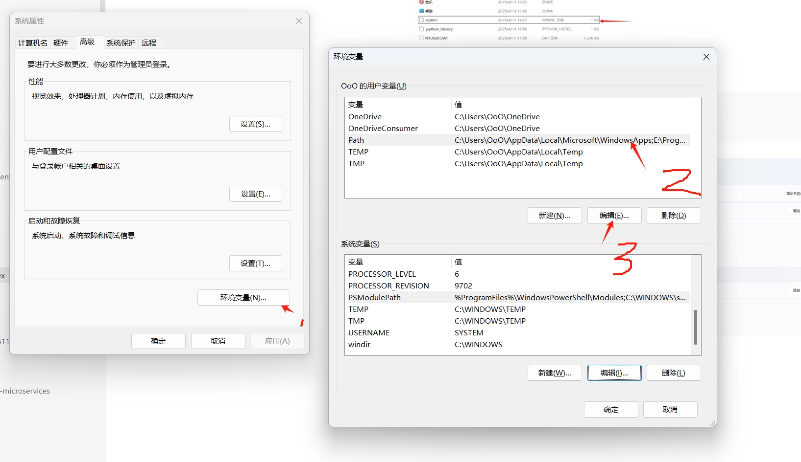
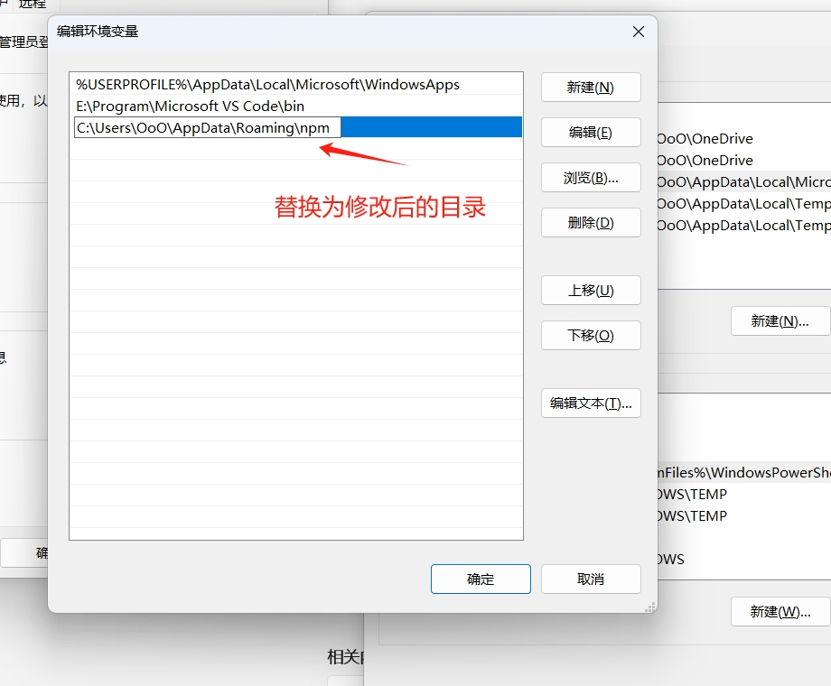
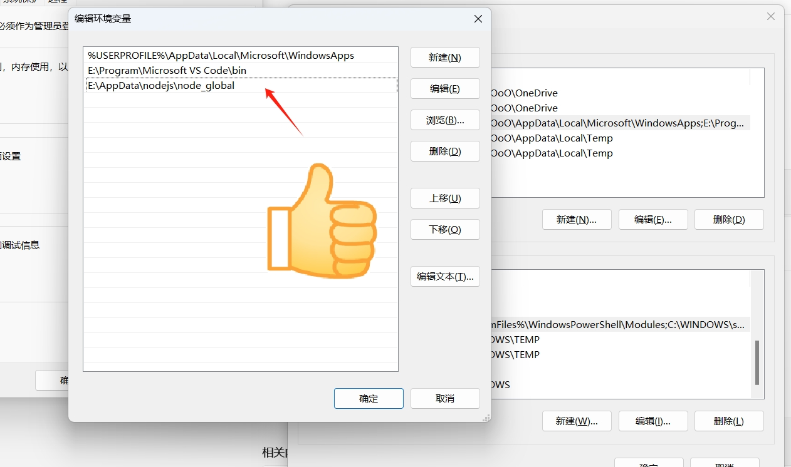

# Windows 安装 Node.js

官方下载 [Node.js — Download Node.js®](https://nodejs.org/zh-cn/download/)

可以自定义安装路径，比如我安装在 `E:\Program\nodejs` 目录下，其他点“下一步/Next” 即可。

运行 `npm -v` 出错😓：

```shell
PS C:\Users\OoO> npm -v
npm : 无法加载文件 E:\Program\nodejs\npm.ps1，因为在此系统上禁止运行脚本。有关详细信息，请参阅 https:/go.microsoft.com/
fwlink/?LinkID=135170 中的 about_Execution_Policies。
所在位置 行:1 字符: 1
+ npm -v
+ ~~~
    + CategoryInfo          : SecurityError: (:) []，PSSecurityException
    + FullyQualifiedErrorId : UnauthorizedAccess
```

解决：

请使用 **以管理员身份运行** 选项启动 PowerShell，运行如下命令[🔗](https://learn.microsoft.com/zh-cn/powershell/module/microsoft.powershell.core/about/about_execution_policies?view=powershell-7.5)：

```shell
Set-ExecutionPolicy -ExecutionPolicy RemoteSigned -Scope CurrentUser
```




`npm config get prefix` 命令查看全局依赖（`inpm insall -g xx`）安装位置，`npm config get cache` 查看 npm 缓存位置，可以看出都在 C 盘目录下。

```shell
PS C:\WINDOWS\system32> npm config get prefix
C:\Users\OoO\AppData\Roaming\npm
PS C:\WINDOWS\system32> npm config get cache
C:\Users\OoO\AppData\Local\npm-cache
```

如果 C 盘空间小，可以修改到其他盘。我的目录 `E:\AppData\nodejs`:



通过如下命令修改目录:

```shell
npm config set cache "E:\AppData\nodejs\node_cache"
```

```shell
npm config set prefix "E:\AppData\nodejs\node_global"
```

保存在`C:\Users\{用户名}` 目录下的 `.npmrc` 文件：


查看 `.npmrc` 文件：

```shell
cache=E:\AppData\nodejs\node_cache
prefix=E:\AppData\nodejs\node_global
```

修改环境变量，以下打开“环境变量”是基于 Windows 11 演示：









## 安装 pnpm

```shell
npm i -g pnpm
```

修改 `pnpm` 保存目录, 示例：

```shell
pnpm config set store-dir "E:\AppData\.pnpm-store"
```

验证：

```shell
pnpm store path  
```

结果示例：

```shell
E:\AppData\.pnpm-store\v10
```

