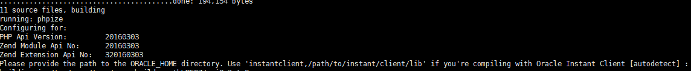
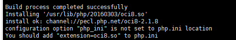
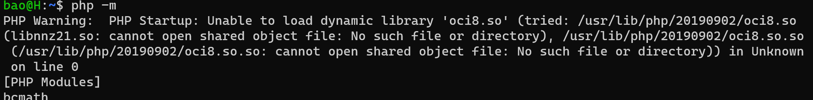
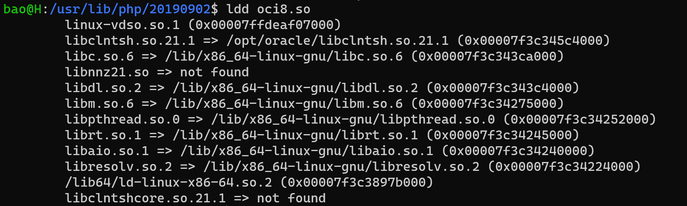
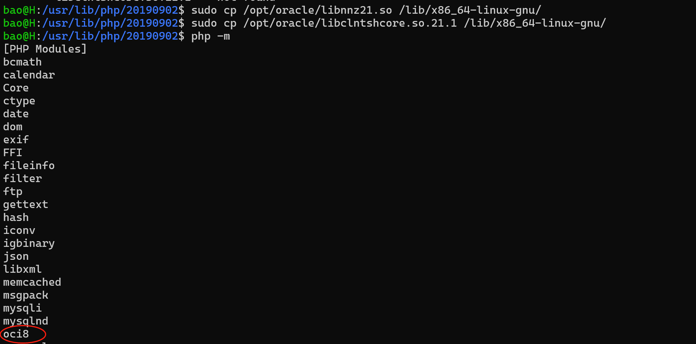

# Ubuntu 安装 Oracle Instant Client 和 OCI


下载 oracle 的 instantclient [https://www.oracle.com/database/technologies/instant-client/linux-x86-64-downloads.html](https://www.oracle.com/database/technologies/instant-client/linux-x86-64-downloads.html) :

```shell
cd /home/bao

wget https://download.oracle.com/otn_software/linux/instantclient/2111000/instantclient-basic-linux.x64-21.11.0.0.0dbru.zip
wget https://download.oracle.com/otn_software/linux/instantclient/2111000/instantclient-sdk-linux.x64-21.11.0.0.0dbru.zip

unzip instantclient-basic-linux.x64-21.11.0.0.0dbru.zip
unzip instantclient-sdk-linux.x64-21.11.0.0.0dbru.zip
```

如果没有安装 `unzip`:

```shell
apt install unzip
```

放到 ` /opt/oracle/` 目录下（可选项）：

```shell
mkdir /opt/oracle

mv  instantclient_21_11/  /opt/oracle/instantclient_21_11/
```

设置环境变量：

```shell
export LD_LIBRARY_PATH=/opt/oracle/instantclient_21_11:$LD_LIBRARY_PATH
```

添加环境变量到 `.bashrc`，使终端重启时仍然生效：

```shell
vi ~/.bashrc
```

在最后一行添加：

```shell
export LD_LIBRARY_PATH=/opt/oracle/instantclient_21_11:$LD_LIBRARY_PATH
```

保存后，运行如下命令使其生效：

```shell
source ~/.bashrc
```

我选择的 instantclient 需要 `glibc 2.14` 以上的版本，安装参考 [Ubuntu 安装 glibc](https://hefengbao.github.io/hw/os/linux/blog/20230709-ubuntu-install-glibc)。

可通过如下命令查看 glibc 版本 ：

```shell
ldd --version
```

下载 oci8 并解压：

```shell
cd ~
wget https://pecl.php.net/get/oci8-3.3.0.tgz
tar -zxf oci8-3.3.0.tgz
cd oci8-3.3.0
```

安装 oci8：

```shell
phpize

./configure -with-oci8=shared,instantclient,/opt/oracle/instantclient_21_11

make & make install
```

成功后的消息：

```shell
Libraries have been installed in:
   /root/oci8-3.3.0/modules

If you ever happen to want to link against installed libraries
in a given directory, LIBDIR, you must either use libtool, and
specify the full pathname of the library, or use the '-LLIBDIR'
flag during linking and do at least one of the following:
   - add LIBDIR to the 'LD_LIBRARY_PATH' environment variable
     during execution
   - add LIBDIR to the 'LD_RUN_PATH' environment variable
     during linking
   - use the '-Wl,-rpath -Wl,LIBDIR' linker flag
   - have your system administrator add LIBDIR to '/etc/ld.so.conf'

See any operating system documentation about shared libraries for
more information, such as the ld(1) and ld.so(8) manual pages.
----------------------------------------------------------------------
Installing shared extensions:     /usr/lib/php/20220829/
```

编辑 `php.ini`，在 【Dynamic Extensions 】后添加如下内容：

```shell
extension=oci8.so
```

```shell
vi /etc/php/8.2/cli/php.ini
vi /etc/php/8.2/fpm/php.ini
```

在 cli 模式下用的好好的，但是部署到服务器后，出现错误 `Undefined constant "Yajra\Pdo\OCI_DEFAULT" found` ，最后解决方法：

```shell
sudo sh -c "echo /opt/oracle/instantclient_21_11 > \
      /etc/ld.so.conf.d/oracle-instantclient.conf"
sudo ldconfig
```

这样总算可以了！！！

参考：

[https://pecl.php.net/package/oci8](https://pecl.php.net/package/oci8)

[https://www.php.net/manual/zh/oci8.installation.php](https://www.php.net/manual/zh/oci8.installation.php)

--

高版本需要安装 `glibc  2.14` 及以上版本

[glibc的安装配置_glibc环境变量](https://blog.csdn.net/mengzhongsuiyi521/article/details/88432237)

## ZIP 文件安装

在官网 http://www.oracle.com/technetwork/topics/linuxx86-64soft-092277.html 下载：Instant Client Package - Basic 和 Instant Client Package - SDK ，我选的版本是Version 21.1.0.0.0，下载 zip 格式的， 由于需要登录，所以最好在桌面电脑下载好，然后上传到 Ubuntu 服务器。我上传到 `/opt/oracle` 目录，在下载页面的底端，有安装的文档，我也把我安装的过程写出来：

1、解压：

使用 `unzip` 命令，可通过 `sudo apt-get install unzip` 安装。

```
unzip instantclient-basic-linux.x64-21.1.0.0.0.zip
unzip instantclient-sdk-linux.x64-12.2.0.1.0.zip 
```

解压到的目录是 `/opt/oracle`

2、创建适合的软连接

`libclntsh.so`，`libocci.so` 这两文件已经有了，但是发现会报错，删除后，建立软连接：
```
cd /instantclient_21_1
ln -s libclntsh.so.21.1 libclntsh.so
ln -s libocci.so.21.1 libocci.so
```

3、安装 oci8

一点准备：

```
apt-get install make  //为了后面的编译软件使用
apt-get install php-pear  //为了得到 pecl 这个程序
apt-get install php7.4-dev  //为了得到 phpize 这个程序
```

运行 `sudo pecl install oci8-2.2.0` 命令,



出现如上界面，按提示输入：

```
instantclient,/opt/oracle/
```

回车，不出意外，会安装成功。



按提示，把 `extension=oci8.so` 添加到 `/etc/php/7.4/fpm/php.ini ` 和 `/etc/php/7.4/cli/php.ini ` 中，可通过 `php -m` 或 `echo phpinfo()` 查看。

---

## 遇到的问题：





把缺失的文件拷贝到相应目录即可。



参考：

http://pecl.php.net/package/oci8