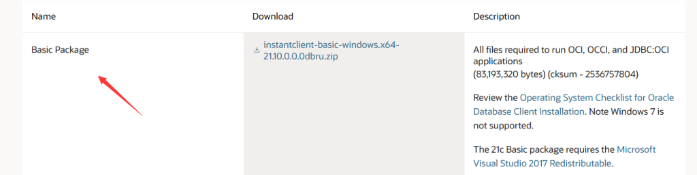
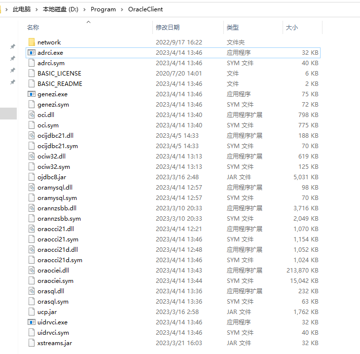
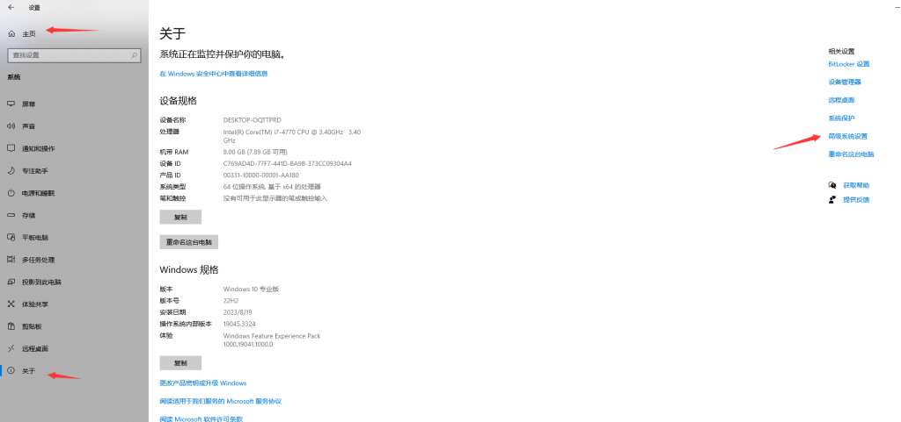

# Windows 10 安装配置 PL/SQL

先安装配置 Oracle 客户端，下载 [Oracle Instant Client Downloads for Microsoft Windows (x64) 64-bit](https://www.oracle.com/database/technologies/instant-client/winx64-64-downloads.html)



下载后解压，例如我的目录是：`D:\Program\OracleClient`,



配置环境变量：



在 `path` 中添加 `D:\Program\OracleClient`。

如果下载的 OracleClient 版本比较高，比如这里使用的 `Version 21.12.0.0.0`, 注意下载链接的 Description 最后一项：

The 21c Basic package requires the [Microsoft Visual Studio 2017 Redistributable](https://support.microsoft.com/en-us/help/2977003/the-latest-supported-visual-c-downloads).

如果没有安装，启动 PL/SQL 客户端会报错：

```
不能初始化 "..\oci.dll"

Make sure you have the 64 bits Oracle Client installed.

你确认已安装了64位Oracle Client 吗？

```

其他语言、日期格式配置：


```
变量名：NLS_LANG
变量值：SIMPLIFIED CHINESE_CHINA.ZHS16GBK

变量名：NLS_DATE_FORMAT
变量值：YYYY-MM-DD HH24:MI:SS

变量名：NLS_TIMESTAMP_FORMAT
变量值：YYYY-MM-DD HH24:MI:SS
```

下载安装 PL/SQL，注册码网上也有😀。

下载地址：https://www.allroundautomations.com/try-it-free/

一个可用的 PL/SQL 15 注册码：

>product code : ke4tv8t5jtxz493kl8s2nn3t6xgngcmgf3   
>serial Number: 264452   
>password: xs374ca   

在 `D:\Program\OracleClient\network\admin` 目录下创建 `tnsnames.ora` 文件（如果没有的话），在 `tnsnames.ora` 文件中配置 TNS，然后打开 PL/SQL 测试连接数据库。