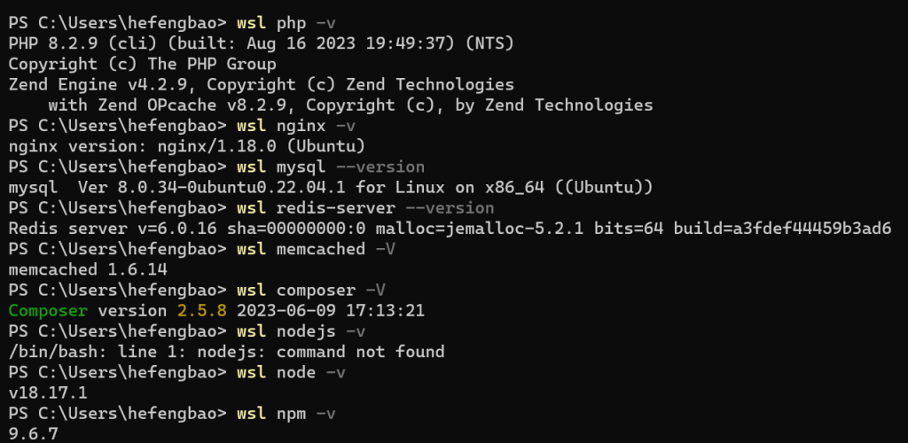
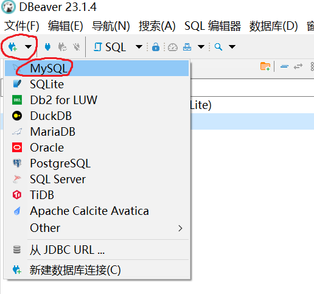
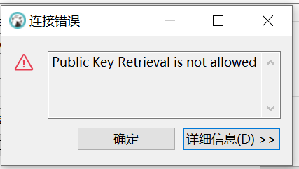
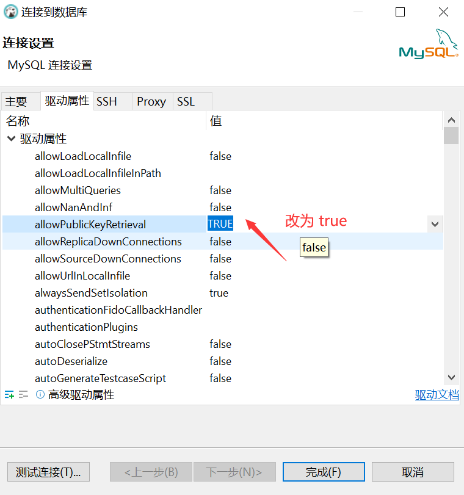
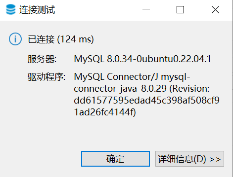

# Ubuntu 服务器配置 LEMP 环境

Ubuntu 安装 LEMP （Nginx、MySQL、PHP）开发环境，以及安装 Composer、Nodejs（npm）、Redis、Memcached 等。

## 系统更新

```shell
sudo bash # 之后就可以省略输入 sudo 

apt-get update

apt-get upgrade -y
```

## 安装 PPAs

```shell
apt-add-repository ppa:ondrej/php -y

apt-get update
```

## 安装一些基本软件包

```shell
apt-get install -y build-essential dos2unix gcc git git-lfs libmcrypt4 libpcre3-dev libpng-dev chrony unzip make pv \
python3-pip re2c supervisor unattended-upgrades whois vim cifs-utils bash-completion zsh graphviz avahi-daemon tshark
```

## 安装 PHP 通用包

```shell
apt-get install -y --allow-change-held-packages \
php-imagick php-memcached php-redis php-xdebug php-dev php-swoole
```

## 安装 PHP 8.3

```shell
apt-get install -y --allow-change-held-packages \
php8.3 php8.3-bcmath php8.3-bz2 php8.3-cgi php8.3-cli php8.3-common php8.3-curl php8.3-dba php8.3-dev \
php8.3-enchant php8.3-fpm php8.3-gd php8.3-gmp php8.3-imap php8.3-interbase php8.3-intl php8.3-ldap \
php8.3-mbstring php8.3-mysql php8.3-odbc php8.3-opcache php8.3-pgsql php8.3-phpdbg php8.3-pspell php8.3-readline \
php8.3-snmp php8.3-soap php8.3-sqlite3 php8.3-sybase php8.3-tidy php8.3-xml php8.3-xsl \
php8.3-zip php8.3-imagick php8.3-memcached php8.3-redis php8.3-xmlrpc php8.3-xdebug
```

编辑 `/etc/php/8.3/fpm/php.ini` :

```shell
cgi.fix_pathinfo=0
```

## 安装 Nginx

```shell
apt-get install -y --allow-downgrades --allow-remove-essential --allow-change-held-packages nginx
```

## 安装 mysql

```shell
apt install -y mysql-server mysql-client mysql-common
```

运行 `sudo mysql` 命令即可以 root 账户登录 mysql，添加用户并授权，之前用 Homestead 开发环境，这里沿用 `homestead`、`secret`  作为数据库的默认账号密码，可自行修改：

```shell
CREATE USER IF NOT EXISTS 'homestead'@'%' IDENTIFIED BY 'secret';
GRANT ALL PRIVILEGES ON *.* TO 'homestead'@'%';
FLUSH PRIVILEGES;
```

## 安装 Sqlite

```
apt-get install -y sqlite3 libsqlite3-dev
```


# 安装 Redis, Memcached
```shell
apt-get install -y redis-server memcached

# redis 开机自启动
systemctl enable redis-server

service redis-server start
```


# 安装 Composer

```shell
curl -sS https://getcomposer.org/installer | php
mv composer.phar /usr/local/bin/composer
```


# 安装 NodeJS

```shell
curl -SLO https://deb.nodesource.com/nsolid_setup_deb.sh

chmod 500 nsolid_setup_deb.sh

./nsolid_setup_deb.sh 20

apt-get install nodejs -y
```

其中 `20` 为版本号，查看[https://nodejs.org/](https://nodejs.org/) 最新版本信息。

参考：[https://github.com/nodesource/distributions#installation-scripts](https://github.com/nodesource/distributions#installation-scripts)

通过终端查看各个软件的版本：



测试连接 mysql ，我客户端用的是 [dbeaver 社区版](https://dbeaver.io/download/)：










参考：

[https://github.com/laravel/homestead/blob/main/bin/wsl-init](https://github.com/laravel/homestead/blob/main/bin/wsl-init)