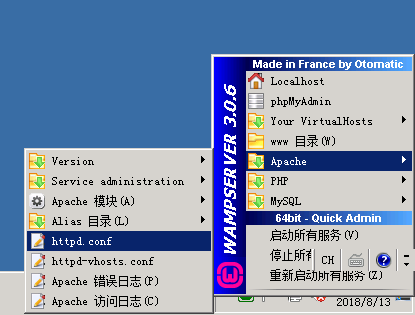

# WAMPServer 之 Apache 日志分割

WAMPServer 服务器访问出错，想看看访问日志，但是累积的日志文件过大（1.4G），文本编辑器没法打开，便打算做日志分割，在网上找到了办法，并能正确设置，现在记录一下：



打开 `httpd.conf ` 文件，查找 `ErrorLog` ,作如下修改：

```
ErrorLog "|${INSTALL_DIR}/bin/apache/apache2.4.23/bin/rotatelogs.exe ${INSTALL_DIR}/logs/error-%y%m%d.log 86400 480"
```

查找 `CustomLog` 作如下修改：

```
CustomLog "|${INSTALL_DIR}/bin/apache/apache2.4.23/bin/rotatelogs.exe ${INSTALL_DIR}/logs/access-%y%m%d.log 86400 480" common
```

重启所有服务。


参考：
[window apache 日誌分割](https://hk.saowen.com/a/ee25d00cba77cd2b7e90acc31fdb90039b2132a9ba8040b9c887a8345bbd5a04)