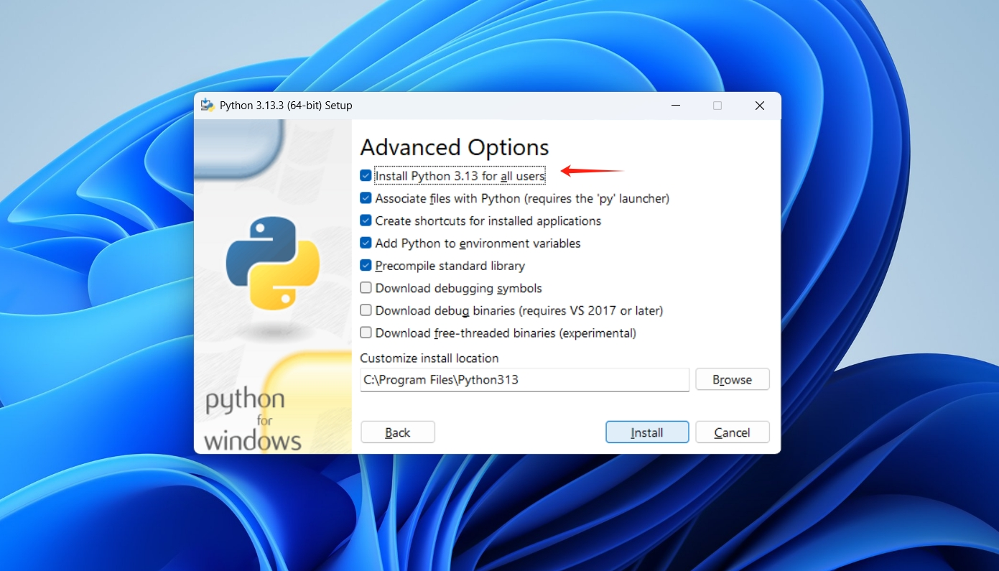

# 安装 Python

## Windows

### 从 Microsoft Store 安装


安装多个版本


### 下载安装包安装

从官网 [https://www.python.org/downloads/](https://www.python.org/downloads/) 下载。


安装步骤：





## Mac

下载 [Download Python | Python.org](https://www.python.org/downloads/) 相应的安装包，安装步骤可参考上面的示例

## Linux

通常可使用命令安装。

```shell
sudo apt install python
```


通过 `python --version` 命令可检查是否安装成功，也可查看当前使用的 python 版本号。


