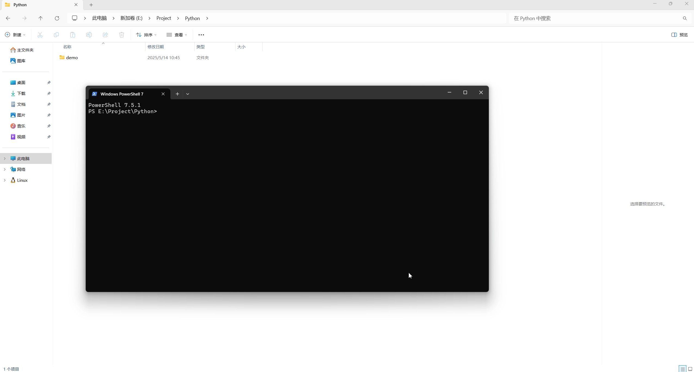
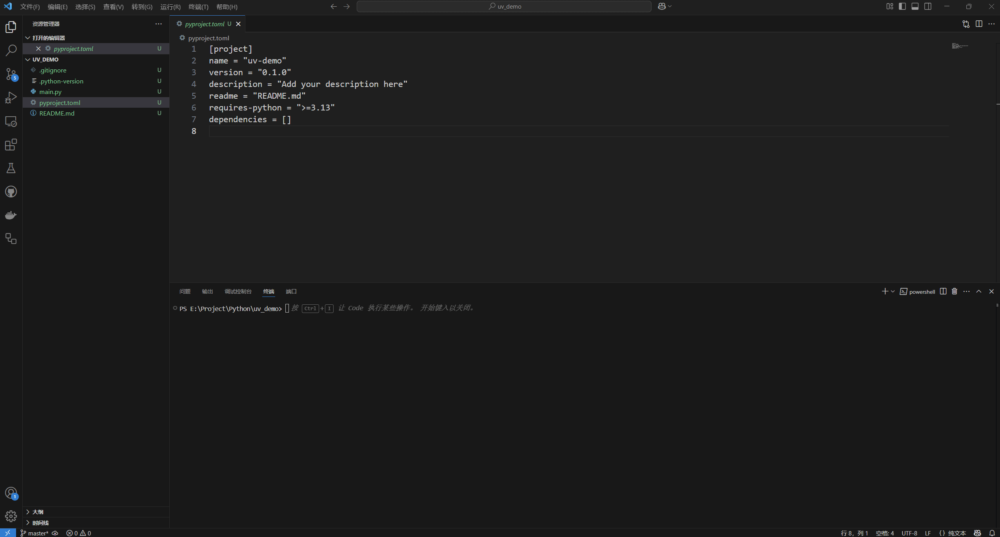
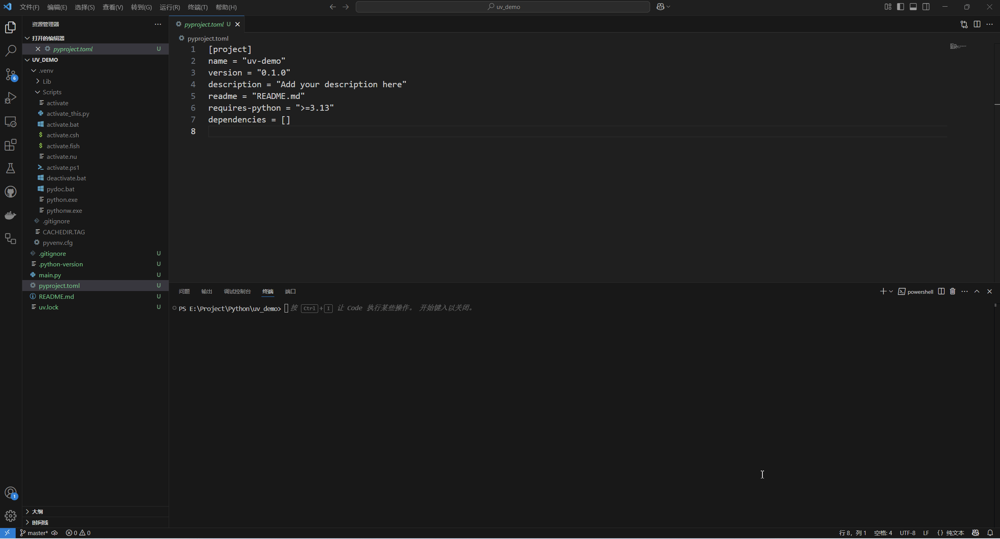

# uv

## 安装

官方文档 [Installation | uv](https://docs.astral.sh/uv/getting-started/installation/)

### Windows

```shell
powershell -ExecutionPolicy ByPass -c "irm https://astral.sh/uv/install.ps1 | iex"
```

### Linux || MacOS

```shell
curl -LsSf https://astral.sh/uv/install.sh | sh

# 或者

wget -qO- https://astral.sh/uv/install.sh | sh
```

## 创建项目

```shell
uv init <project_name>
```


## 创建虚拟环境

```shell
uv venv

# 或者

uv sync
```



## 安装依赖

示例：

```shell
uv add requests
```




```shell
uv add --group production requests
```

```shell
uv add --group dev requests
```
[Features | uv](https://docs.astral.sh/uv/getting-started/features/#projects)