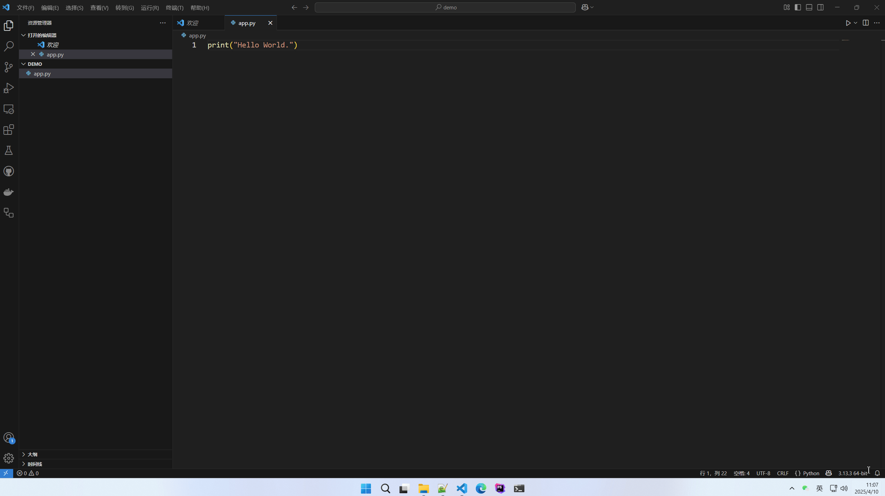
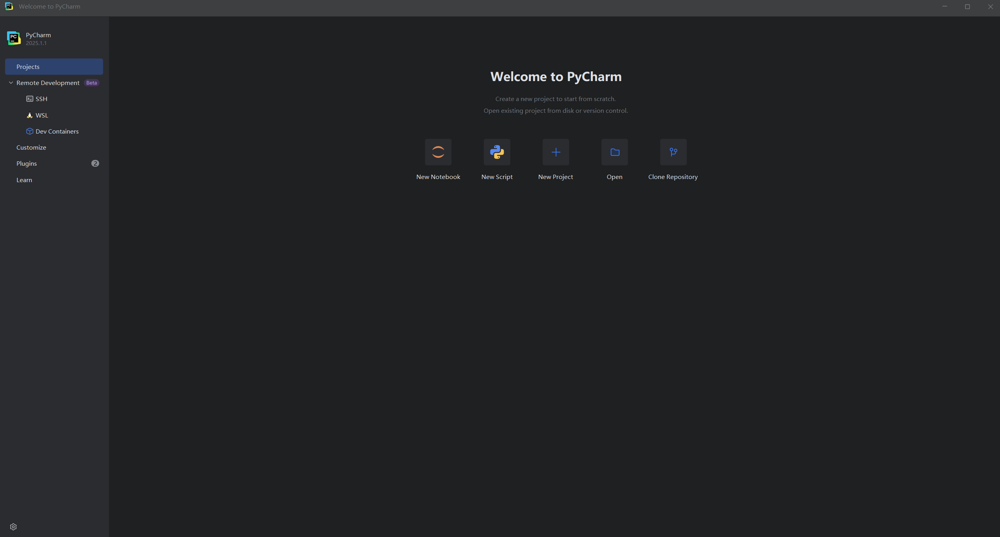
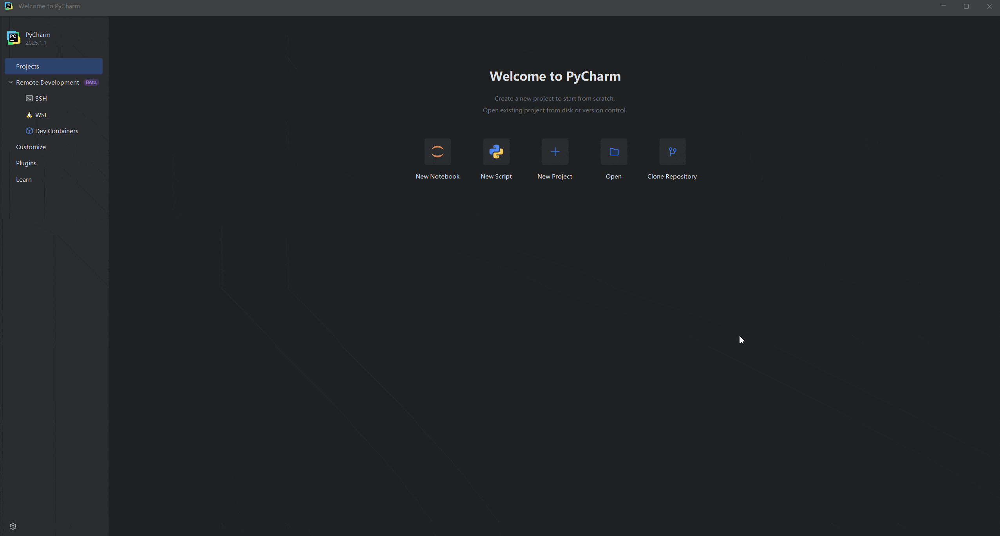
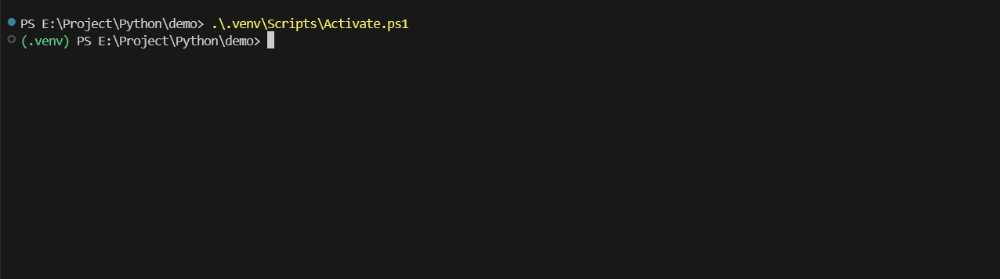
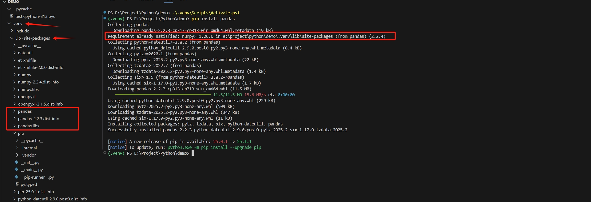
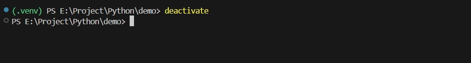

# 虚拟环境

## venv

无论是使用 VS Code 或者 PyCharm 可以方便创建 `venv` 环境：

VS Code 创建虚拟环境：



PyCharm 创建虚拟环境：

新建项目：



已有项目：



进入虚拟环境：

```shell
激活环境
# macOS / Linux
source .venv/bin/activate

# windows
.venv\Scripts\activate
```



安装 `pandas` 示例：

```shell
pip install pandas
```

可以看到安装的 `pandas` 在虚拟目录下👇



退出虚拟环境：

```shell
deactivate
```


