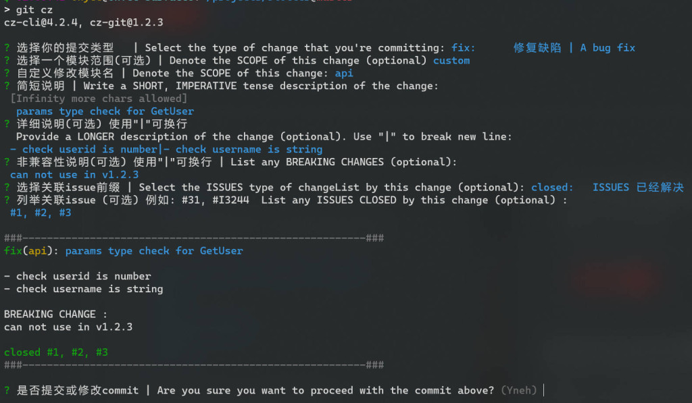

# Git Commit 规范化工具

## 格式规范

对于比较通用的规范而言，commit 信息为如下格式

```shell
<type>[(<scope>)]: (<emoji>) <subject>

[body]

[breaking changes]

[footer]
```

一个完整的 commit 可能长如下的模样

```shell
fix(api): 🐛 params type check for GetUser

- check userid is number
- check username is string

BREAKING CHANGE :
can not use in v1.2.3

closed #1, #2, #3
```

对于一个 commit，其至少应该包含 `type` 和 `subject` 两部分。

- `type` 可能包含以下几种可能：
	- `chore`: 构建过程或辅助工具更改
	- `ci`: CI 相关更改
	- `docs`: 文档更改
	- `feat`: 新功能特性
	- `fix`: 修复 Bug
	- `perf`: 性能优化
	- `refactor`: 功能重构（未修复 Bug 或添加功能）
	- `release`: 发布新版本
	- `style`: 修改代码样式（缩进、空格、换行、分号）
	- `test`: 添加测试样例
- `subject` 是对于改动的简短描述，用一句话进行概述
- `scope` 是改动涉及的范围，如 xx 模块、xx 分层。如果不需要可以省略
- `emoji` 与 `type` 绑定，是固定的 emoji 表情
- `body` 是对于改动详细描述，可以使用多行描述
- `breaking changes` 用于描述与旧版本不兼容的改动，也可以用来生成更新日志
- `footer` 用于描述与 Github 等系统的联动，如关联 issue、PR

## 工具

大部分情况下，手打 commit 并不麻烦。但是对于不同的项目，scope 等信息可能是固定的，通过选择更方便填写（同时避免错误）

因此适当的第三方工具可以有效辅助 commit 填写

比较了相关的项目，推荐使用 [ commitizen/cz-cli](https://github.com/commitizen/cz-cli) 和 [Zhengqbbb/cz-git](https://github.com/Zhengqbbb/cz-git) 组合使用（其他工具在涉及换行等需要时，可能存在问题）



安装依赖于 npm

```shell
npm install -g cz-git commitizen
```

安装完成后还需要在用户目录添加配置文件 `~/.czrc`

如果对于不同的项目，需要添加不同的配置，也可以在项目目录中进行配置（详见官方文档）

```shell
{
    "path": "cz-git",
    "messages": {
        "type": "选择你的提交类型   | Select the type of change that you're committing:",
        "scope": "选择一个模块范围(可选) | Denote the SCOPE of this change (optional)",
        "customScope": "自定义修改模块名 | Denote the SCOPE of this change:",
        "subject": "简短说明 | Write a SHORT, IMPERATIVE tense description of the change:\n",
        "body": "详细说明(可选) 使用\"|\"可换行 \n  Provide a LONGER description of the change (optional). Use \"|\" to break new line:\n",
        "breaking": "非兼容性说明(可选) 使用\"|\"可换行 | List any BREAKING CHANGES (optional):\n",
        "footerPrefixsSelect": "选择关联issue前缀 | Select the ISSUES type of changeList by this change (optional):",
        "customFooterPrefixs": "输入自定义issue前缀 | Input ISSUES Prefix:",
        "footer": "列举关联issue (可选) 例如: #31, #I3244  List any ISSUES CLOSED by this change (optional) :\n",
        "confirmCommit": "是否提交或修改commit | Are you sure you want to proceed with the commit above?"
    },
    "types": [
        {
            "value": "feat",
            "name": "feat:     新增功能 | A new feature"
        },
        {
            "value": "fix",
            "name": "fix:      修复缺陷 | A bug fix"
        },
        {
            "value": "release",
            "name": "release:  发布版本 | release a new version"
        },
        {
            "value": "docs",
            "name": "docs:     文档更新 | Documentation only changes"
        },
        {
            "value": "style",
            "name": "style:    代码格式 | Changes that do not affect the meaning of the code"
        },
        {
            "value": "refactor",
            "name": "refactor: 代码重构 | A code change that neither fixes a bug nor adds a feature"
        },
        {
            "value": "perf",
            "name": "perf:     性能提升 | A code change that improves performance"
        },
        {
            "value": "test",
            "name": "test:     测试相关 | Adding missing tests or correcting existing tests"
        },
        {
            "value": "build",
            "name": "build:    构建相关 | Changes that affect the build system or external dependencies"
        },
        {
            "value": "ci",
            "name": "ci:       持续集成 | Changes to our CI configuration files and scripts"
        },
        {
            "value": "revert",
            "name": "revert:   回退代码 | Revert to a commit"
        },
        {
            "value": "chore",
            "name": "chore:    其他修改 | Other changes that do not modify src or test files"
        }
    ],
    "useEmoji": false,
    "scopes": [],
    "allowCustomScopes": true,
    "allowEmptyScopes": true,
    "customScopesAlign": "bottom",
    "customScopesAlias": "custom",
    "emptyScopesAlias": "empty",
    "upperCaseSubject": false,
    "allowBreakingChanges": [
        "feat",
        "fix"
    ],
    "breaklineNumber": 100,
    "breaklineChar": "|",
    "skipQuestions": [],
    "issuePrefixs": [
        {
            "value": "link",
            "name": "link:     将任务状态更改为进行中"
        },
        {
            "value": "closed",
            "name": "closed:   ISSUES 已经解决"
        }
    ],
    "customIssuePrefixsAlign": "top",
    "emptyIssuePrefixsAlias": "skip",
    "customIssuePrefixsAlias": "custom",
    "confirmColorize": true,
    "maxHeaderLength": null,
    "maxSubjectLength": null,
    "minSubjectLength": 0,
    "defaultBody": "",
    "defaultIssues": "",
    "defaultScope": "",
    "defaultSubject": ""
}
```

而后，使用 `git cz` 替代 `git commit` 即可

转自：https://www.ohyee.cc/post/note_git_commit

参考：

https://xie.infoq.cn/article/dffa8c4efd68796bc526639ee

https://segmentfault.com/a/1190000040879546

https://segmentfault.com/a/1190000040995531