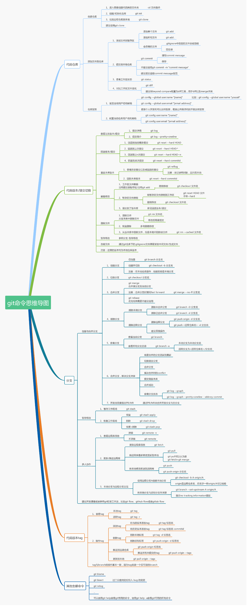

# Git

## 使用

- [Git 使用](./usage)
- [Git Commit规范化工具](https://hefengbao.github.io/blog/20231026-git-commit-format)
- [图解Git](https://marklodato.github.io/visual-git-guide/index-zh-cn.html)
- [Oh My Git!|一款关于学习Git的开源游戏！](https://ohmygit.org/)

## 安装

- [Ubuntu搭建git server](https://hefengbao.github.io/blog/20170711-ubuntu-install-git-server)

