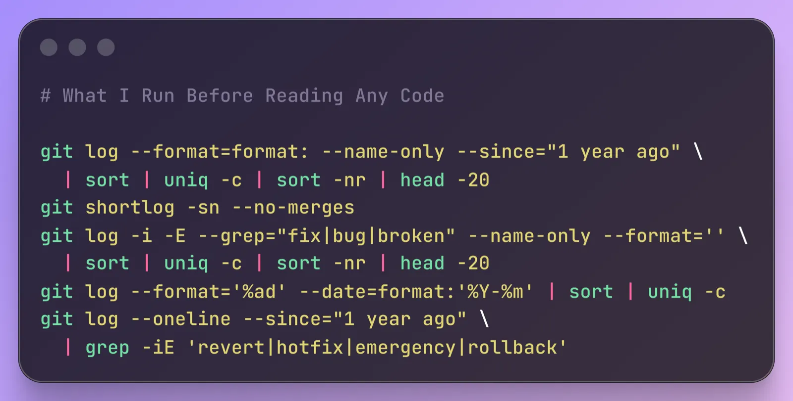

# 技巧

## 阅读代码之前先跑这5条 git 命令



### What Changes the Most

```bash
git log --format=format: --name-only --since="1 year ago" | sort | uniq -c | sort -nr | head -20
```

### Who Built This

```bash
git shortlog -sn --no-merges
```

### Where Do Bugs Cluster

```bash
git log -i -E --grep="fix|bug|broken" --name-only --format='' | sort | uniq -c | sort -nr | head -20
```

### Is This Project Accelerating or Dying

```bash
git log --format='%ad' --date=format:'%Y-%m' | sort | uniq -c
```

### How Often Is the Team Firefighting

```bash
git log --oneline --since="1 year ago" | grep -iE 'revert|hotfix|emergency|rollback'
```

[The Git Commands I Run Before Reading Any Code](https://piechowski.io/post/git-commands-before-reading-code/)