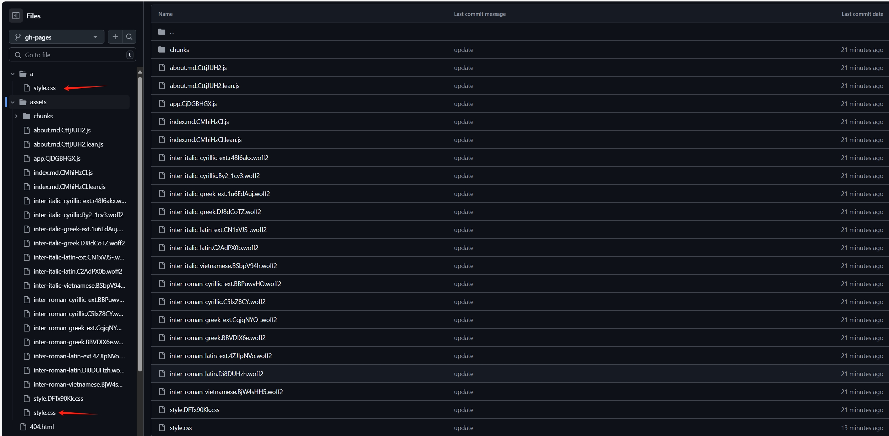
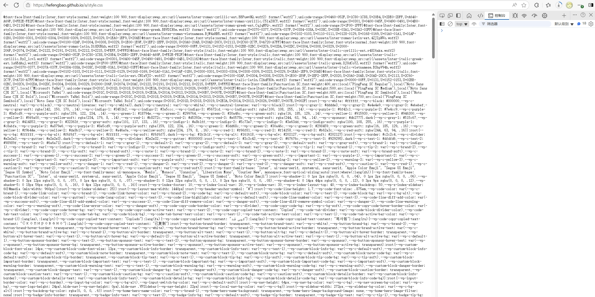
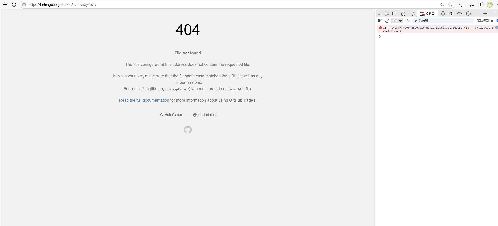

# hefengbao.github.io 无法加载样式

在 https://github.com/hefengbao/hefengbao.github.io 仓库使用 `vitepress`  建立站点，部署到 Github Page 后，访问 https://hefengbao.github.io 不能加载样式,，因为使用 vitepress 建立过 https://hefengbao.github.io/knowledge 等站点，所以配置是没问题的，做了一些测试，发现无法加载 `assets` 目录下的文件，然而 https://hefengbao.github.io/knowledge 站点下却是没问题的😓。









于是想有没有办法修改打包后静态资源输出的目录名称，查找 vitepress 的文档，果然可以设置：https://vitepress.dev/zh/reference/site-config#assetsdir。

```js
export default {
  assetsDir: 'static'
}
```