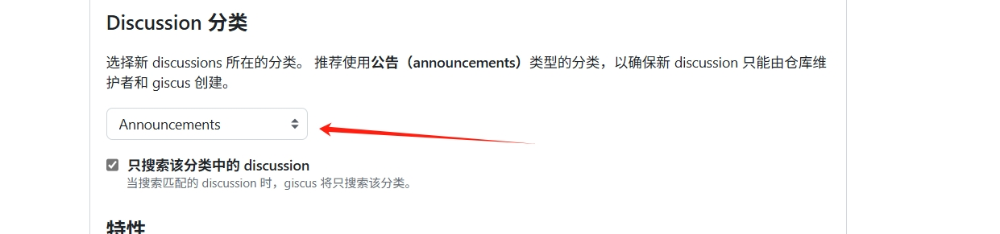

# Vitepress 集成 Giscus 评论系统

## 仓库启用 Discussions

`Settings` -> `General` -> `Features` -> 勾选 `Discussions `。

点击 `Settings` 进入设置页面，向下拉就可以找到了😀。

## 安装 Giscus GitHub App

1. 访问 https://github.com/apps/giscus；

2. 点击绿色的 "Install" 按钮；

3. 接下来一步一步操作即可，仓库选择，建议选择 "Only select repositories"，之后还可以添加其他的仓库。

## 生成配置

访问 https://giscus.app/zh-CN ，在线生成配置。

1. 填写仓库名称并验证：


2. 选择 Discussion 分类，按推荐选择 `Announcements` 即可：



在 `启用 giscus` 模块可看到生成的配置信息。

## 集成 Giscus

使用 `vitepress-plugin-comment-with-giscus` 插件可以简化集成过程。

### 安装

```shell
# 使用 npm
npm i vitepress-plugin-comment-with-giscus

# 或者使用 yarn
yarn add vitepress-plugin-comment-with-giscus
```

### 配置

在 `.vitepress` 目录下创建 `theme/index.mts`（如果有直接添加所需配置即可， 文件类型也不一定是 `.mts`， 参考 `.vitepress/config` 的文件类型即可。）

配置示例：

```js
import DefaultTheme from 'vitepress/theme';
import giscusTalk from 'vitepress-plugin-comment-with-giscus';
import { useData, useRoute } from 'vitepress';
import { toRefs } from "vue";

export default {
    ...DefaultTheme,
    enhanceApp(ctx) {
        DefaultTheme.enhanceApp(ctx);
        // 注册全局组件，如果你不想使用也可以不添加
        ctx.app.component('vImageViewer', vImageViewer);
        // ...
    },
    setup() {
        // 获取路由
        const route = useRoute();
        // 获取当前页面的 frontmatter
        const { frontmatter } = toRefs(useData());
      
        giscusTalk({
            repo: 'your-username/your-repo-name',
            repoId: 'your-repo-id',
            category: 'Announcements', // 或其他分类
            categoryId: 'your-category-id',
            mapping: 'pathname',
            inputPosition: 'top',
            lang: 'zh-CN',
            lightTheme: 'light',
            darkTheme: 'transparent_dark',
        }, {
            frontmatter,
            route
        }, true);
    },
};
```

然后参考上一步生成的配置修改，主要是 `repo`、`repoId`、`categoryId` 这三项。