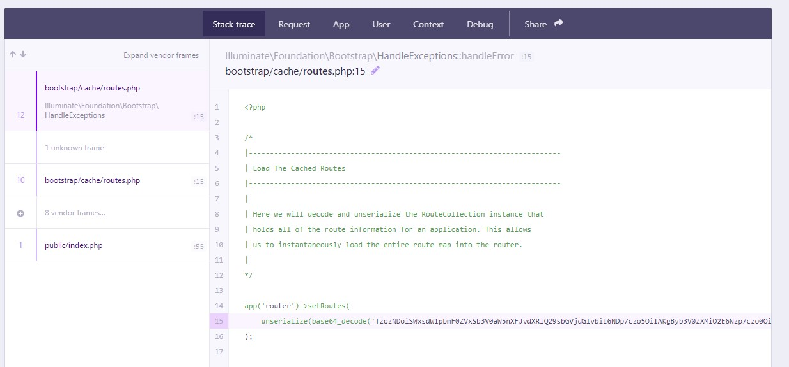

## Erroneous data format for unserializing 'Symfony Component Routing CompiledRoute'

运行 `php artisan route:cache` 出现如下错误：

```shell
ErrorException
Erroneous data format for unserializing 'Symfony\Component\Routing\CompiledRoute'
```



运行其他一些命令也会出现如上错误，

删除 `bootstap/cache/route.php` 文件。