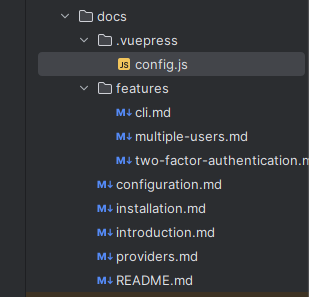

# Laravel 使用 Vuepress 搭建文档

## 安装 Vuepress

```shell
npm install -D vuepress
```

## 编辑 `package.json` :

在 `scripts` 标签中添加：

```json
"scripts": {
        "docs:dev": "vuepress dev docs",
        "docs:build": "vuepress build docs"
    },
```

## 配置 VuePress：

### 1、在项目根目录下创建 `docs` 文件夹
### 2、在 `docs` 目录中创建 `.vuepress` 文件夹
### 3、编辑 `docs/.vuepress/config.js`，示例如下：

```javascript
module.exports = {
    base: '/docs/',
    dest: 'public/docs',
    title:'Your App Docs',
    description:'Your App official documentation',
    head: [
        ['link', { rel: 'icon', href: 'https://yourapp.domain/icon.ico/svg/png/jpg/jxl/etc' }],
    ],
    themeConfig: {
        nav: [
            { text: 'Home', link: 'https://yourapp.domain/', target: '_self' },
            // versions
        ],
        logo: 'https://yourapp.domain/yourappheaderlogo.svg/png/jpg/jpeg/jxl/etc',
        displayAllHeaders: true,
        activeHeaderLinks: false,
        searchPlaceholder: 'Press / to search',
        lastUpdated: false, // string | boolean
        sidebar: [
            {
                title: "Getting Started",
                collapsable: false,
                children: [
                    ['/introduction', '介绍'],
                    ['/installation', '安装'],
                    ['/configuration', '配置'],
                    ['/providers', 'Providers'],
                ],
            },
            {
                title: "Features",
                collapsable: false,
                children:  [
                    ['/features/multiple-users', '多用户'],
                    ['/features/two-factor-authentication','双因子认证'],
                    ['/features/cli','Cli'],
                ]
            },
        ]
    }
}
```
### 4、在 `docs` 目录下创建 `introduction.md` 等文件



### 5、编译文档

```shell
npm run docs:build
```

### 6、设置通过 Laravel 路由访问文档

创建 `DocsController`：

```shell
php artisan make:controller DocsController
```

编辑 `DocsController`：

```php
<?php

namespace App\Http\Controllers;

use Illuminate\Http\Request;
use File;

class DocsController extends Controller
{
    public function index(Request $request, $file = 'index')
    {
        if ($file != 'index') {
            $file = $file . '/index';
        }
        return File::get(public_path() . '/docs/' . $file . '.html');
    }
}

```

添加路由，编辑 `routes/web.php`：

```php
Route::get('/docs/{file?}', [\App\Http\Controllers\DocsController::class, 'index'])->name('docs.index');
```

运行项目：

```shell
php artisan serve
```

访问文档， 示例地址 `http://127.0.0.1:8000/docs`。

参考：   
https://devdojo.com/superdev/how-to-add-documentation-to-your-laravel-app-with-vuepress   
https://vuepress.vuejs.org/zh/