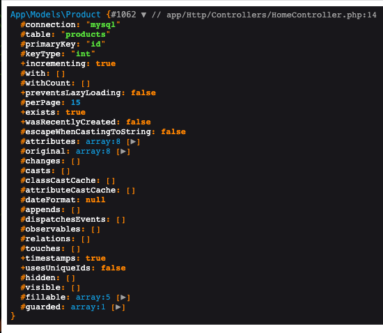
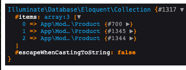

# LaravelTips：7个Laravel函数也接受数组参数

## Eloquent: find($id) VS find($array)

Eloquent Model 的 `find()` 方法根据主键查询模型：

```php
$products = Product::find(1);
```

返回某一个 Product：



但是我们也可以将一个ID数组传递给 `find()` 方法：

```php
$products = Product::find([1, 2, 3]);
```

返回一组集合：



_注意： 不能用于查询构造器（Query Builder） 仅用于 Eloquent Models 时有效。_

## Eloquent: where($key, $value) VS where($conditionsArray)

Eloquent Model 的 `where()` 方法，常用示例：

```php
$products = Product::query()
    ->where('category_id', 1)
    ->where('manufacturer_id', 2)
    ->get();
```

也可以这么写：

```php
$products = Product::query()
    ->where([
        'category_id' => 1,
        'manufacturer_id' => 2,
    ])
    ->get();
```

生成如下 sql :

```sql
select * from `products` where (`category_id` = 1 and `manufacturer_id` = 2)
```

如果使用  "<" 或者 ">"  操作符：

```php
$products = Product::query()
    ->where([
        'category_id' => 1,
        ['stock_left', '>', 100]
    ])
    ->get();
```

对应的 sql：

```sql
select * from `products` where (`category_id` = 1 and `stock_left` > 100)
```

注意 where 后的括号，如果不用数组写法，示例代码如下：

```php
$products = Product::query()
    ->where(function($query){
        $query->where('category_id', 1)
              ->where('stock_left', '>', 100);
    })
    ->get();
```

## Session: put($key, $value) VS put($valuesArray)

```php
session()->put('cart', 'Cart information');
session()->put('cart_total', 'Cart total');
```

也可以这么写：

```php
session()->put([
    'cart' => 'Cart information',
    'cart_total' => 'Cart total'
]);
```

类似的，查询特定的 key 是否存在：

```php
session()->has('cart');
```

如果要同时查询多个 key 是否存在呢？可以这么做：

```php
session()->has(['cart', 'cart_total']);
```

如果两个键都存在，它将返回true；如果其中任何一个键不存在，则返回false。

## Cache: put($key, $value) VS put($valuesArray)

和上面的比较类似。

```php
Cache::put('cart', 'Cart information', 60);
Cache::put('cart_total', 'Cart total', 60);
```

可以修改为：

```php
Cache::put([
    'cart' => 'Cart information',
    'cart_total' => 'Cart total'
], 60);
```

## Migrations: dropColumn($name) VS dropColumn($columnsArray)

```php
Schema::table('products', function (Blueprint $table) {
    $table->dropColumn('name');
    $table->dropColumn('description');
    $table->dropColumn('price');
});
```

可以修改为：

```php
Schema::table('products', function (Blueprint $table) {
    $table->dropColumn(['name', 'description', 'price']);
});
```

## Gates: has($gate) VS has($gatesArray)

判断用户是否有单一授权：

```php
Gate::has('edit-post')
```

如果要判断用户是否同时满足多个授权：

```php
Gate::has(['edit-post', 'delete-post'])
```

## App: environment($env) VS environment($envArray)

获取当前环境：

```php
App::environment();
```

检查是否 `local` 环境：

```php
App::environment('local');
```

检查是否是 `local` 或者 `testing` 环境：

```
App::environment(['local', 'testing']);
```

原文：https://laraveldaily.com/post/laravel-functions-that-also-accept-array-parameter