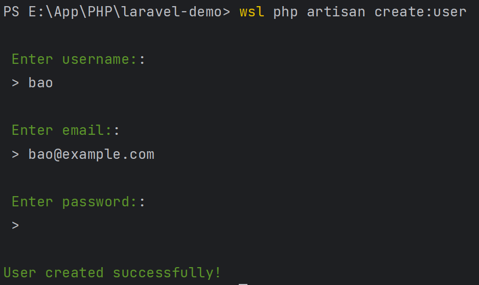

# 添加自定义Artisan命令（带可选参数）

## 1、创建命令（command）

```shell
php artisan make:command CreateUserCommand
```

## 2、完善逻辑

```php

<?php

namespace App\Console\Commands;

use Illuminate\Console\Command;
use App\Models\User;

class CreateUserCommand extends Command
{
    protected $signature = 'create:user {username?} {email?} {password?} {--admin : Create an admin user}';

    protected $description = 'Create a new user';

    public function handle()
    {
        $username = $this->argument('username') ?? $this->ask('Enter username:');
        $email = $this->argument('email') ?? $this->ask('Enter email:');
        $password = $this->argument('password') ?? $this->secret('Enter password:');
        $isAdmin = $this->option('admin');

        $user = new User();
        $user->name = $username;
        $user->email = $email;
        $user->password = bcrypt($password);
        $user->is_admin = $isAdmin;
        $user->save();

        $this->info('User created successfully!');
    }
}
```

## 3、使用命令

按照 `$signature` 中的定义传入参数：

```shell
php artisan create:user admin admin@example.com password123 --admin
```

还可以不传参数，通过命令行提示完成：

```shell
php artisan create:user
```




参考：https://laracoding.com/adding-a-custom-artisan-command-with-optional-arguments/