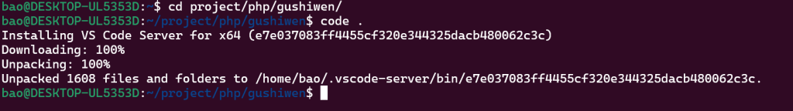
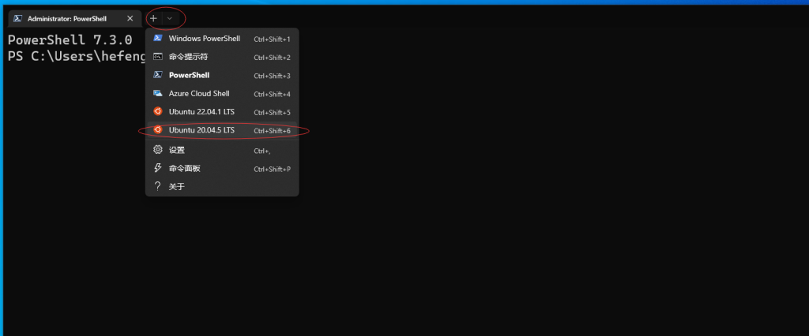
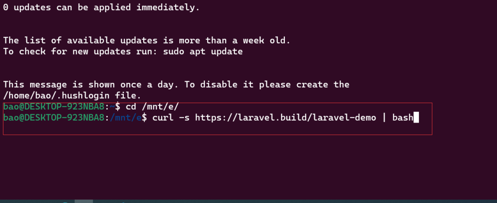

# Laravel 入门：02-搭建开发环境 & 创建项目

我本人使用的是 Windows 操作系统，涉及到的软件安装也是在 Windows 操作系统上。

感觉 Windows 使用 WSL 安装 Linux 虚拟机，然后搭建开发环境，挺好用。

[使用 WSL 在 Windows 上安装 Linux](https://learn.microsoft.com/zh-cn/windows/wsl/install)

在 `https://github.com/laravel/homestead` 下载压缩包。

这里是为了使用 `homestead/bin/wsl-init` 脚本。

录了个简单的视频上传到了 B 站：

[Windows 使用 WSL 虚拟机搭建 Laravel 开发环境](https://www.bilibili.com/video/BV1jo4y1w7NN)

 2023.05.11
 
 
 
---

## 一、安装 Git

下载 [Git ](https://git-scm.com/) 并安装。

顺便生成 `ssh key` ，打开 `Git Bash`，运行命令：

``` bash
ssh-keygen -t rsa
```

## 二、开发环境

### 1、“多合一” 安装套件

一次性安装 PHP、Nginx(Apache)、MySql 等，适合新手，安装简单，但是在 Windows 平台上，如果部署到 Linux 平台（通常生产环境都是基于 Linux 平台）可能存在兼容问题（常见的是目录、文件名的大小写），知名的有 [XAMPP] (https://www.apachefriends.org/)  、[MAMP](https://www.mamp.info)、[Laragon](https://laragon.org/download/) 等。

安装 `Composer`：

https://getcomposer.org/download/

创建项目：

```shell
composer create-project laravel/laravel laravel-demo
```

### 2、Homestead

这是 Laravel 在 8.5 之前推荐的开发环境，基于虚拟机的 Linux 环境。参考文档：https://learnku.com/docs/laravel/8.x/homestead/9357。我觉着这套环境挺好用😓。

#### 2.1 首先安装 `VirtualBox` 和 `Vagrant`：

VirtualBox 下载地址：https://www.virtualbox.org/wiki/Downloads

Vagrant 下载地址：https://www.vagrantup.com/downloads

#### 2.2 安装 Homestead Vagrant Box

打开 `Git Bash` （`Windows PowerShell`、`Windows Terminal` 等）， 运行命令：

```shell
vagrant box add laravel/homestead
```

#### 2.3 安装 Homestead

```shell
git clone https://github.com/laravel/homestead.git ~/Homestead

cd ~/Homestead

git checkout release
```

#### 2.4 配置 Homestead

进入安装目录（C:\\Users\\用户名\\Homestead），双击运行 `init.bat` 命令创建 `Homestead.yaml` 配置文件。

假如我在 `E:/App/PHP` 目录下创建新项目`laravel-demo`（这里创建该文件夹即可），接下来编辑 `Homestead.yaml`，主要修改如下所示：

```yaml
folders:
    - map: E:/App/PHP/laravel-demo
      to: /home/vagrant/code/laravel-demo

sites:
    - map: laravel-demo.test
      to: /home/vagrant/code/laravel-demo/public

databases:
    - laravel-demo
```

#### 2.5 主机名解析

修改 C:\Windows\System32\drivers\etc 目录下的 hosts 文件，添加：

```shell
192.168.10.10  laravel-demo.test
```

#### 2.6 启动 Vagrant Box

```shell
cd ~/Homestead
vagrant up
```

可能遇到的问题：

```shell
C:/HashiCorp/Vagrant/embedded/gems/2.3.3/gems/childprocess-4.1.0/lib/childprocess/windows/process_builder.rb:44:
in `encode!': "\\xE5" to UTF-8 in conversion from ASCII-8BIT to UTF-8 to UTF-16LE (Encoding::UndefinedConversionError)
```

解决办法请参考 https://blog.csdn.net/qq_41606390/article/details/122854431

#### 2.7 通过 SSH 连接

```shell
vagrant ssh
```

将会以 SSH 的方式连接到虚拟机：

```shell
# 进入 code 目录
cd code

# 查看当前目录下的项目
ls -l

composer create-project laravel/laravel laravel-demo
```

* 👊 如果遇到文件夹权限问题，请选则以管理员身份打开 Git Bash 等终端。 *

在浏览器中访问 `laravel-demo.test` 查看是否正常。

#### 2.8 vagrant 的常用命令（管理虚拟机）

启动：

```shell
vagrant up
```

关闭：

```shell
vagrant halt
```

远程连接到虚拟机：

```shell
vagrant ssh
```

删除虚拟机（本来用的好好的，忽然遇到启动报错、远程连接到虚拟机报错，便可运行此命令）：

```shell
vagrant destroy
```

查看安装的虚拟机：

```shell
vagrant box list
```

如果修改了 `Homestead.yaml`，运行如下命令重新加载配置：

```shell
vagrant reload --provision
```

其他的命令可运行帮助命令查看：

```shell
vagrant --help
```

#### 2.9 连接数据库

下载安装 MySql Workbench（https://dev.mysql.com/downloads/workbench/） 、DBeaver（https://dbeaver.io/download/） 或其他数据库管理工具，默认服务器地址：`192.168.10.10`，用户名：`homestead`，密码：`secret`，一个示例：


### 3、 Sail

#### 3.1 开启 WSL, 并安装 Linux

https://learn.microsoft.com/zh-cn/windows/wsl/install

#### 3.2 安装 Docker Desktop 

https://www.docker.com/products/docker-desktop/

#### 3.3安装 Windows Terminal

https://apps.microsoft.com/store/detail/windows-terminal/9N0DX20HK701

#### 3.4 创建项目





```shell
cd laravel-demo

./vendor/bin/sail up  #可能需要很长一段时间
```

参考：https://learnku.com/docs/laravel/9.x/installation/12200#2e8ee3

### 三、IDE

1、PhpStorm

虽然有人抱怨 `PhpStorm` 臃肿占内存，但我觉得它是最好用的 PHP IDE。“术业有专攻”，不需要额外的配置，安装激活便可使用。如果是高校学生，有 `.edu.cn` 邮箱的话，建议使用 `PhpStorm`，下面的链接注册后可以获取免费注册码（有效期一年，结束后可继续获取）：

https://www.jetbrains.com/shop/eform/students

2、Vs Code

需要安装插件：

PHP Intelephense

参考：

https://blog.theodo.com/2019/07/vscode-php-development/