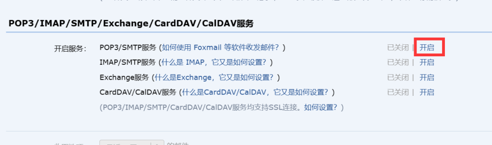
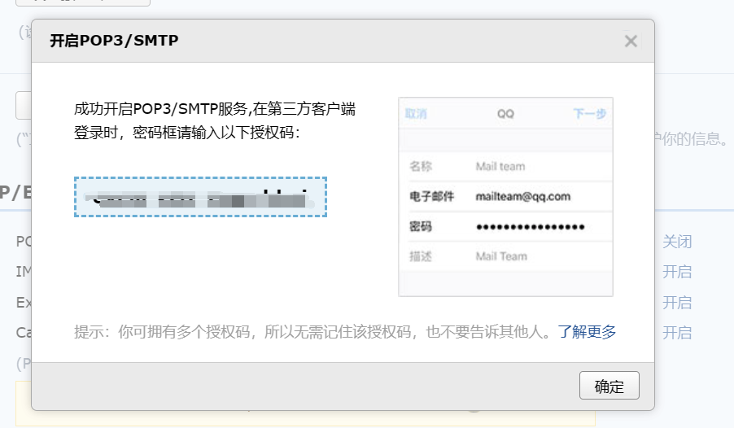
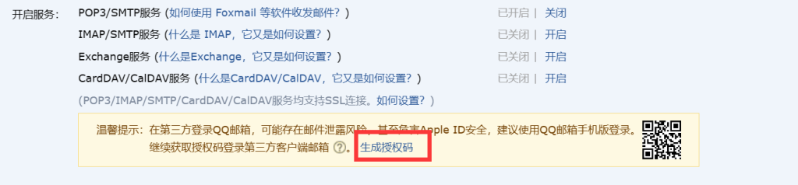

# Laravel 入门：17-发送邮件

Laravel 提供了多种邮件发送驱动，但主要还是是国外的商业产品，这里说一下以 SMTP 驱动发送邮件。使用 QQ 邮箱，登陆邮箱，进入“设置” ->“账号”，按如下操作：

开启 SMTP:



生成授权码：



重新生成授权码：



在 `.env` 中配置：

```shell
MAIL_MAILER=smtp
MAIL_HOST=smtp.qq.com
MAIL_PORT=587
MAIL_USERNAME=QQ号
MAIL_PASSWORD=生成的授权码
MAIL_ENCRYPTION=null
MAIL_FROM_ADDRESS="QQ号@qq.com"
```

创建邮件通知类：

```shell
php artisan make:mail PostCommented
```

编辑 `app/Mail/PostCommented.php`：

```php
<?php

namespace App\Mail;

class PostCommented extends Mailable
{
    use Queueable, SerializesModels;

    public $comment;

    public function __construct( Comment $comment)
    {
        $this->comment = $comment;
    }

    /**
     * 邮件标题
     * @return Envelope
     */
    public function envelope()
    {
        return new Envelope(
            subject: '您的文章《'.$this->comment->post->title.'》有新的评论',
        );
    }

    /**
     * 邮件正文
     *
     * view 指定邮件视图
     * with 传递到视图的数据，以数组形式
     * @return \Illuminate\Mail\Mailables\Content
     */
    public function content()
    {
        return new Content(
            view: 'mails.post_commented',
            with: [
                'comment' => $this->comment
            ]
        );
    }
}
```

编辑 `resources/views/mails/post_commented.blade.php`：

```php
<p>{{ $comment->user->name }} 评论了您的文章《{{ $comment->post->title }}》</p>
<i>{{ $comment->body }}</i>
```

在 `routes/web.php` 中创建路由：

```php
Route::get('mail/post-commented', function (){});
```

渲染邮件（查看邮件效果）：

```php
Route::get('mail/post-commented', function (){
    $post = \App\Models\Post::find(1);

    $user = \App\Models\User::find(1);

    $comment = new \App\Models\Comment();
    $comment->body = '评论测试';
    $comment->user()->associate($user);
    $comment->post()->associate($post);
    $comment->save();

    return new \App\Mail\PostCommented($comment);
});
```

访问 http://laravel-demo.test/mail/post-commented

发送邮件：

```php
Route::get('mail/post-commented', function (){
    $post = \App\Models\Post::find(1);

    $user = \App\Models\User::find(1);

    $comment = new \App\Models\Comment();
    $comment->body = '评论测试';
    $comment->user()->associate($user);
    $comment->post()->associate($post);
    $comment->save();

    \Illuminate\Support\Facades\Mail::to('.env 中配置的 MAIL_FROM_ADDRESS')->send(new \App\Mail\PostCommented($comment));
});
```

再次访问 http://laravel-demo.test/mail/post-commented

Demo：https://github.com/hefengbao/laravel-demo