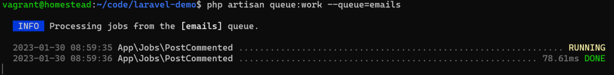

# Laravel 入门：18-队列

在项目中，为了快速相应，对于一些耗时的任务（比如，发送邮件）或者实时性要求不那么高的操作（比如写日志），可以后台队列排队处理。

在 `.env` 中配置：

```shell
QUEUE_CONNECTION=redis
```

参考 `config/queue.php`， Laravel 提供的队列驱动有 "sync", "database", "beanstalkd", "sqs", "redis", "null"，实际项目中一般选择异步队列，使用 `redis` 驱动。

还是以文章被评论时给作者发通知邮件为例，创建 Job：

```shell
 php artisan make:job PostCommented
```

编辑 `app/Jobs/PostCommented.php` ：

```php
<?php

namespace App\Jobs;

class PostCommented implements ShouldQueue
{
    use Dispatchable, InteractsWithQueue, Queueable, SerializesModels;

    public $comment;

    public function __construct(Comment $comment)
    {
        /**
         * 在 Queueable trait 中定义的
         * 这里可以覆盖全局设定， 即 .env 中的 QUEUE_CONNECTION 设置
         * @var string
         */
        $this->connection = 'redis';

        /**
         * 在 Queueable trait 中定义的
         * 指定使用 emails 队列, 可选项， 默认使用 default
         * @var string
         */
        $this->queue = 'emails';

        $this->comment = $comment;
    }

    public function handle()
    {
        // 发送通知邮件
        Log::info('这里要发送通知邮件');
    }
}
```

调度任务：

```php
Route::get('mail/post-commented', function (){
    $post = \App\Models\Post::find(1);

    $user = \App\Models\User::find(1);

    $comment = new \App\Models\Comment();
    $comment->body = '评论测试';
    $comment->user()->associate($user);
    $comment->post()->associate($post);
    $comment->save();

    \App\Jobs\PostCommented::dispatch($comment);
});
```

访问 http://laravel-demo.test/mail/post-commented 

然后在控制台运行 `php artisan queue:work --queue=emails` 命令：



在生产环境，我们需要确保 `php artisan queue:work ` 一直处于运行状态， 可以通过 Supervisor 和官方的 [Horizon 队列管理工具](https://learnku.com/docs/laravel/9.x/horizon/12268) 来实现。

Demo：[https://github.com/hefengbao/laravel-demo](https://github.com/hefengbao/laravel-demo)