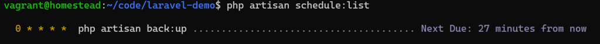

# Laravel 入门：19-任务调度

项目中有时需要定期执行一些周期性的任务，比如数据备份、清楚日志等，Laravel 的命令行调度器允许你在 Laravel 中清晰明了地定义命令调度。

新建命令行调度器：

```shell
php artisan make:command Backup
```

编辑 `app/Console/Commands/Backup.php` ：

```php
<?php

namespace App\Console\Commands;

use Illuminate\Console\Command;
use Illuminate\Support\Facades\Log;

class Backup extends Command
{
    /**
     * 命名,格式为 command:name
     *
     * @var string
     */
    protected $signature = 'backup:run';

    /**
     * 描述
     *
     * @var string
     */
    protected $description = '项目备份';

    public function handle()
    {
        // TODO 备份数据库、备份上传的附件等
        Log::info('测试 backup:run');
        return Command::SUCCESS;
    }
}

```

在 `app/Console/Kernel.php` 中注册：

```php
<?php

namespace App\Console;

use Illuminate\Console\Scheduling\Schedule;
use Illuminate\Foundation\Console\Kernel as ConsoleKernel;

class Kernel extends ConsoleKernel
{
    protected function schedule(Schedule $schedule)
    {
        // 每小时备份一次数据
        $schedule->command('back:up')->hourly();
    }
}
```

使用服务器的定时命令 cron 运行 `php artisan schedule:run`，在你的服务器端配置， 例如：

```shell
* * * * * cd /home/vagrant/code/laravel-demo && php artisan schedule:run >> /dev/null 2>&1
```

每分钟运行一次 `php artisan schedule:run` 命令。

通过命令 `php artisan schedule:list` 查看注册的定时任务：



Demo：[https://github.com/hefengbao/laravel-demo](https://github.com/hefengbao/laravel-demo)