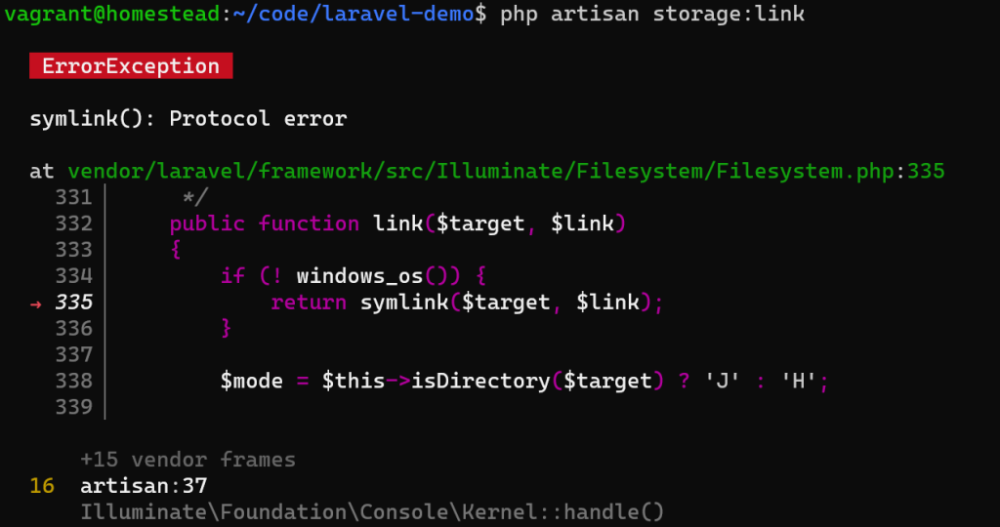
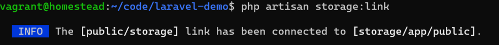

# Laravel 入门：20-文件系统

Laravel 文件系统提供了多种驱动，参考 `config/filesystems.php` 配置中的说明，并提供统一的访问、操作 API，开发人员可以方便快速的切换存储选项。

Laravel 默认配置的驱动有三种：`local`、`public`、`s3`。其中 `local` 、`public` 是本地存储，其中 `local` 存储目录是 `storage/app/`，`public` 存储目录是 `storage/app/public/`，如果选择本地存储并且文件可通过网络访问，则应该选择 `public` 驱动；`s3` 是远程存储，适用于 Amazon S3 兼容文件系统，比如国外的 Amazon S3，开源的 MinIO，国内的阿里 OSS 等。本文中主要介绍使用 `public` 驱动的本地存储，首先使用 Artisan 命令 storage:link 来创建符号链接：

```shell
php artisan storage:link
```

该命令创建从 `public/storage` 到 `storage/app/public` 的符号链接。

使用 Windows 操作系统和 Homestead， 如果遇到以下问题：



请以管理员身份运行终端（命令提示符cmd， Git Bash, Power Shell）：



文件存储在实际项目中主要用于保存用户上传的文件（诸如头像、图片、文件等），保存文件的几种写法：

```php
<?php

namespace App\Http\Controllers;

use Illuminate\Support\Facades\Storage;
use Illuminate\Support\Str;

class UserController extends Controller
{
    public function avatar(Request $request)
    {
        /*
         * store 方法：
         * 参数1：指定目录
         * 参数2：指定驱动
         *
         * 该方法将生成一个唯一的 ID 作为文件名
         *
         * 文件存储在 storage/app/public/avatars/ 目录下
         */
        $path = $request->file('avatar')->store('avatars', 'public');

        /*
         * store 方法：
         * 参数1：指定目录
         * 参数2：指定文件名
         * 参数3：指定驱动
         *
         * 文件存储在 storage/app/public/avatars/ 目录下
         */
        $path = $request->file('avatar')->storeAs('avatars', Str::random().'.jpg','public');


        $path = Storage::putFile('avatars', $request->file('avatar'), 'public');

        $path = Storage::putFileAs('avatars', $request->file('avatar'), Str::random().'.jpg', 'public');


        $url = Storage::disk('public')->url($path);
    }
}
```

本篇文章可参考文档中的『文件存储』和『请求』中的文件上传部分学习。

Demo：https://github.com/hefengbao/laravel-demo