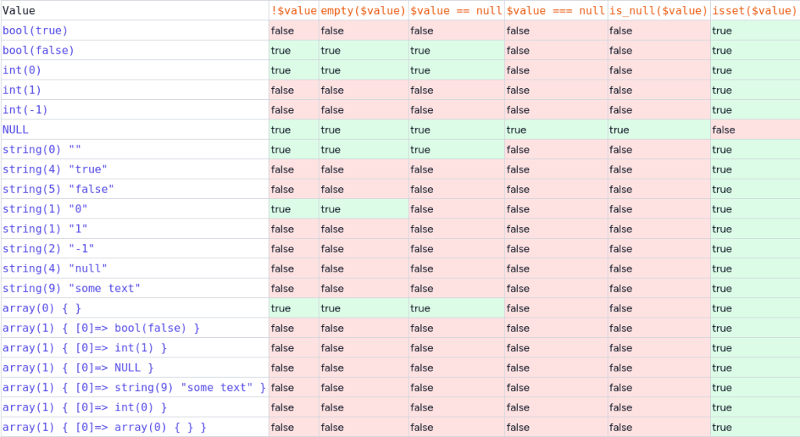

# PHP 空值检查："!" vs "is_null" vs "isset"

检查是否为 `null` 使用 `=== null` 或者 `is_null`；

检查不为 `null` 使用 `!== null` 和 `is_set()`;

`empty()` 和 `isset()` 判断数组的键值是否存在

参考：

https://laraveldaily.com/post/php-check-for-empty-values-not-is-null-vs-isset