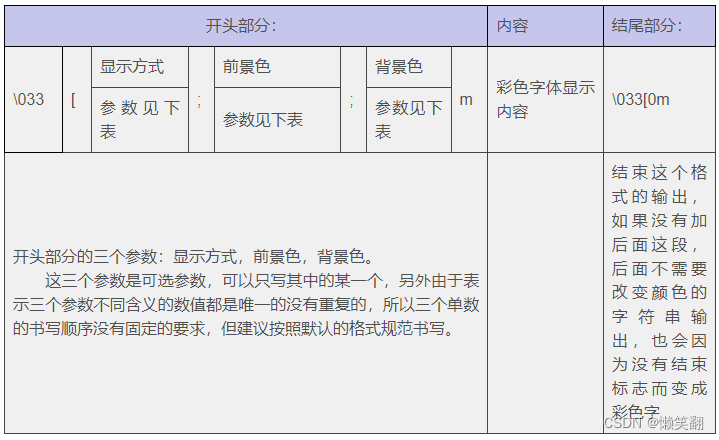

# 打印

## 打印

`print()` 函数接受一个或多个用逗号分隔的参数，并在控制台或终端上显示它们。

```python
# 打印字符串
print("Hello, Python!") # Hello, Python!

# 打印正数
print(43) # 43

# 打印浮点数
print(3.14) #3.14

# 打印多个变量
print("The answer is:", 42) # The answer is: 42
```

还可以对 `print()` 函数使用各种选项，例如指定项目之间的分隔符、以换行符结束输出以及将输出重定向到文件或其他流。

## 格式化

### 使用 `f` 字符串

使用 `f 字符串`，你可以通过将表达式括在大括号 `{}` 中来将它们嵌入字符串文字中。例如

```python
name = "Tom"
age = 32
print(f"My name is {name} and I am {age} years old.")

# 输出：My name is Tom and I am 32 years old.
```

### 使用 `format()` 方法

在字符串中使用 `{}` 来指示要插入变量值的位置，然后使用 `format()` 方法替换实际值。

```python
name = "John"
age = 30
location = "New York"

print("My name is {}, I'm {} years old, and I live in {}.".format(name, age, location))

# 输出：My name is John, I'm 30 years old, and I live in New York.
```

## 使用 `%` 运算符

```python
name = "John"
age = 25
print("My name is %s and I'm %d years old." % (name, age)) 

# 输出: My name is John and I'm 25 years old.
```

此处，`%s` 是字符串的占位符，`%d` 是整数的占位符。

## 字符串模板

字符串模板提供了一种创建字符串的方法，其中包含将稍后填入的值的占位符。当你想要基于某些输入动态生成字符串时，这会很有用。

使用 `string.Template` 类。

```python
from string import Template

name = "Alice"
age = 30

# 创建字符串模板，使用 name 和 age 作为占位符
template_str = "My name is ${name} and I am ${age} years old."

# 创建字符串模板对象
template = Template(template_str)

# 填充数据
result = template.substitute(name=name, age=age)

print(result)  # 输出: My name is Alice and I am 30 years old.
```

参考：

[在 Python 中调试和打印变量，使用 f 字符串格式化字符串 - 《Dive into Python》中文版](https://diveintopython.cn/learn/variables/print)


## 字体颜色

格式：



示例：

```python
print('\033[4;35;46mHello, World!\033[0m')
```

vs code 下感觉不是很明显😓

::: info
\33[0m 关闭所有属性
\33[1m 设置高亮度
\33[4m 下划线
\33[5m 闪烁
\33[7m 反显
\33[8m 消隐

\33[30m - \33[37m 设置前景色
字颜色:30 - 37
30:黑
31:红
32:绿
33:黄
34:蓝色
35:紫色
36:深绿
37:白色

\33[40m - \33[47m 设置背景色
字背景颜色范围:40 - 47
40:黑
41:深红
42:绿
43:黄色
44:蓝色
45:紫色
46:深绿
47:白色

\33[90m -- \33[97m 黑底彩色
90:黑
91:深红
92:绿
93:黄色
94:蓝色
95:紫色
96:深绿
97:白色

\33[nA 光标上移n行
\33[nB 光标下移n行
\33[nC 光标右移n行
\33[nD 光标左移n行
\33[y;xH设置光标位置
\33[2J 清屏
\33[K 清除从光标到行尾的内容
\33[s 保存光标位置
\33[u 恢复光标位置
\33[?25l 隐藏光标
\33[?25h 显示光标
:::


参考：
[Python \033[95m print打印设置字体颜色_python033-CSDN博客](https://blog.csdn.net/c_lanxiaofang/article/details/126107796)