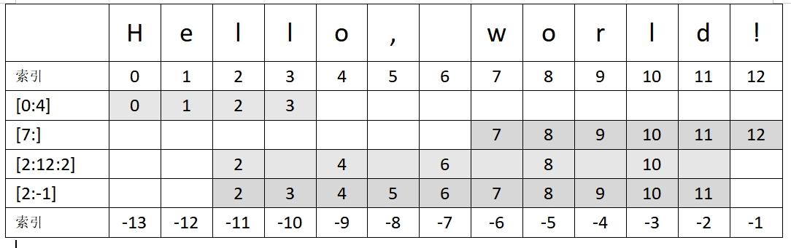

# 字符串

## 字符串变量声明

用引号（单引号或双引号）括起来，可以包含字母、数字和特殊字符。

```python
a = "Hello, World!"
b = 'Python is cool'
```

空字符串：

```python
my_string = ""
```

## 多行字符串

可以通过将文本括在三引号中来创建多行字符串，即三个单引号 (''') 或三个双引号 (""").

```python
multiline_string = '''
This is a multiline string
that spans multiple lines.
You can use single quotes
or double quotes.
'''

print(multiline_string)
```

::: warning 注意
请注意，三引号字符串中的任何空白，包括换行符，都将包含在字符串中。如果您想排除行首或行尾的空白，可以使用 `strip()` 或 `rstrip()` 等字符串方法。
:::

## 字符串连接

字符串连接是将两个或多个字符串组合成一个字符串的过程。在 Python 中，你可以使用 `+` 运算符连接字符串。

```python
str1 = "Hello"
str2 = "World"
result = str1 + " " + str2
print(result) # Output: Hello World
```

附加字符串的另一种选择是使用 `+=` 运算符。

```python
list = ["Hello", "World"]
result = ""

for item in list:
    result += item

print(result)

# 输出：HelloWorld
```

## 字符串中的变量

### 字符串连接

可以使用 `+` 运算符连接字符串和变量

```python
name = "Alice"
age = 30
message = "Hello, my name is " + name + " and I am " + str(age) + " years old."
print(message)
```

### 使用 `str.format()` 方法

使用占位符 `{}` 在字符串中嵌入变量

```python
name = "Bob"
age = 25
message = "Hello, my name is {} and I am {} years old.".format(name, age)
print(message)
```

### 使用 `f` 字符串

```python
name = "Charlie"
age = 35
message = f"Hello, my name is {name} and I am {age} years old."
print(message)
```

## 字符串长度

使用内置函数 `len()` 获取字符串的长度，还可以使用此方法检查字符串是否为空。

```python
my_string = "Hello, world!"
print(len(my_string))  # Output: 13
```

```python
empty_string = ""
print(len(empty_string))  # Output: 0

whitespace_string = "   "
print(len(whitespace_string))  # Output: 3
```

## 字符串比较

在 Python 中比较字符串时，比较是按字典顺序进行的，这意味着比较基于字符串中字符的 ASCII 值。

### `==` 运算符

检查两个字符串是否相等。

```python
str1 = "mango"
str2 = "pineapple"

if str1 == str2:
    print("相等")
else:
    print("不相等")

# 输出: 不相等
```
### `!=` 运算符

检查两个字符串是否不相等。

```python
str1 = "mango"
str2 = "pineapple"

if str1 != str2:
    print("不相等")
else:
    print("相等")
    
# 输出：不相等
```

### `<` 运算符

检查第一个字符串在词典顺序中是否小于第二个字符串。

```python
str1 = "mango"
str2 = "pineapple"

if str1 < str2:
    print("str1 小于 str2")
else:
    print("str2 大于等于 str1")

# 输出：str1 小于 str2
```

### `>` 运算符

检查第一个字符串在词典顺序中是否大于第二个字符串。

### `<=` 运算符

检查第一个字符串是否小于或等于第二个字符串（按字典顺序）。

### `>=` 运算符

检查第一个字符串是否大于或等于第二个字符串（按字典顺序）。

## 字符串遍历

### 使用 `for` 循环

```python
my_string = "Hello, world!"
for char in my_string:
    print(char)
```

### 使用 `while` 循环

```python
my_string = "Hello, world!"
i = 0
while i < len(my_string):
    print(my_string[i])
    i += 1
```

### 使用列表解析

```python
my_string = "Hello, world!"
char_list = [char for char in my_string]
print(char_list)

# 输出：['H', 'e', 'l', 'l', 'o', ',', ' ', 'w', 'o', 'r', 'l', 'd', '!']
```

### 使用 `map()` 函数

```python
my_string = "Hello, world!"
char_list = list(map(str, my_string))
print(char_list)
```

### 使用 `enumerate()` 函数

```python
my_string = "Hello, world!"
for index, char in enumerate(my_string):
    print(f"Character at index {index}: {char}")
```

## 字符串大小写转换

`lower()` 和 `upper()` 方法分别用于将字符串中的所有字符转换为小写和大写。

`lower()` 方法将字符串中的所有大写字符转换为相应的小写字符，同时保留所有现有的小写字符。

```python
string = "Hello World"
new_string = string.lower()
print(new_string) # Output: hello world
```

`upper()` 方法将字符串中的所有小写字符转换为相应的大写字符，同时保留所有现有的大写字符。

```python
string = "Hello World"
new_string = string.upper()
print(new_string) # Output: HELLO WORLD
```

## 字符串首字母大写

`capitalize()` 方法仅将字符串的首字母大写，并将其余字母保留为小写。

```python
string = "hello world"
capitalized_string = string.capitalize()
print(capitalized_string) # Output: Hello world
```

## 字符串替换

### `replace()` 方法

```python
string = "Hello World"
new_string = string.replace("Hello", "Hi")
print(new_string) # Output: Hi World
```

删除换行符

```python
string_with_newline = "This is a string\nwith a newline character."
string_without_newline = string_with_newline.replace("\n", "")
print(string_without_newline) # Output: This is a stringwith a newline character.
```

在上面的代码中，我们首先定义了一个名为 `string_with_newline` 的字符串，其中包含一个换行符 (`\n`)。然后我们使用 `replace()` 方法用空字符串 (`""`) 替换换行符的所有出现。结果字符串 `string_without_newline` 不包含任何换行符。然后我们使用 `print()` 函数打印结果字符串。

### `strip()` 方法

`strip()` 方法可用于删除空格字符，如空格、制表符和换行符。

```python
string = "  hello world  "
new_string = string.strip()
print(new_string) # Output: "hello world"
```

如果只想删除前导或尾随空格，则可以使用 `lstrip()` 或 `rstrip()` 方法。

## 字符串切片

字符串切片是从现有 Python 中的字符串 创建新子字符串的过程。你可以使用语法 `[start:end]` 切片字符串，以提取字符串中从 `start` 索引开始到 `end` 索引结束（不包括）的部分。

```python
my_string = "Hello, world!"

# 索引 0 到 4 （不包含4）获取子字符串
print(my_string[0:4])  # 输出: "Hell"

# 索引从 7 到末尾获取子字符串
print(my_string[7:])  # 输出: "world!"

# 索引从 2 到 12 (不包含12) 步进 2 获取子字符串
print(my_string[2:12:2])  # 输出: "lo ol"

# 索引从 2 到倒数第一个（不包含倒数第一个）获取子字符串
print(my_string[2:-1])  # 输出: "llo, world"
```



要使用分隔符拆分字符串，你还可以使用 `split()` 方法。

```python
my_string = "Hello,world"
my_list = my_string.split(",")
print(my_list) # Output: ['Hello', 'world']
```

以使用字符串切片从 Python 中的字符串中删除第一个字符。

```python
string = "hello"
new_string = string[1:]
print(new_string) # Output: ello
```

字符串切片还可以用来从字符串中删除最后一个字符。

```python
my_string = "Hello World!"
new_string = my_string[:-1]
print(new_string)  # Output: "Hello World"
```

## 字符串子集

要检查 Python 字符串是否包含特定子字符串，你可以使用 `in` 关键字或 `find()` 方法。

###  `in` 关键字

```python
my_string = "Hello, world!"
if "world" in my_string:
    print("Substring found!")
else:
    print("Substring not found.")
# Output: Substring found!
```

### `find()` 方法

这是内置 [Python 函数](../functions)，它返回给定字符串中子字符串首次出现的索引。如果找不到子字符串，它将返回 `-1`。

```python
my_string = "Hello, world!"
if my_string.find("world") != -1:
    print("Substring found!")
else:
    print("Substring not found.")
# Output: Substring found!
```

## 字符串反转

### 使用切片

```python
string = "hello"
reversed_string = string[::-1]
print(reversed_string)  # Output: "olleh"
```

### 使用 reversed() 函数

```python
string = "hello"
reversed_string = "".join(reversed(string))
print(reversed_string)  # Output: "olleh"
```

### 使用循环

```python
string = "hello"
reversed_string = ""
for char in string:
    reversed_string = char + reversed_string
print(reversed_string)  # Output: "olleh"
```

## 字符串截断

```python
text = "This is a long text that needs to be truncated."
max_length = 20
truncated_text = text[:max_length] + "..." if len(text) > max_length else text
print(truncated_text) # Output: This is a long text...
```

使用切片获取字符串的前 `max_length` 个字符。如果原始字符串的长度大于 `max_length`，我们使用字符串连接在截断字符串的末尾追加省略号。如果原始字符串的长度小于或等于 `max_length`，我们只需将原始字符串分配给 `truncated_text` 变量。

## `startswith()` 和 `endswith()` 方法

`startswith()` 方法用于检查字符串是否以特定前缀开头。该方法将一个或多个前缀作为参数，如果字符串以其中任何一个前缀开头，则返回 `True`，否则返回 `False`。以下是 `startswith()` 方法的语法

```python
string.startswith(prefix, start=0, end=len(string))
```

其中
- `prefix` 是要检查的前缀。
- `start` 是一个可选参数，指定要搜索的字符串的起始索引。默认情况下，`start` 设置为 0，这意味着将搜索整个字符串。
- `end` 是一个可选参数，指定要搜索的字符串的结束索引。默认情况下，`end` 设置为字符串的长度。

```python
s = "Python is a great programming language"
print(s.startswith("Python"))  # True
print(s.startswith("Java"))    # False
print(s.startswith(("Java", "Python")))  # True (checking multiple prefixes)
```

`endswith()` 方法用于检查字符串是否以特定后缀结尾。该方法将一个或多个后缀作为参数，如果字符串以其中任何一个结尾，则返回 `True`，否则返回 `False`。以下是 `endswith()` 方法的语法

```python
string.endswith(suffix, start=0, end=len(string))
```

其中

- `suffix` 是要检查的后缀。
- `start` 和 `end` 参数与 `startswith()` 方法中的含义相同。

下面是使用 `endswith()` 方法的一个示例

```python
s = "Python is a great programming language"
print(s.endswith("language"))  # True
print(s.endswith("Python"))    # False
print(s.endswith(("Python", "language")))  # True (checking multiple suffixes)
```

## count() 方法

可以使用内置的 `count` 方法计算字符串中子字符串出现的次数。

```python
string = "Hello, world! This is a sample string."
substring = "is"

count = string.count(substring)

print(count) # Output: 2
```

## 转换为字符串

要将非字符串对象转换为 Python 中的字符串)，可以使用 `str()` 函数。

```python
# convert an integer to a string
num = 42
str_num = str(num)
print(str_num)  # outputs "42"
print(type(str_num))  # outputs "<class 'str'>"

# convert a float to a string
pi = 3.14159
str_pi = str(pi)
print(str_pi)  # outputs "3.14159"
print(type(str_pi))  # outputs "<class 'str'>"

# convert a boolean to a string
flag = True
str_flag = str(flag)
print(str_flag)  # outputs "True"
print(type(str_flag))  # outputs "<class 'str'>"
```

## Unicode 转换为字符串

可以使用 `encode` 方法将 Unicode 字符串转换为常规字符串（也称为字节字符串）。

```python
unicode_string = "Hello, World! 🌍"
byte_string = unicode_string.encode("utf-8")
print(byte_string) # Output: b'Hello, World! \xf0\x9f\x8c\x8d'
```

请注意，输出中的 `b` 前缀表示该值是字节字符串，而不是常规字符串。如果你想将字节字符串转换回常规字符串，可以使用 decode 方法。

```python
new_unicode_string = byte_string.decode("utf-8")
print(new_unicode_string) # Output: Hello, World! 🌍
```

## 字符串转换为列表

### 使用内置的 `list()` 函数

```python
my_string = "hello"
letters_list = list(my_string)
print(letters_list)
```
### 循环遍历字符串并将每个字母追加到新列表中


```python
my_string = "hello"
letters_list = []
for letter in my_string:
    letters_list.append(letter)
print(letters_list)
```

## 字符串转换为布尔值

可以使用内置的 `bool()` 函数将字符串转换为布尔值。

默认情况下，以下字符串被视为 `True`
- 任何非空字符串
- 字符串“True”（不区分大小写）

另一方面，以下字符串被视为 `False`
- 空字符串
- 字符串“False”（不区分大小写）
- 任何等于 0 的数字值（即“0”或“0.0”）

```python
>>> bool("hello")
True
>>> bool("")
False
>>> bool("True")
True
>>> bool("false")
False
>>> bool("0")
False
>>> bool("1")
True
```

## 字符串转换为十六进制

可以使用 `encode()` 方法和 `'hex'` 编码将字符串转换为其十六进制表示形式。

```python
string = "Hello, world!"
hex_string = string.encode('hex')

print(hex_string) # Output: 48656c6c6f2c20776f726c6421
```

在 Python 3 中，可以使用 `hex()` 方法将字符串转换为其十六进制表示形式。

```python
string = "Hello, world!"
hex_string = ''.join([hex(ord(c))[2:] for c in string])

print(hex_string) #Output: 48656c6c6f2c20776f726c6421
```
// TODO

## join() 方法

此方法允许你使用分隔符字符串将可迭代对象（例如列表、元组或字符串）的元素连接到单个字符串中。

```python
my_list = ['mango', 'pineapple', 'banana']
separator = ', '
result = separator.join(my_list)
print(result)  # Output: "mango, pineapple, banana"
```

## 二进制字符串

可以使用前缀 `0b` 后跟一系列 `0` 和 `1` 数字来表示二进制字符串。例如，二进制字符串 `1101` 可以表示为 `0b1101`。

### 创建二进制字符串

```python
binary_str = '0b1101'
```

### 将十进制整数转换为二进制字符串

```python
decimal_num = 13
binary_str = bin(decimal_num)
```

### 将二进制字符串转换为十进制整数

```python
binary_str = '0b1101'
decimal_num = int(binary_str, 2)
```

### 二进制字符串上的按位运算

```python
binary_str1 = '0b1101'
binary_str2 = '0b1010'

# Bitwise AND
result = int(binary_str1, 2) & int(binary_str2, 2)
print(bin(result))  # Output: 0b1000

# Bitwise OR
result = int(binary_str1, 2) | int(binary_str2, 2)
print(bin(result))  # Output: 0b1111

# Bitwise XOR
result = int(binary_str1, 2) ^ int(binary_str2, 2)
print(bin(result))  # Output: 0b0111
```

请注意，在执行按位运算时，我们需要使用 `int()` 函数将二进制字符串转换为十进制 [整数](02-number.md)，其中第二个参数指定基数（在本例中为 `2`），然后使用 `bin()` 函数将结果转换回二进制字符串。


参考：

[Python 中的字符串变量：声明、连接、长度、比较 - 《Dive into Python》中文版](https://diveintopython.cn/learn/variables/string)

[Python 中字符串规范化方法 - 小写、大写和首字母大写 - 《Dive into Python》中文版](https://diveintopython.cn/learn/variables/string/case-change)

[Python 中的字符串替换：替换子字符串和字符 - 《Dive into Python》中文版](https://diveintopython.cn/learn/variables/string/replacement)

[Python 中的子字符串操作：切片、子集、反转、拆分、替换 - 《Dive into Python》中文版](https://diveintopython.cn/learn/variables/string/substring)

[ASCII 表 | 菜鸟教程](https://www.runoob.com/w3cnote/ascii.html)

[字典序_百度百科](https://baike.baidu.com/item/%E5%AD%97%E5%85%B8%E5%BA%8F/7786229

[Python 字符串的索引 | 菜鸟教程](https://www.runoob.com/w3cnote/python-string-index.html)