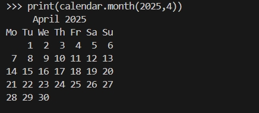
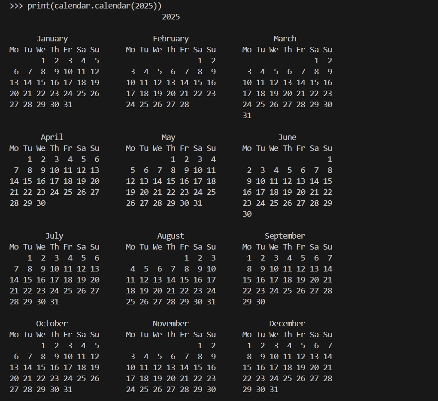

# 日期和时间

Python 有几个用于处理日期和时间的内置模块。以下是其中一些最常用的模块

- datetime 模块：Python datetime 模块提供了用于处理日期和时间的 类。它包括 `datetime`、`date`、 `time` 和 `timedelta` 等类，可用于表示和操作日期、时间和持续时间。

- time 模块：此模块提供了用于处理与时间相关的函数，例如获取当前时间、等待一段时间以及在时间表示之间转换。

- calendar 模块：此模块提供了用于处理日历的函数，例如获取月份中的天数、确定给定日期的星期几以及以各种方式格式化日期。

- dateutil 模块：此模块提供了用于处理日期和时间的附加功能，包括从字符串解析日期和时间、处理时区以及使用日期和时间执行算术运算。


## 日期（Date）

**datetime** 模块提供了一个 `date` 类，允许你专门处理日期。

```python
from datetime import date

my_date = date(2025, 4, 9)

print(my_date) 

```

打印内容：

```shell
2025-04-09
```

```python
from datetime import date

my_date = date(2025, 4, 9)

year = my_date.year

month = my_date.month

day = my_date.day

print(year, month, day) 
```

打印内容：

```shell
2025 4 9
```

## 日历（Calendar）

### month

`month()` 函数返回一个格式化字符串，表示给定年份和月份的日历。

```python
import calendar

# 2025 年 4 月份日历
print(calendar.month(2025,4))
```



### calendar

`calendar()` 函数返回一个多行字符串，表示全年的日历。

```python
import calendar

# 2025 年日历
print(calendar.calendar(2025))
```



### isleap

`isleap()` 函数如果给定的年份是闰年，则返回 `True`，否则返回 `False`。

```python
import calendar

# 判断 2025 年是否是闰年
print(calendar.isleap(2025))
```

打印内容：

```shell
False
```

### monthrange

`monthrange(`) 函数返回一个元组，其中包含该月的第一天是星期几（0 - 6 表示星期一 - 星期日）和该月的天数。

```python
import calendar

print(calendar.monthrange(2025, 4))
```

打印内容：

```shell
(1, 30)
```

上面结果的含义是 2025 年 4 月的第一天（2025-04-01）是星期二，本月共 30 天。

## Dateutil

`dateutil` 模块是 Python 中的一个*第三方模块*，它提供了用于处理日期和时间的各种实用程序。它扩展了内置 `datetime` 模块提供的功能，并使在 Python 中处理日期和时间变得更加容易。

