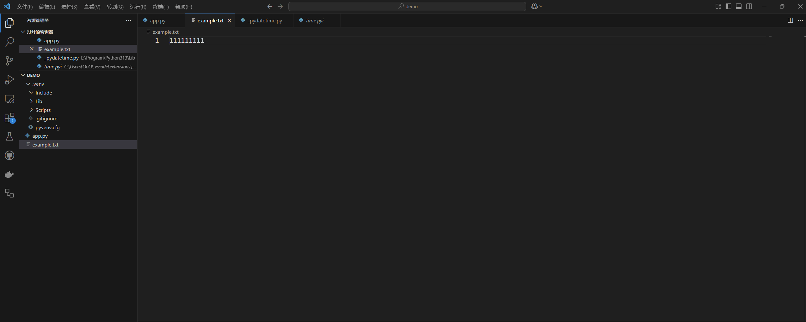
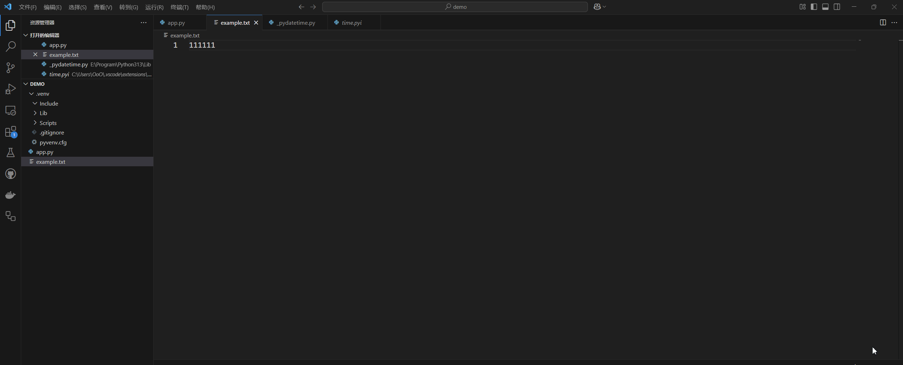

# 文件处理和文件操作

## Python 中文件处理的不同模式

在 Python 中，文件处理（文件打开模式）有几种模式，包括

- **读取模式 ('r')**：此模式用于读取现有文件。
- **写入模式 ('w')**：此模式用于写入文件。如果文件不存在，它将创建一个新文件，如果文件存在，它将覆盖该文件。
- **追加模式 ('a')**：此模式用于将新数据添加到现有文件的末尾（追加到文件）。如果文件不存在，将创建一个新文件。
- **二进制模式 ('b')**：此模式用于读取或写入二进制数据，例如图像或音频文件。

## 读取文件

使用 `open()` 函数打开文件。使用 `read()` 方法*读取文件的所有内容*并将其作为字符串返回。

```python
file = open('example.txt', 'r') # 第一个参数是文件路径，第二个参数是文件打开模式
data = file.read()
file.close()

print(data)
```

逐行读取文件，使用 `for` 循环逐行遍历文件，仍然是读取文件的所有内容。

```python
file = open('example.txt', 'r')
for line in file:
    print(line)
file.close()
```

使用 `readline()` 方法从文件中读取单行。它将行作为字符串返回，并将文件指针移动到下一行。

```python
file = open("example.txt", "r")
line = file.readline()
print(line)
file.close()
```

## 处理 `No such file or directory` 错误

文件路径不存在，使用 `try` 和 `except` 块捕获错误并相应地处理它。

```python
try:
    file = open('example.txt', 'r')
	# 处理逻辑
	
	file.close()
except FileNotFoundError:
    print("File not found!")
```

## 在写入模式下打开文件

可以向文件中写入数据，`write()` 方法用于向文件写入数据，它将字符串作为参数并将其写入文件。或者，`writelines()` 方法允许你通过提供字符串列表向文件写入多行。

```python
file = open('example.txt', 'w')

# Write to the file
file.write('Hello, World!')

# Close the file
file.close()
```

这种模式下后写入的数据会替换文件的数据。



如果需要保留原来的内容，使用**追加模式 ('a')** ：

```python
file = open('example.txt', 'a')

# Write to the file
file.write('Hello, World!')

# Close the file
file.close()
```



## 文件删除

`os` 模块提供的 `remove()` 方法可以用来删除文件。

```python
import os

os.remove("example.txt")
```


## 文件重命名

`os` 模块提供的` rename()` 方法可以用来重命名文件。

```python
import os

os.rename("example.txt", "new_example.txt")
```

## 文件复制

`shutil` 模块提供的 `copy()` 方法可以用来复制文件。

```python
import shutil

shutil.copy("example.txt", "new_example.txt")
```

## 文件移动

`shutil` 模块提供的 `move()` 方法可以用来移动文件。

```python
import shutil

shutil.move("example.txt", "./file/example.txt") # 移动到当前目录下的 file 文件夹内
```


## 获取文件大小

`os.path` 模块提供了一个便捷的方法 `getsize()`，用于以字节为单位检索文件的大小。

```python
import os

file_path = "example.txt" 

try:
    file_size = os.path.getsize(file_path)
    print("File size:", file_size, "bytes")
except FileNotFoundError:
    print("File not found.")
```

还可以使用 `os.stat()` 函数，该函数返回一个包含文件属性（包括文件大小）的命名元组。

```python
import os

file_path = "example.txt"

try:
    file_stats = os.stat(file_path)
    print(file_stats)
    file_size = file_stats.st_size
    print("File size:", file_size, "bytes")
except FileNotFoundError:
    print("File not found.")
```

打印结果示例：
```shell
os.stat_result(st_mode=33206, st_ino=281474977171536, st_dev=5367172644775328647, st_nlink=1, st_uid=0, st_gid=0, st_size=18, st_atime=1744774530, st_mtime=1744774530, st_ctime=1744773641)

File size: 18 bytes
```

## 文件扩展名操作

`os.path` 模块提供的 `splitext()` 函数，从给定的文件名中分离文件扩展名。它返回一个包含基本名称和扩展名的元组，我们使用索引提取 `extension`。

```python
import os

filename = "example.txt"

extension = os.path.splitext(filename)[1]

print("File Extension:", extension)
```

## 检查文件是否存在

`os.path` 模块提供的 `exists()` 函数用于检查文件是否存在。

```python
import os

file_path = "./example.txt"

if os.path.exists(file_path):
    print("File exists!")
else:
    print("File does not exist.")
```

还可以通过尝试打开文件的方式判断文件是否存在：

```python
import os

file_path = "./example.txt"

try:
    # Check if the file exists
    with open(file_path) as f:
        print("File exists!")
except FileNotFoundError:
    print("File does not exist.")
```

## 创建简单文件

```python
with open("example.txt", "w") as file:
  print("Hello, World!", file=file)
```

```python
with open("example.txt", "w") as file:
  file.write("Hello, World!")
```


参考：

[如何在 Python 中处理文件：读取、写入和文件操作 - 《Dive into Python》中文版](https://diveintopython.cn/learn/file-handling)

[在 Python 中将文件读入字符串，探索“with”语句 - 《Dive into Python》中文版](https://diveintopython.cn/learn/variables/string/read-from-file)

