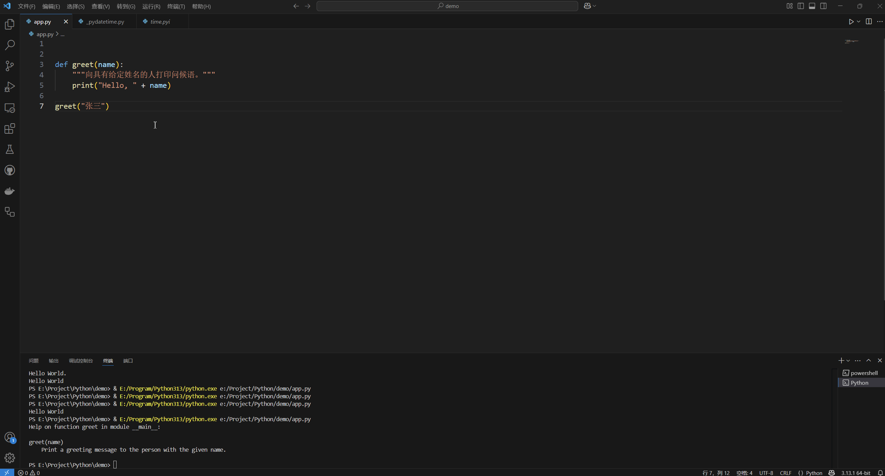

# 函数

函数，可执行特定任务的可重用代码块。

### ## 编写函数

一个简单示例：

```python
# 定义函数
def my_function():
    print("Hello World.")

# 调用函数 
my_function()


# 定义有参数的函数
def hello(name):
    print ("Hello " + name)

# 调用有参数的函数，需要传入参数
hello("World")
```

首先要使用 **def** (define) 关键字，然后是**函数名**（最好以要实现的功能命名），接下来是**括号**，括号里是 0 个到多个参数（根据实际情况确定），后面是英文冒号`:`，然后另起一行开始编写函数逻辑（必须有缩进）

```python
def 函数名(可选参数1, 可选参数2, ...):
	函数逻辑
	函数逻辑
	函数逻辑
	...
```

## 类型提示

为了是函数更健壮，为**函数参数**和**返回值**添加类型提示:

```python
def hello(name: str) -> str:
    return "Hello " + name

print(hello("World"))
```

## 默认参数

**函数参数**可以具有默认值，如果在调用函数时未提供值，则使用这些默认值。

```python
def greet(name="there"):
	print("Hello, " + name)

greet() # Output: Hello, there
greet("John") # Output: Hello, John
```

## 可变长度参数

**可变长度函数参数**（参数的个数不确定）使用 `*` 符号表示：

```python
def calculate_sum(*numbers):
    total = 0
    for num in numbers:
        total += num
    return total

sum1 = calculate_sum(1, 2, 3)   # 6
sum2 = calculate_sum(10, 20)    # 30
sum3 = calculate_sum(5)         # 5
```

## 从函数返回多个值

```python
def test_return():
    return 1
    return 2

print(test_return())
```

打印结果：

```shell
1
```

可以看出，函数只能直接返回单个值。但是，你可以通过将它们打包到元组、列表或字典等数据结构中来返回多个值。

```python
def get_user_info():
    name = "John Doe"
    age = 30
    email = "john@gmail.com"
    return name, age, email

# 调用函数并解包返回的值
user_name, user_age, user_email = get_user_info()

print("Name:", user_name)
print("Age:", user_age)
print("Email:", user_email)
```

## 函数文档

使用文档字符串(`""" """`)添加函数**文档**，描述函数的作用、其参数及其返回值。可以使用 `help` 函数访问此信息。

```python
def greet(name):
    """向具有给定姓名的人打印问候语。"""
    print("Hello, " + name)

help(greet)
```

实际使用时，把鼠标移到函数名上，即可看到注释说明：



## 生成器函数

**生成器函数**是一种特殊类型的函数，可用于创建**迭代器**。它们根据需要即时生成一系列值。

### 生成器函数的语法和结构

使用 `yield` 关键字返回一个值并暂时挂起函数的执行。生成器函数的语法:

```python
def count_up_to(n):
    i = 1
    while i <= n:
        yield i
        i += 1
```

### 理解生成器函数中的 yield 语句

迭代器对象可用于即时生成一系列值，而不是一次性计算所有值并将其存储在列表中。yield 语句是生成器函数的关键部分，它允许函数生成一个值并暂时暂停其执行。

```python
def simple_generator():
    yield 'Hello'
    yield 'World'
    yield '!'

gen = simple_generator()

print(gen.__next__()) # 输出：Hello
print(gen.__next__()) # 输出：World
print(gen.__next__()) # 输出：!
```

在这个示例中，`simple_generator()` 函数有三个 yield [语句](https://diveintopython.cn/learn/statements)，它们将生成三个值：`Hello`、`World` 和 `!`。当调用该函数时，它不会立即执行其代码；相反，它返回一个迭代器对象。每次调用迭代器的 `__next__()` 方法时，该函数都会执行直到遇到 `yield` 语句。在这一点上，该函数将暂停其执行并将值返回给调用者。下次调用迭代器的 `__next__()` 方法时，该函数将从中断处恢复执行并继续执行，直到到达下一个 `yield` 语句或函数的末尾。

### 生成器函数的常见用例

1. **解析大型文件或数据集** - 生成器函数可用于一次读取文件或数据集的块，而不是一次将整个文件加载到内存中。
2. **生成无限序列** - 生成器函数可用于生成无限的数字序列，例如斐波那契数列，而无需程序员创建大型列表或 [数组](./datatype/array)。

```python
def read_chunks(file_path, chunk_size=1024):
    with open(file_path, "r") as f:
        while True:
            chunk = f.read(chunk_size)
            if not chunk:
                break
            yield chunk
```

`read_chunks()` 函数以 `chunk_size` 大小的块读取文件，并生成每个块，直到到达文件末尾。这允许程序员处理大型文件，而无需将整个文件加载到内存中。

### 使用生成器函数的高级技术

#### 惰性执行

生成器函数的主要优点之一是**能够延迟执行**，直到实际需要输出为止。这可以通过避免生成和将所有输出存储在内存中来显著提高代码的性能。

```python
# 斐波那契数列
def fibonacci(n):
    a, b = 0, 1
    for _ in range(n):
        yield a
        a, b = b, a + b

gen = fibonacci(10) # Does not execute any code.
for num in gen:
    print(num) # Executes code as needed.
```

#### 使用生成器的多线程

可以**将生成器与线程结合**起来**异步**执行代码，允许**多个进程**同时执行，进一步提高代码的性能。

### 编写高效且有效的生成器函数的最佳实践和提示

1. **生成大量数据序列时，使用生成器函数而不是列表解析或循环**，这是因为生成器函数会按需生成值，而列表解析或循环会在返回之前在内存中创建整个序列。
2. **在生成器函数中生成值时，使用 `yield` 关键字而不是 `return`**。这允许函数暂停执行并返回一个值，而无需终止函数。然后可以从函数先前停止的位置恢复函数。
3. **使用 `next()` 函数** 来推进生成器函数生成的序列。此函数检索函数生成的下一个值，并向前移动函数的执行状态。
4. **使用 `send()` 函数** 将值送回生成器函数并恢复其执行。此函数允许客户端代码将值传递到生成器函数中，然后生成器函数可以使用这些值生成新值。

示例：生成几何序列中值的生成器函数

```python
def geometric_sequence(start, factor):
    value = start
    while True:
        yield value
        value *= factor

# Usage:
g = geometric_sequence(2, 3)
print(next(g))  # Prints 2
print(next(g))  # Prints 6
print(next(g))  # Prints 18
print(next(g))  # Prints 54
print(next(g))  # Prints 162
# ...
```

## 如何在 Python 中正确命名函数

1. 函数名称必须**以字母或下划线** `_` 开头，后跟任意组合的字母、数字或下划线。示例：`def my_function():`
2. 函数名称应**具有描述性**，并传达函数的目的。示例：`def calculate_total():`
3. 函数名称**区分大小写**，这意味着 `my_function` 和 `My_Function` 是不同的名称。示例：`def my_function():` 和 `def My_Function():` 是两个不同的函数。
4. 函数名称不应与**Python 关键字**相同，例如 `print` 或 `if`。示例：`def print():` 不是一个有效的函数名称。
5. 函数名称应遵循 **snake_case** 命名约定，其中单词用下划线分隔。此约定使函数名称更具可读性和易于理解。示例：`def calculate_total_with_discount():`

总体而言，建议选择一个**具有描述性**、**易于理解**且遵循 Python 函数命名约定的函数名称。


参考：

[Python 中的函数：参数、定义、高阶函数示例 - 《Dive into Python》中文版](https://diveintopython.cn/learn/functions)

[Python 中的生成器函数：语法、结构和 yield 用法示例 - 《Dive into Python》中文版](https://diveintopython.cn/learn/functions/generators)