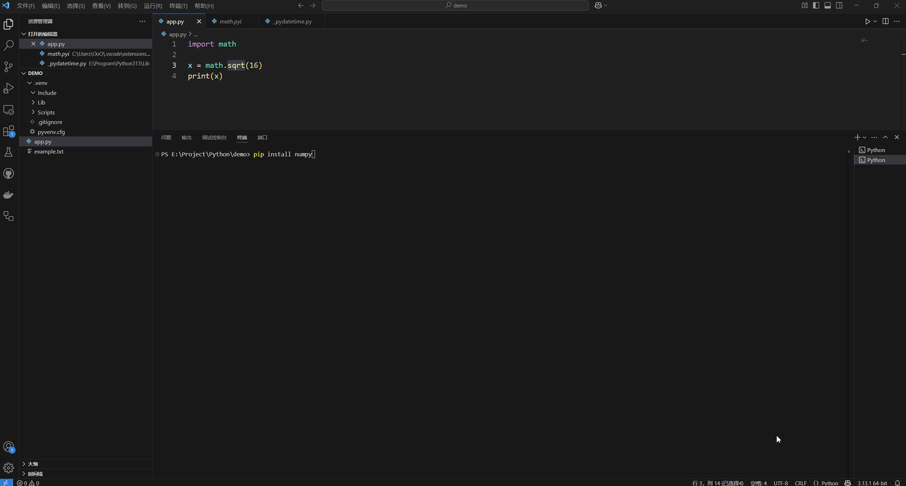

# 模块

## 什么是 Python 中的模块？

Python 中的模块是一个包含语句和定义的文件。它可以定义函数、类和变量，还可以包含可运行的代码。模块用于将代码组织成逻辑单元，以降低复杂性并提高可重用性。

使用 `import` 语句将模块导入到程序中。

```python
import math

x = math.sqrt(16) # 求算数平方根
print(x) 
```

## 如何安装 Python 模块

### 使用 `pip` 安装模块

要使用 `pip` 安装 Python 模块，请执行以下步骤

1. 打开命令提示符或终端
2. 键入 `pip install <module_name>` 并按 Enter




要卸载模块，可以使用 `pip uninstall <module_name>`。

