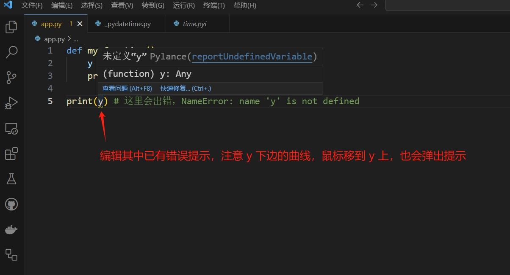

# 变量

## 变量定义

变量是计算机内存中一个已命名的位置，用于存储值。

要在 Python 中创建变量，你需要给它一个名称，并使用赋值运算符 `=` 为它分配一个值。

## 变量命名约定

在 Python 中，变量名称区分大小写，可以是字母、数字和下划线的任意组合。但是，Python 中有指导原则和变量命名约定，可以使你的代码更具可读性和可维护性

- 为变量名称使用小写字母。在 Python 中，惯例是为变量名称使用小写字母。
- 使用下划线分隔变量名称中的单词。如果变量名称由多个单词组成，请使用下划线分隔它们。例如，`first_name` 是一个比 `firstname` 更好的变量名称
- 避免使用保留关键字。Python 有保留关键字，在语言中具有特殊含义，例如 `if`、`else`、`while` 和 `for`。避免将这些关键字用作变量名称。
- 为变量使用描述性名称。选择反映变量用途的描述性名称。例如，`count` 是一个比 `c` 更好的变量名称
- 为变量名称使用单数名词。例如，`student` 是一个比 `students` 更好的变量名称。
- 在你的代码中和整个团队中保持命名约定的一致性。
## 变量声明

```python
x = "Hello World"

print(x) # 输出：Hello World

y = 1

print(y) # 输出：1

y = 10

print(y) # 输出：10

y = "Hello World" # y 变量既可以是数字类型的 10 也可以是字符串类型的 Hello World

print(y) #输出：Hello World

```

```python
# 预先定义变量
a = 1

if(a < 5):
    b = 1 # 在使用时定义变量
else:
    b = 0

print(b)
```

## 常量

常量变量，是一种约定，指的是变量一旦赋值就不再改变，比如数学中的圆周率 `π`，约定使用大写字母命名：

```python
PI = 3.14159
```

## 全局变量和局部变量定义

全局变量和局部变量指的是变量的作用域（有效范围）。

Python 中的全局变量是在**函数外部定义**的变量，并且程序的任何部分都可以访问它，包括函数。Python 中的全局变量具有全局作用域，这意味着它们可以从代码中的任何位置访问。

```python
x = "全局变量"  

print(x)

def my_function():
    print(x)

my_function()
```

打印结果：

```shell
全局变量
```

局部变量是在**函数内部定义**的变量，只能在该函数内访问。局部变量具有局部作用域，这意味着它们只能在定义它们的代码块内访问。

```python
def my_function():
    y = "局部变量"
    print(y)

print(y) # 这里会出错，NameError: name 'y' is not defined
```




如果运行项目，同样会报错：

```shell
PS E:\Project\Python\demo> & E:/Program/Python313/python.exe e:/Project/Python/demo/app.py
Traceback (most recent call last):
  File "e:\Project\Python\demo\app.py", line 5, in <module>
    print(y)
          ^
NameError: name 'y' is not defined
```


```python
x = "全局变量"  

def my_function():
    x = "局部变量"
    print(x)

my_function() # 输出：局部变量

print(x) # 输出：全局变量
```

如上述代码所述，`my_function()` 函数中定义的 `x = "局部变量"` 创建了一个新的局部变量，而不是修改全局变量 `x`。

如何在函数内修改全局变量？

```python
x = "全局变量"  

def my_function():
    global x
    x = "局部变量"
    print(x)

my_function() # 输出：局部变量

print(x) # 输出：局部变量
```


## 检查变量的类型

### 函数 `type()`

使用内置 `type()` 函数返回变量的数据类型。

```python
x = 23
print(type(x))   # Output: <class 'int'>

y = 3.14
print(type(y))   # Output: <class 'float'>

z = "Hello, friend!"
print(type(z))   # Output: <class 'str'>

w = True
print(type(w))   # Output: <class 'bool'>
```

### 函数 `isinstance()`

使用内置函数 `isinstance()` 检查变量是否为指定类的实例。

```python
x = 5
print(isinstance(x, int))  # Output: True

y = "hello"
print(isinstance(y, str))  # Output: True

z = [1, 2, 3]
print(isinstance(z, list))  # Output: True
```

### 使用 `__class__` 属性

此属性返回对象的类。

```python
x = 17
print(x.__class__)  # Output: <class 'int'>

y = "hello"
print(y.__class__)  # Output: <class 'str'>

z = [1, 2, 3]
print(z.__class__)  # Output: <class 'list'>
```

### 将 `type()` 函数与 `assert` 语句一起使用

这是一种检查变量类型的方法，如果类型与预期不符，则会引发错误。

```python
x = 98
assert type(x) == int

y = "hello"
assert type(y) == str

z = [1, 2, 3]
assert type(z) == list
```

## 变量操作

### 复制变量

要在 Python 中复制变量，你可以使用赋值运算符 `=` 或 `copy()` 方法。但是，需要注意的是，这些方法的行为可能因变量的类型而异。

- 浅拷贝：当您使用赋值运算符复制列表、字典或其他可变对象时，您将创建一个浅拷贝。这意味着新变量引用与原始变量在内存中相同的对象。对原始变量所做的任何更改都将反映在副本中，反之亦然。例如

```python
original_list = [1, 2, 3]
copy_list = original_list  # Shallow copy
original_list[0] = 4
print(copy_list)  # Output: [4, 2, 3]
```

- 深拷贝：如果您想在内存中创建一个新对象，该对象是原始变量的副本，则可以使用`copy()`方法。这将创建一个深拷贝，这意味着对原始变量所做的任何更改都不会反映在副本中，反之亦然。例如

```python
import copy

original_list = [1, 2, 3]
copy_list = copy.deepcopy(original_list)  # Deep copy
original_list[0] = 4
print(copy_list)  # Output: [1, 2, 3]
```

### 检查变量是否已定义

可以使用`in`运算符检查变量是否已定义。

```python
if 'my_variable' in locals() or 'my_variable' in globals():
    print('my_variable is defined')
else:
    print('my_variable is not defined')

# 输出：my_variable is not defined 
```

请注意，如果变量已定义但值为`None`，则此方法仍会将其视为已定义。如果您想专门检查非`None`值，则可以像这样修改代码

```python
if 'my_variable' in locals() and locals()['my_variable'] is not None or 'my_variable' in globals() and globals()['my_variable'] is not None:
    print('my_variable is defined and has a non-None value')
else:
    print('my_variable is not defined or has a value of None')
```

### 检查变量是否为空

- 使用带有变量名的`if`语句

```python
my_variable = None

if my_variable:
    print("变量不为空")
else:
   print("变量为空")

# 输出：变量为空
```

- 使用带有变量名的`not`运算符

```python
my_variable = None

if not my_variable:
    print("变量为空")
else:
   print("变量不为空")

# 输出：变量为空
```

- 使用内置的`len()`函数

```python
my_variable = ""

if len(my_variable) == 0:
    print("变量为空")
else:
   print("变量不为空")

# 输出：变量为空
```

- 使用带有`None`的`is`运算符

```python
my_variable = None

if my_variable is None:
    print("变量为空")
else:
   print("变量不为空")

# 输出：变量为空
```


## 删除变量

### 使用 `del` 语句

在 Python 中，`del` 语句用于从列表、字典或任何其他集合对象中删除变量或项。使用 del 的语法为

```python
del object
```

其中 `object` 可以是变量、列表项、字典项或任何其他对象。

```python
# Delete a variable
x = 5
del x

# Delete an item from a list
my_list = [1, 2, 3, 4, 5]
del my_list[2]

# Delete an item from a dictionary
my_dict = {'a': 1, 'b': 2, 'c': 3}
del my_dict['b']
```

在第一个示例中，使用 `del` 语句删除了变量 `x`。在执行该语句后，变量 `x` 不再存在。

在第二个示例中，使用 del `my_list[2]` 删除了列表 `my_list` 中的第三个项。在执行该语句后，`my_list` 包含项 `[1, 2, 4, 5]`。

在第三个示例中，使用 `del my_dict['b']` 从字典 `my_dict` 中删除了键为 `'b'` 的项。在执行该语句后，`my_dict` 包含项 `{'a': 1, 'c': 3}`。

::: tip :bell:
请注意，`del` 仅删除对对象的引用，而不是对象本身。如果对象在代码中的其他位置仍有引用，则不会从内存中删除它。
:::

```python
x = 5
y = x

del x

print(y) # 输出：5
```

### 将 `None` 赋值给变量

清除变量的另一种方法是将值 `None` 赋值给变量，以表明它没有值。`None` 值是一个内置常量，表示没有值。

```python
x = None
print(x)  # Output: None
```

### 使用 `locals()` 或 `globals()` 函数

你可以使用 `locals()` 和 `globals()` [函数](./functions) 分别访问局部和全局命名空间。这些函数返回一个字典，其中包含当前命名空间中的所有变量及其值。你可以使用这些函数通过使用 `del` 语句从命名空间中删除变量。

```python
def my_function():
    x = 5
    y = 10
    print(locals()) # 输出： {'x': 5, 'y': 10}
    
    del locals()['y']

    print(x) # 输出：5

    print(y) # 输出：10
my_function()
```

::: warning
如上述代码执行结果表明，locals() 获取的局部变量，无法通过 `del` 语句删除！！！
:::

```python
x = 5
y = 10

def my_function():
    del globals()['y']

my_function()

print(x)  # 输出：5

print(y)  # NameError: name 'y' is not defined
```

### 使用 `__del__()` 方法

`__del__()` 方法是一个特殊方法，当对象即将被销毁或垃圾回收时调用。你可以在你的类中定义此方法，以便在对象被销毁之前执行任何所需的清理任务。

`__del__()` 方法不接受任何参数，也没有返回值。

::: warning
请注意， `__del__()` 方法并不保证在所有情况下都会被调用。例如，如果程序突然终止，则可能不会调用该方法。因此，通常不建议依赖此方法来执行关键清理任务。相反，最好在可能的情况下使用其他清理机制，例如 `with` [语句](./statements) 或上下文管理器。
:::

## 导入变量

例如在 `text.py` 文件中定义变量:

```python
# text.py
world = "Hello World."
python = "Hello Python."
```

### 从另一个文件中导入变量


```python
import test
print(test.world) # 输出：Hello World.
```

### 通过模块导入从另一个文件中导入变量

```python
from test import world
print(world) # 输出：Hello World.
```

### 从另一个文件中导入多个变量

通过在`from ... import`语句后用逗号分隔指定多个变量：

```python
from test import world, python
```

### 使用别名

有时，从不同文件中导入时，变量名称可能会冲突或模棱两可，可以使用别人加以区分,，示例：

```python
from test import world as alias_world

print(alias_world)
```

### 从不同目录导入模块

Python 支持使用绝对或相对路径从不同目录导入[模块](./modules)。

### 使用 `importlib` 进行动态导入

`importlib` 库允许动态导入，使你能够根据运行时条件导入模块或变量。


参考：

[Python 中的变量 - 变量类型、定义、命名约定 - 《Dive into Python》中文版](https://diveintopython.cn/learn/variables)

[Python 中的变量：如何检查、删除和操作变量 - 《Dive into Python》中文版](https://diveintopython.cn/learn/variables/operations-with-variables)

[Python 函数中的全局变量 - 如何使用、设置和更新 - 《Dive into Python》中文版](https://diveintopython.cn/learn/functions/global-variables)
