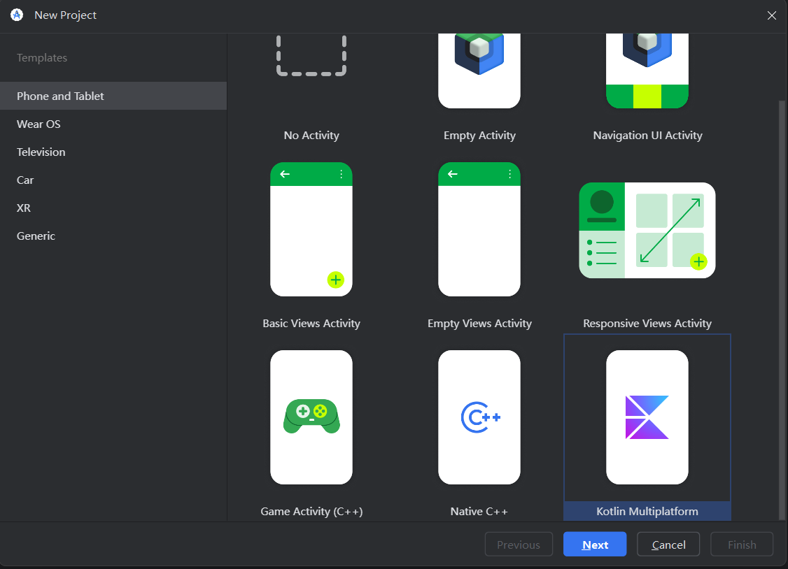
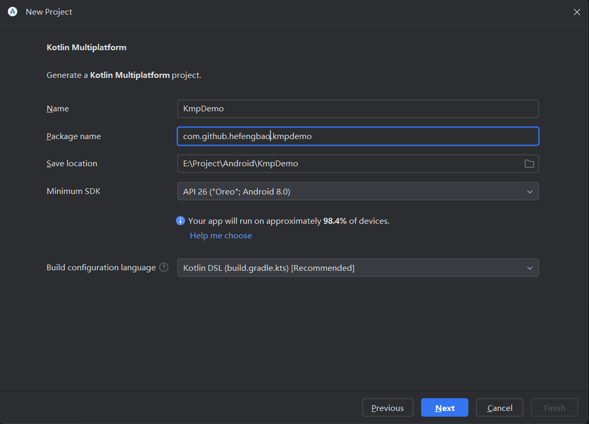
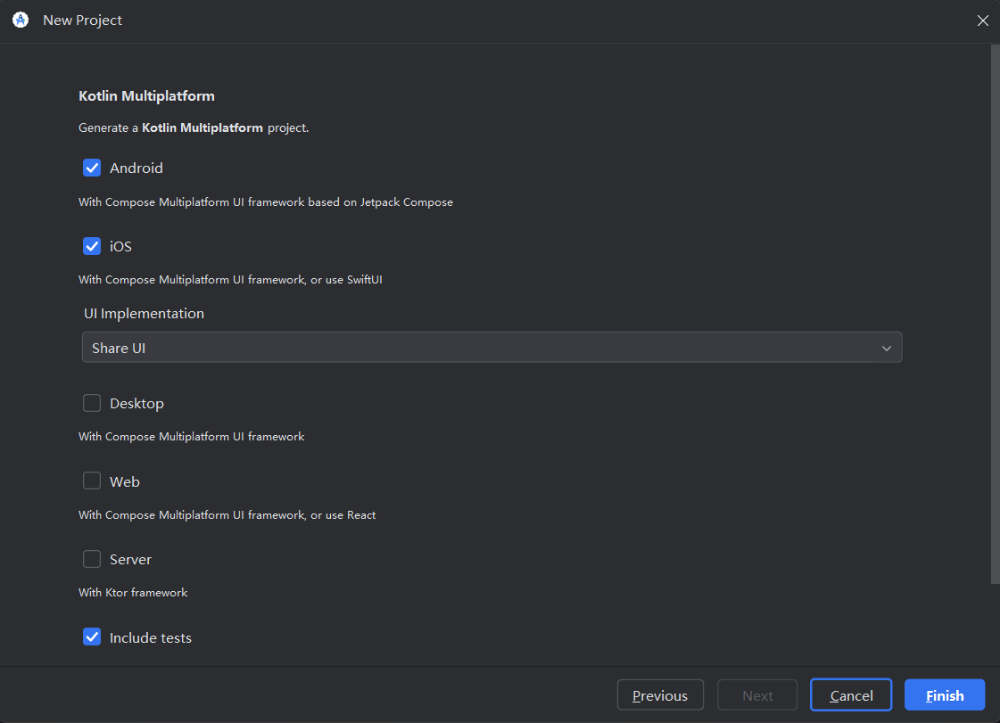

# 创建项目

## Android Studio

安装官方的插件：

## Kotlin Multiplatform Wizard

在线创建 [Kotlin Multiplatform Wizard | JetBrains](https://kmp.jetbrains.com/?android=true&ios=true&iosui=compose&includeTests=true)， 可根据模板创建。