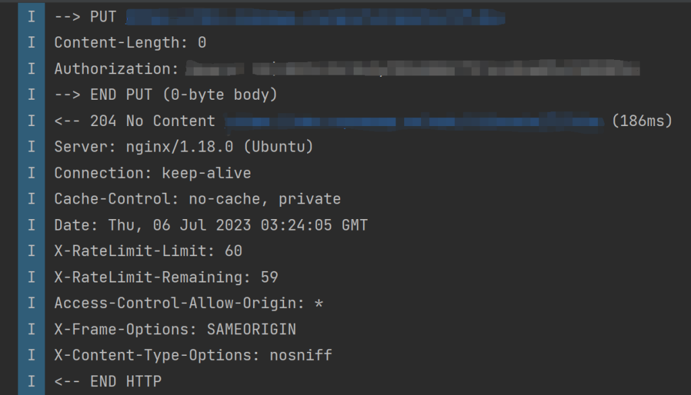

# Response from xxx  was null but response body type was declared as non-null

Android 使用 Kotlin、Retrofit2 请求网络，服务器端提供的 API 对于关注、点赞之类的请求以 HTTP 的状态码 `204` 返回，然后处理返回值遇到错误：

```shell
Response from xxx  was null but response body type was declared as non-null
```



尝试了各种写法：

```kotlin
@PUT("posts/{postId}/like")
suspend fun likePost(
	@Path("postId") postId: Long,
	@Header("Authorization") authorization: String
)
```

```kotlin
@PUT("posts/{postId}/like")
suspend fun likePost(
	@Path("postId") postId: Long,
	@Header("Authorization") authorization: String
): Any
```

等等，都不能正常使用，最终的方案：

```kotlin
@PUT("posts/{postId}/like")
suspend fun likePost(
	@Path("postId") postId: Long,
	@Header("Authorization") authorization: String
): Response<Unit>
```

引入的是 `import retrofit2.Response`。