# Jetpack Compose 入门：搭建 Android 开发环境、配置、新建项目

先决条件：熟悉 `Kotlin` 的语法。

下载 Android Studio ， https://developer.android.google.cn/?hl=zh-cn， 下载完成后，安装基本点击 「Next」即可：

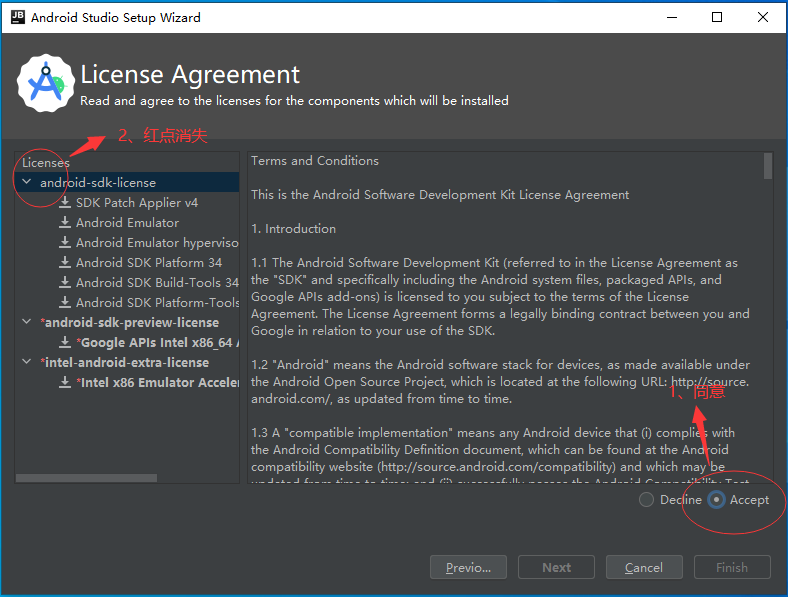

新建项目：

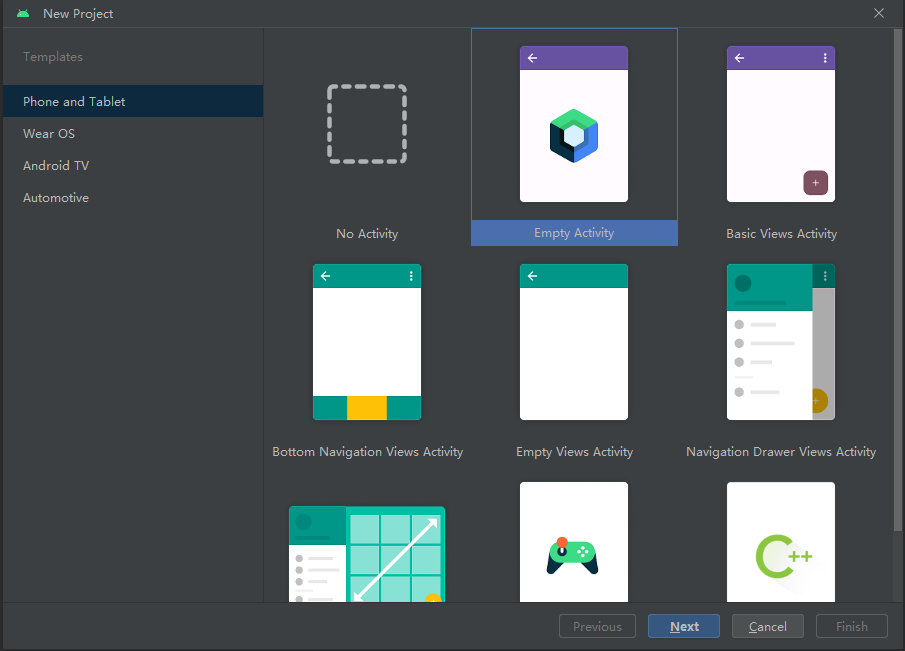

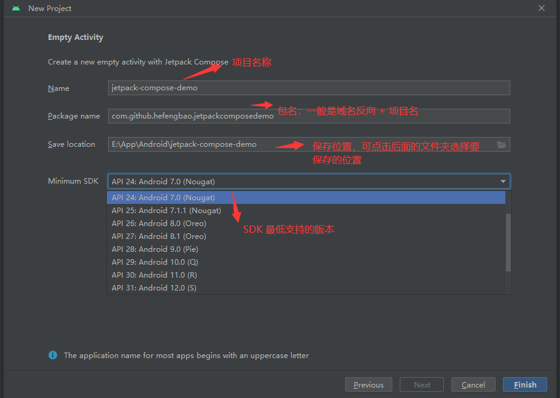

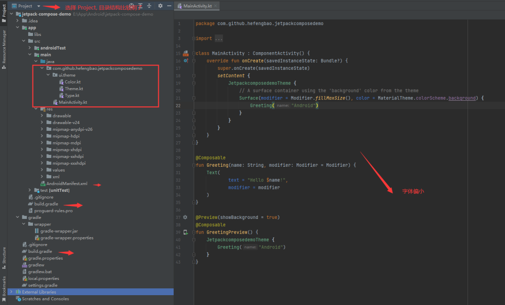

设置：

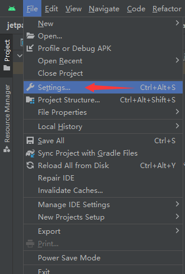

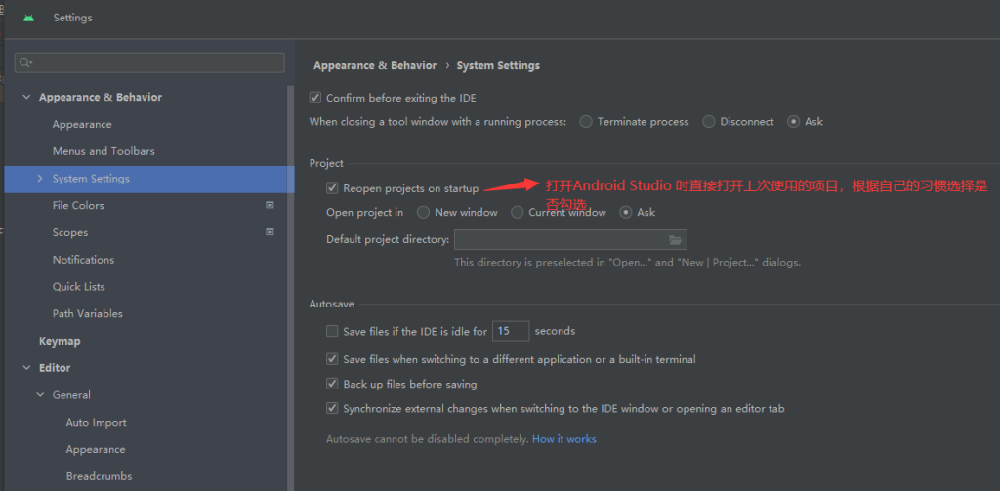

设置编辑区字体大小：

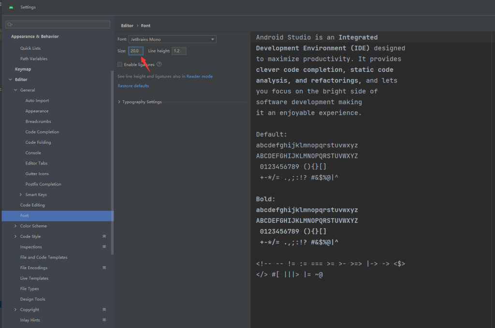

SDK:

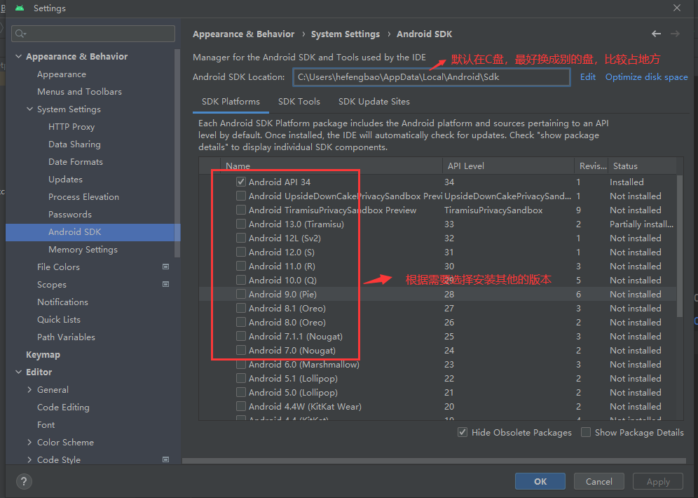

Gradle:

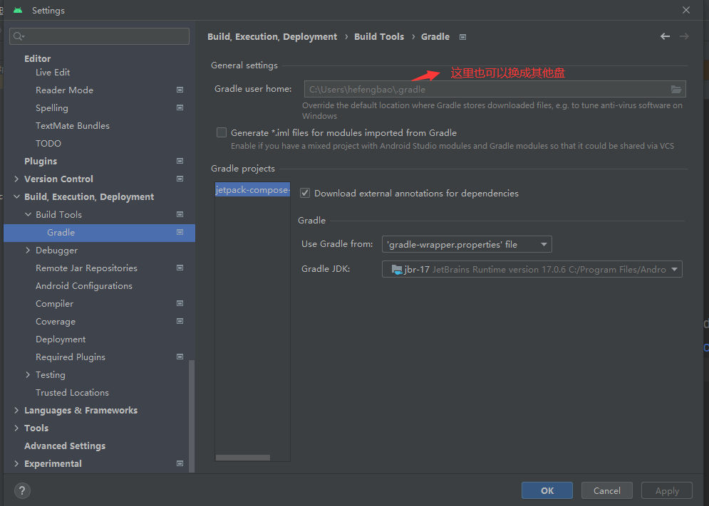

如果重新设置了 gradle 保存目录，则需要在项目中同步 gradle 文件：

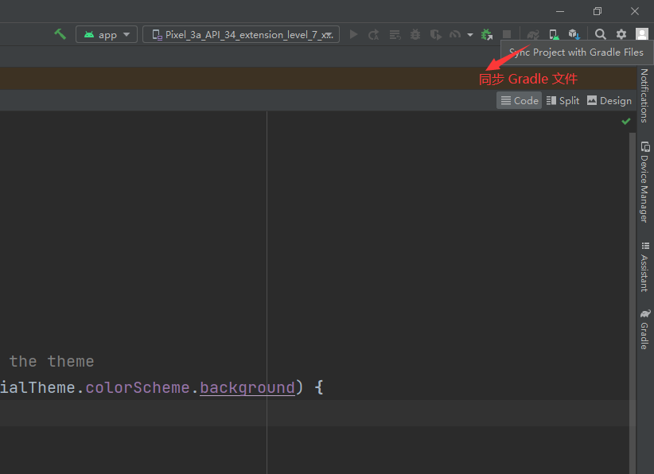

模拟器：

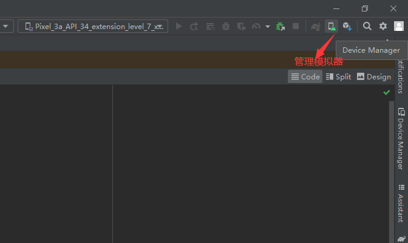

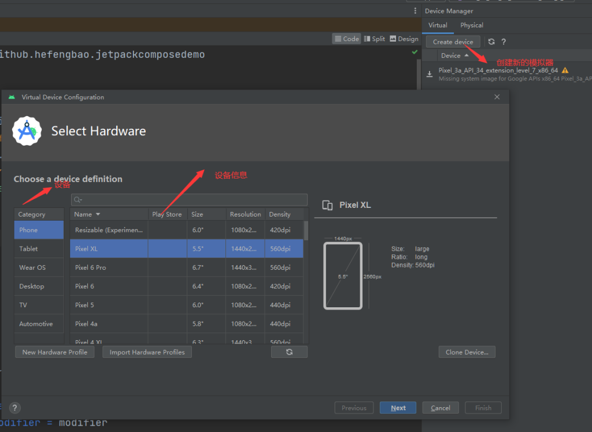

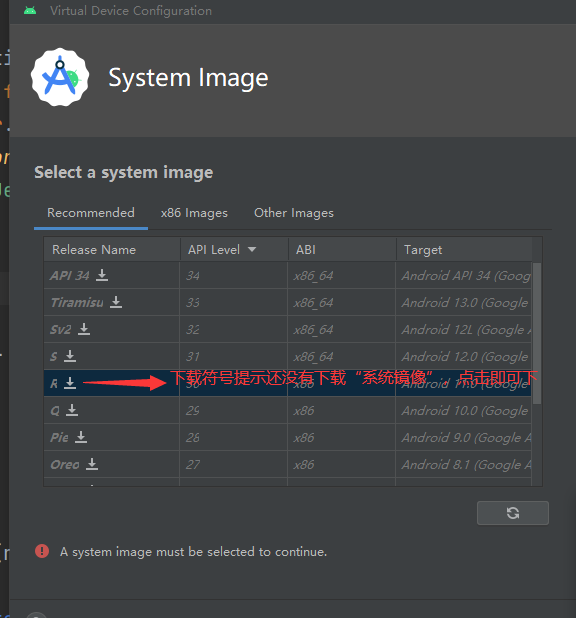

运行项目：

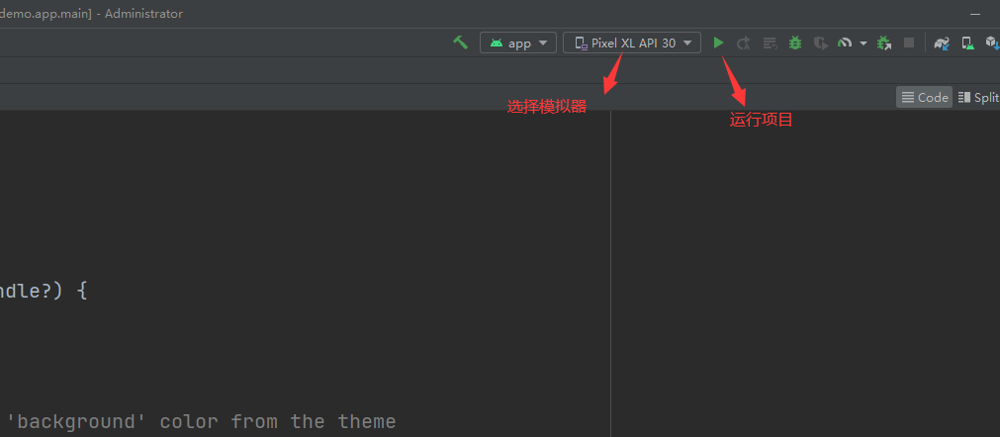

资料：

[Compose 经验分享：开发要点&常见错误&面试题](https://mp.weixin.qq.com/s/EqPiBBw7tnLRv0XpQzz5qQ)