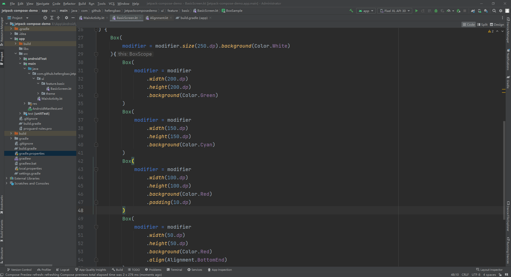

# Jetpack Compose 入门：Modifier、Box、Colum、Row

JetpackCompose 文档：https://developer.android.google.cn/jetpack/compose/documentation?hl=zh-cn

官方教程：https://developer.android.google.cn/courses/pathways/compose?hl=zh-cn

compose 版本：https://developer.android.google.cn/jetpack/androidx/releases/compose?hl=zh-cn 更新比英文官网慢 /(ㄒoㄒ)/~~

>implementation platform('androidx.compose:compose-bom:2023.05.00')


官方示例：

https://github.com/android/nowinandroid

https://github.com/android/compose-samples

学习完基本知识点后，可以仔细研究一下官方的例子。

## Modifier 修饰符

按文档的描述：

更改可组合项的大小、布局、行为和外观：Modifier.size()`，`Modifier.fillMaxWidth()`，`Modifier.fillMaxSize()`，`Modifier.padding()` 等，这是最常用的。

添加信息，如无障碍标签：

```kotlin
Modifier.clickable(
    enabled: Boolean,
    onClickLabel: String?,
    role: Role?,
    onClick: () -> Unit
)
```

处理用户输入：

```kotlin
Modifier.onFocusChanged(onFocusChanged: (FocusState) -> Unit)
```

添加高级互动，如使元素可点击、可滚动、可拖动或可缩放：`clickable {}` 等

初始化 Modifer：

```kotlin
val modifer = Modifier

// 或者

@Composable
fun BasicScreen(
    modifier: Modifier = Modifier
) {

}
```

相关文档：

修饰符：https://developer.android.google.cn/jetpack/compose/modifiers?hl=zh-cn

修饰符列表：https://developer.android.google.cn/jetpack/compose/modifiers-list?hl=zh-cn

## 可组合函数
Jetpack Compose 是围绕可组合函数构建的。这些函数可让您以程序化方式定义应用的界面，只需描述应用界面的外观并提供数据依赖项，而不必关注界面的构建过程（初始化元素、将其附加到父项等）。如需创建可组合函数，只需将 @Composable 注解添加到函数名称中即可。

快捷输入 `comp` ,待出现提示，然后按回车键：


教程：https://developer.android.google.cn/jetpack/compose/tutorial?hl=zh-cn

## Box 布局

相对布局，元素依次堆叠，默认在左上方（TopStart）：

```kotlin
@Composable
fun BoxSample(
    modifier: Modifier
) {
    Box(
        modifier = modifier.size(250.dp).background(Color.White)
    ){
        Box(
            modifier = modifier
                .width(200.dp)
                .height(200.dp)
                .background(Color.Green)
        )
        Box(
            modifier = modifier
                .width(150.dp)
                .height(150.dp)
                .background(Color.Cyan)
        )
        Box(
            modifier = modifier
                .padding(10.dp)
                .width(100.dp)
                .height(100.dp)
                .background(Color.Red)
        )
        Box(
            modifier = modifier
                .width(50.dp)
                .height(50.dp)
                .background(Color.Red)
                .align(Alignment.BottomEnd)
        )
    }
}

@Preview
@Composable
private fun BoxSamplePreview() {
    BoxSample(modifier = Modifier)
}
```



知识点：

1、modifier 链式调用，以及设置顺序

2、设置元素大小：`size()`  设定长度、高相同, `width()` 和 `height()` 分别设定长度和高度，还有 `fillMaxWidth()` 和 `fillMaxHeight()` 以及 `fillMaxSize()` ,则是自适应宽度和高度。

3、设置背景色 `background()`

4、Box 元素的位置设置用 `align()`，可用的参数有 `Alignment.BottomEnd` 、`Alignment.TopStart` 等十多种，可把鼠标指到 `align(Alignment.BottomEnd)` 括号内， Ctr + b 快捷键查看。

5、使用 @Preview 注解预览

## Colum 布局

默认元素从上到下依次排列。

```kotlin
@Composable
fun ColumSample(
    modifier: Modifier
) {
    Column(
        modifier = modifier.fillMaxWidth().background(Color.White),
        verticalArrangement = Arrangement.spacedBy(8.dp)
    ) {
        Box(modifier = modifier
            .height(20.dp)
            .fillMaxWidth()
            .background(Color.Green))
        Box(modifier = modifier
            .height(20.dp)
            .fillMaxWidth()
            .background(Color.Red))
        Box(modifier = modifier
            .padding(horizontal = 16.dp)
            .height(20.dp)
            .fillMaxWidth()
            .background(Color.Blue))
    }
}

@Preview
@Composable
private fun ColumSamplePreview() {
    ColumSample(modifier = Modifier)
}
```

知识点：

1、可通过 ` verticalArrangement = Arrangement.spacedBy(8.dp)`  设置每行之间的间隔

2、`padding(8.dp)`  设置上下左右相同的边距，`padding(start = 8.dp, end = 4.dp, top = 10.dp, bottom = 6.dp)` 上下左右需要设置那个就用那个，如果左右边距或上下边距相同则可以用 `padding(horizontal = 16.dp, vertical = 0.dp)`

## Row 布局

默认元素从左到右依次排列。

```kotlin
@Composable
fun RowSample(
    modifier: Modifier
) {
    Row(
        modifier = modifier
            .fillMaxWidth()
            .background(Color.Black),
        horizontalArrangement = Arrangement.spacedBy(8.dp)
    ) {
        Box(modifier = modifier
            .width(20.dp)
            .height(40.dp)
            .background(Color.Green))
        Box(modifier = modifier
            .width(30.dp)
            .height(30.dp)
            .background(Color.Red))
        Box(modifier = modifier.height(50.dp).weight(2f).background(Color.Blue))
        Box(modifier = modifier.height(50.dp).weight(1f).background(Color.Cyan))
    }
}

@Preview
@Composable
private fun RowSamplePreview() {
    RowSample(modifier = Modifier)
}
```

知识点：

1、` horizontalArrangement = Arrangement.spacedBy(8.dp)` 设置没列的间隔

2、 `weight()` 设置元素如何使用横向的剩余空间，比只有一个元素设置了 `weight` 属性，则它会占用横向的所有空间，又比如上面的代码中，蓝色快占 2/3, 青色块占 1/3。

示例代码：https://github.com/hefengbao/jetpack-compose-demo