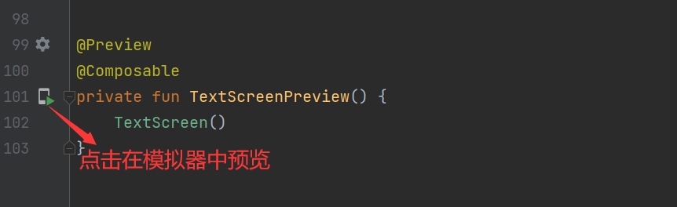
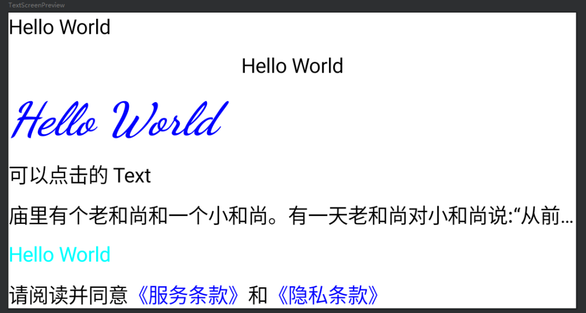

# Jetpack Compose 入门：Text & ClickableText

compose 版本：https://developer.android.google.cn/jetpack/androidx/releases/compose?hl=zh-cn

```shell
implementation platform('androidx.compose:compose-bom:2023.05.00')
```

**Text** 是 `androidx.compose.material3.Text` 中的控件，用来显示文本内容，**ClickableText** 用于显示文本内容中部分内容需要添加点击事件。

```kotlin
@Composable
fun TextScreen(
    modifier: Modifier = Modifier
) {
    val context = LocalContext.current

    Column(
        modifier = modifier.background(Color.White),
        verticalArrangement = Arrangement.spacedBy(8.dp)
    ) {
        Text(text = "Hello World")
        Text(
            text = "Hello World",
            modifier = modifier.fillMaxWidth(),
            textAlign = TextAlign.Center
        )
        Text(
            text = "Hello World",
            color = Color.Blue,
            fontStyle = FontStyle.Italic,
            fontFamily = FontFamily.Cursive,
            fontWeight = FontWeight.ExtraBold,
            fontSize = 32.sp
        )
        Text(
            text = "可以点击的 Text",
            modifier = modifier.clickable {
                Toast.makeText(context,"点击了",Toast.LENGTH_SHORT).show()
            }
        )
        Text(
            text = "庙里有个老和尚和一个小和尚。有一天老和尚对小和尚说:“从前有座山.山里有座庙，庙里有个老和尚和一个小和尚，有一天老和尚对小和尚说：“从前有座山.山里有座庙，庙里有个老和尚和一个小和尚......““。",
            maxLines = 1,
            overflow = TextOverflow.Ellipsis
        )
        Text(text = AnnotatedString("Hello World", spanStyle = SpanStyle(color = Color.Cyan)))
        ClickableTextSample(modifier = modifier)
    }
}

@Composable
fun ClickableTextSample(
    modifier: Modifier
) {
    val tag = "ClickableText"
    val text = buildAnnotatedString {
        append("请阅读并同意")
        pushStringAnnotation(tag = tag, annotation = "https://www.baidu.com")
        withStyle(style = SpanStyle(color = Color.Blue)){
            append("《服务条款》")
        }
        pop()
        append("和")
        pushStringAnnotation(tag,"https://www.bing.com")
        withStyle(style = SpanStyle(color = Color.Blue)){
            append("《隐私条款》")
        }
        pop()
    }

    val uriHandler = LocalUriHandler.current

    ClickableText(text = text, onClick = {index ->
        text.getStringAnnotations(tag, index, index).map {
            uriHandler.openUri(it.item)
        }
    })
}

@Preview
@Composable
private fun TextScreenPreview() {
    TextScreen()
}
```





知识点：

1、获取 `context`：` val context = LocalContext.current`；

2、`textAlign` 设置文本对齐方式，默认是向左对齐，可以通过 `textAlign = TextAlign.Center` 等设置对齐方式；

3、`color = Color.Blue` 设置文本颜色；

4、`fontStyle = FontStyle.Italic` 设置字体样式；

5、`fontFamily = FontFamily.Cursive` 设置字体；

6、`fontWeight = FontWeight.ExtraBold` 设置字体粗细；

7、`fontSize = 32.sp` 设置字体大小；

8、 `maxLines = 1`， `overflow = TextOverflow.Ellipsis` 设置最多显示几行，以及超过时的处理方式

9、`ClickableText`

示例代码： https://github.com/hefengbao/jetpack-compose-demo.git

提升：

https://juejin.cn/post/7057112301446365192