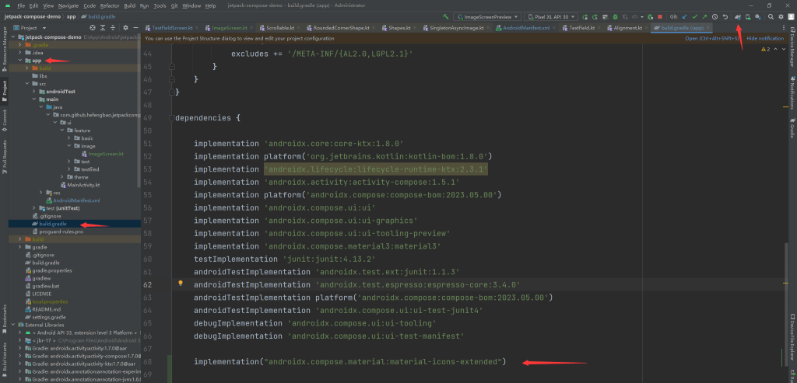

# Jetpack Compose 入门： Image

`Image` 用于显示图片，是 `androidx.compose.foundation.Image` 中的控件。文档：https://developer.android.google.cn/jetpack/compose/graphics/images?hl=zh-cn 。

最基本的是显示图标（Icon），Compose 的 `androidx.compose.material.icons` 包提供了常用的图标，默认以引入项目，如果要使用更多，可以引入扩展包：

```kotlin
implementation("androidx.compose.material:material-icons-extended")
```



要查找那些图标可用，按如下步骤操作：


找到要使用的图标，记住名称，比如 add，则可以通过 `androidx.compose.material.icons.Icons.Default.Add` 使用，具体看下面代码。

要加载网络图片，推荐使用 [Coil](https://github.com/coil-kt/coil) 库：

```kotlin
implementation("io.coil-kt:coil:2.4.0")
implementation("io.coil-kt:coil-compose:2.4.0")
```

```kotlin
@Composable
fun ImageScreen(
    modifier: Modifier = Modifier
) {
    Column(
        modifier = modifier.fillMaxSize().scrollable(rememberScrollState(),Orientation.Vertical),
        verticalArrangement = Arrangement.spacedBy(16.dp)
    ) {
        Image(
            modifier = modifier.size(48.dp),
            imageVector = androidx.compose.material.icons.Icons.Default.Add,
            contentDescription = "Notifications",
            colorFilter = ColorFilter.tint(color = MaterialTheme.colorScheme.primary)
        )

        Image(painter = painterResource(id = R.drawable.ic_launcher_background), contentDescription = "painterResource")

        AsyncImage(
            model = "https://pic.616pic.com/ys_bnew_img/00/28/60/6p82GlZ565.jpg",
            contentDescription = null
        )

        AsyncImage(
            model = "https://pic.616pic.com/ys_bnew_img/00/28/60/6p82GlZ565.jpg",
            contentDescription = null,
            contentScale = ContentScale.Crop,
            modifier = modifier
                .size(100.dp)
                .clip(CircleShape)
                .align(Alignment.CenterHorizontally)
        )

        AsyncImage(
            model = "https://pic.616pic.com/ys_bnew_img/00/28/60/6p82GlZ565.jpg",
            contentDescription = null,
            modifier = modifier
                .size(100.dp)
                .clip(RoundedCornerShape(16.dp)),
            contentScale = ContentScale.Inside
        )
    }
}

@Preview
@Composable
private fun ImageScreenPreview() {
    ImageScreen()
}
```

知识点：

1、`imageVector` 使用 `androidx.compose.material.icons.Icons` 图标；

2、`painter` 配合 `painterResource` 加载 `res/drawable` 目录下的图标；

3、圆形头像，添加圆角，`contentScale` 设置图片的填充方式等参考文档：https://developer.android.google.cn/jetpack/compose/graphics/images/customize?hl=zh-cn ；

4、 Coil 提供的 `AsyncImage` 加载网络图片。